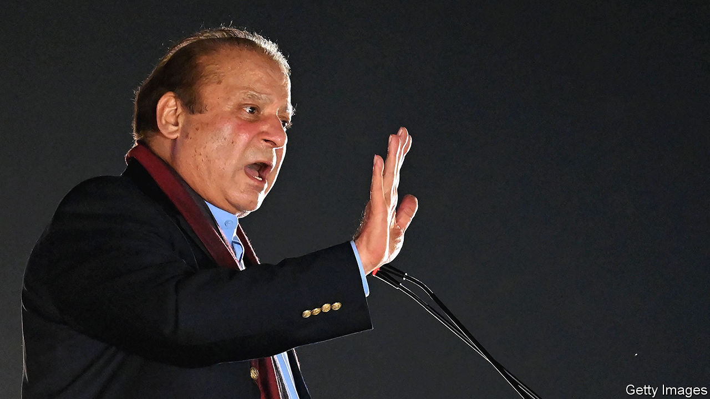

###### Back to the future

# Nawaz Sharif returns to Pakistan, again 

##### A truce with the generals revives the former prime minister’s career 

 

> Oct 26th 2023 

Four years ago Nawaz Sharif’s political career appeared to be over. The three-time former prime minister had once again been ousted from power, jailed on corruption charges, disqualified for life from holding public office and then exiled to his plush London flat. Not even his brother Shehbaz Sharif’s year-long spell as prime minister, which ended in August, could facilitate his return to Pakistan. The country’s powerful generals, who had at various times elevated Mr Sharif and then laid him low, would not allow it. But at last they have relented. On October 21st Mr Sharif returned to Pakistan. 

The 73-year-old’s homecoming was lavish. He flew in by chartered jet, surrounded by supporters and journalists. A helicopter then whisked him off to a big rally in Lahore, where his Pakistan Muslim League—Nawaz (PML-N) party launched a new anthem, including the catchy lyric: “Take charge again, save the country, Nawaz Sharif!” Not at all surprisingly, Mr Sharif sounded far more conciliatory towards the generals in his rally speech than he had in exile. “I have no wish for revenge,” he said magnanimously. “Nawaz Sharif only wishes for the well-being of the people.”

The generals have a habit of reviving Mr Sharif’s career—generally after concluding that his successor was even worse than he was. And so it is again. A general election is due next year and the army is desperate to prevent the party of Imran Khan, a former prime minister and conspiracy theorist who was recently jailed on corruption charges, from winning it. Mr Sharif suddenly doesn’t look too bad by comparison. He has at times played ball with the generals. And given that he will need their support to overturn his various convictions and electoral ban, he may be counted on to do so again. A record fourth term as prime minister could be on the cards.

A stable PML-N government could be relatively good for Pakistan’s economy. The country is in the grip of high inflation and joblessness and serious balance-of-payments problems. An IMF team is due to visit Islamabad next week to discuss releasing the second tranche of a $3bn bail-out—Pakistan’s 23rd by the fund. Mr Sharif is a pragmatic businessman who has support within the Punjabi business establishment. His record suggests he would at least be less flagrantly populist than Mr Khan. His priorities would be stability and growth, insists Khurram Dastgir Khan, a former PML-N commerce minister.

But public opinion is not with the Sharifs. Shehbaz Sharif’s spell as prime minister was doomed by the mismanagement he inherited from Mr Khan. As inflation soared and the rupee crashed, he vacillated, before slashing fuel-price subsidies to woo the IMF. Mr Khan, raging in opposition against the generals and America, which he blames for most things, disassociated himself from the economic mess. 

His subsequent imprisonment (on charges he denies) and a scheme by the generals to dismantle his Pakistan Tehreek-e-Insaf party have only improved Mr Khan’s standing. With an approval rating of 60%, he is the country’s most popular leader. “My friends and I will only vote for Imran Khan,” says Umair, a 32-year-old IT worker in Islamabad. “If he is disqualified, we will vote for whoever he tells us to vote for.” Knowing which way the wind was blowing, the PML-N supported a delimitation exercise that postponed the election shortly before its government was dissolved in August. Though the election commission has said the vote will be held in late January, a further delay is possible.

The army chief, General Asim Munir, is meanwhile growing increasingly assertive. He is pushing an effort to raise billions from Saudi Arabia and other Muslim allies known as the Special Investment Facilitation Council. The current government—a caretaker outfit that took over from Shehbaz Sharif—in effect reports to him. There is already speculation that a detente between the army chief and Mr Sharif would be short-lived.

“Nawaz Sharif has quietened his rhetoric on civilian supremacy, but he won’t be able to resist asserting himself,” says Abbas Nasir, a former editor of  a leading daily newspaper. And so revolves, in its ever-decreasing circles, Pakistan’s army-blighted democracy. ■

