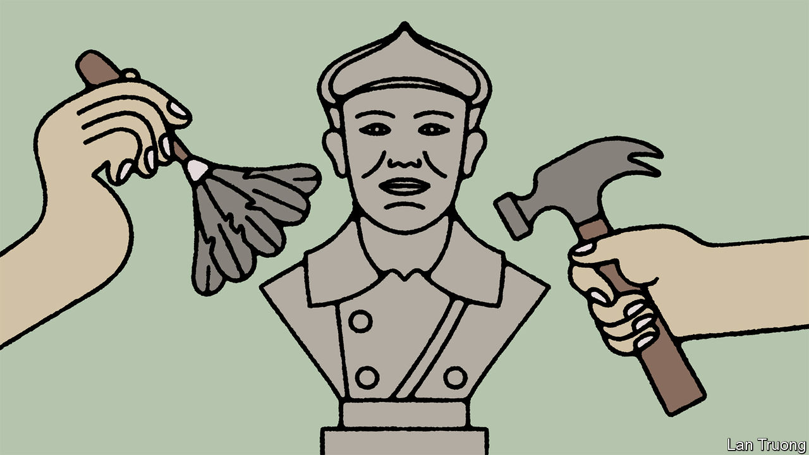

###### Banyan

# South Korean politics is one big row about history 

##### Traditional distinctions of left and right scarcely apply to the country 

 

> Oct 26th 2023 

Just as America has wrestled for years with whether to remove monuments to Confederate generals, so South Korea is gripped by a row about a bust. It concerns a statue of Hong Beom-do, a 20th-century Korean guerrilla leader, which stands on the grounds of the Korea Military Academy in Seoul. Those on the South Korean left consider Hong a nationalist hero; the right claims he fought against the ideals on which the Republic of Korea was founded and says the statue should be removed. On October 16th, after weeks of squabbling in parliament and newspapers, the military academy began to remove the bust as part of a sweeping renovation.

Americans who call for the removal of Confederate monuments are mostly on the left; preservationists such as Donald Trump are right-wingers. In South Korea it tends to be the other way round. This mismatch points to a common misunderstanding of South Korean politics. Western ideas of “left” and “right” do not apply to its two major factions.

In the West, the left-right divide has traditionally been defined by differences over economic and social policy as well as culture. South Korea is different. Of its two main parties, the People’s Power Party (PPP) is often labelled right-wing and the Democratic Party (DP) left-wing. Yet they espouse more or less the same pro-market economic policies and prefer to leave the , the family-run conglomerates that dominate South Korea’s economy, mostly undisturbed. Neither supports socially liberal causes like gay rights or takes a liberal view of immigration. South Korea’s rival factions—which also include civil-society organisations, newspapers and intellectuals—are largely distinguished by their contrasting views on modern Korean history.

For the notionally right-wing pPP, it is dominated by the fight against communism. Just as the civil war between capitalist and communist Korea never formally ended, despite the guns falling silent in 1953, so the South’s political conflict with the communist North continues. Hence the right’s aversion to Hong. A leading figure in the struggle against Japanese colonisation between 1910 and 1945, he led a resistance force in 1920 to two important victories against Japanese troops. The next year, after the occupation became more brutal, he fled to the Soviet Union, where he fought alongside Russia’s communists against the Japanese and later became a member of the Bolshevik party. 

The supposedly left-wing dp is more exercised about Japanese imperialism and the South Korean military dictatorships it helped inspire. Hong’s bust was placed in the Korean Military Academy at the behest of Moon Jae-in, a DP president, as an attempt to link the modern South Korean armed forces with the guerrilla struggle against Japanese colonialism. 

These contrasting points of emphasis yield notable foreign-policy differences. The dp and its allies remain deeply mistrustful of Japan, as was seen in their recent denunciation of the release of wastewater from the Fukushima nuclear reactor. Absurdly, the dp’s leader, Lee Jae-myung, said this would go down in history as “the second Pacific war”. The ppp is more ambivalent about Japanese colonisation and willing to set aside the many crimes it visited on Koreans. Some on the party’s fringe go so far as to suggest colonisation was a necessary evil to facilitate Korea’s modernisation.

The parties’ biggest difference is on North Korea. The South Korean “left” recalls the crucial role of North Koreans in the anti-Japanese struggle and expresses a deep fraternal yearning for a unified Korea. While in office between 2017 and 2022 Moon Jae-in bent over backwards to engage diplomatically with the North. His failure has blunted his party’s peacemaking instincts a bit. Even so, the ppp remains markedly more hostile to the North. It considers unification desirable, but only possible after the North’s totalitarian regime has collapsed. For Yoon Suk-yeol, South Korea’s ppp president, “the power of force is the only way to guarantee true peace.”

Americans would recognise another feature of South Korean politics: vicious partisanship. Yoon Suk-yeol calls his dp opponents apologists for totalitarianism. His defence minister once said Mr Moon should have his throat slit. Mr Lee calls Mr Yoon’s presidency a “dictatorial regime”. As in America, there are two explanations for this ultra-aggressiveness. First, the factions’ single main disagreement is emotive. Also, on most governing issues, there is nothing to choose between them—except an often cynically exaggerated enmity. ■


