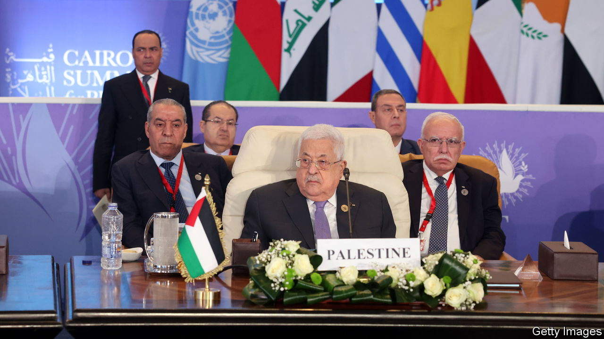
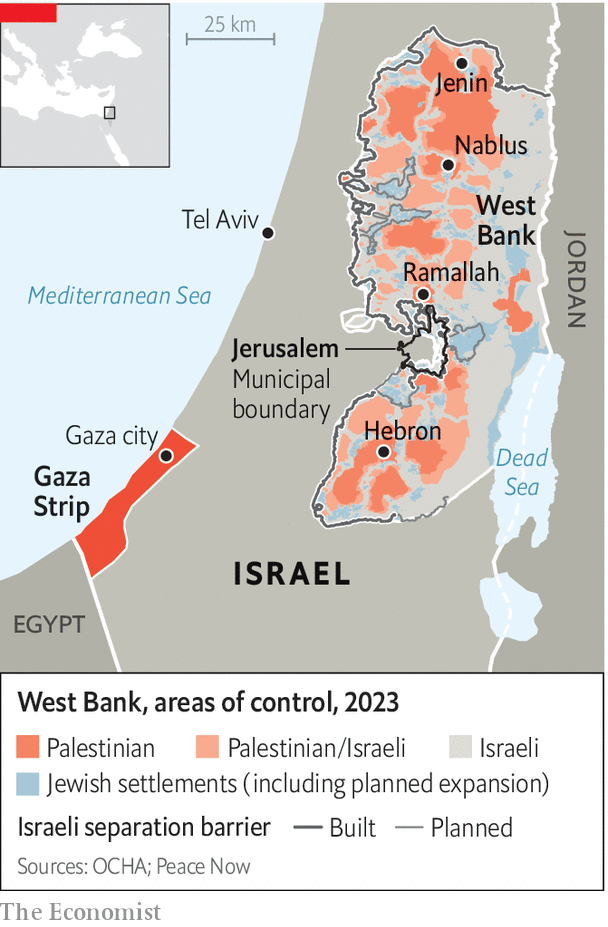

###### The day after

# Can the Palestinian Authority control Gaza if Hamas is ousted? 

##### It may be lucky to keep control of the West Bank by the end of this war 

 

> Oct 23rd 2023 

AS ISRAELI TROOPS prepare to , one question keeps coming up: who should take control of it after they have rooted out Hamas—if, indeed, they are able to do so? Many, especially Israel’s allies, are looking to the  (PA), which was thrown out of Gaza by Hamas almost two years after Israel withdrew its troops and dismantled its settlements there in 2005. But the PA seems to be in no position to take charge of the coastal enclave. In fact there are no guarantees that by the end of this war it will even be in control of Ramallah, the de facto capital city of the .


Born out of the Oslo Accords of 1993, the PA was supposed to be the basis of a future Palestinian state. But as the prospects of that state’s establishment have receded, so has confidence in the PA, which is led by the 87-year-old Mahmoud Abbas (pictured) and is widely seen by Palestinians as corrupt and incompetent. Mr Abbas was elected to serve a four-year presidential term in 2005—and has been there ever since. “There is not really a whole lot left in the legitimacy tank of the PA,” says Salam Fayad, a former prime minister of the PA. “Unless they really change course very rapidly, the whole thing could fall.” 

Partly because it has been unable to protect Palestinian civilians on the West Bank from attacks by Israeli settlers or halt the expansion of Israeli settlements, the PA has lost control of security in swathes of the West Bank to militant groups such as Kata’ib Jenin and the Lions’ Den in Nablus in recent years. The slaughter of 1,400 Israelis by Hamas on October 7th, Israel’s subsequent bombardment of Hamas in Gaza, and a sharp increase in attacks by settlers have all pushed it into an even more precarious position. 

 


In a poll in September, 53% of Palestinians said they thought an “armed struggle” against Israel was the best way to establish a state, compared with just 20% favouring negotiations. As the war in Gaza goes on, along with the flow of pictures coming out of the enclave that show civilians killed by Israel’s bombing, Hamas’s popularity appears to be increasing, while the PA’s seems to be plummeting. When news broke of an explosion at Gaza’s Ahli Arab hospital, furious crowds thronged into the streets of the West Bank. Their anger was not, however, directed at Israel, which most Palestinians believe bombed the hospital. (A more likely explanation for the blast, according to independent analysts and Western intelligence agencies, is that it was caused by a misfired rocket launched from Gaza by , another Palestinian militant group.) Instead anger was directed at the PA. Hundreds marched on Mr Abbas’s presidential compound in Ramallah. In an echo of the protests that rocked Arab countries and toppled governments in 2011, many chanted: “The people want the fall of the president.” 

Fatah, the Palestinian faction led by Mr Abbas that dominates the PA, was already riven by infighting over who would succeed him. Now it is being further torn apart over its stance on Hamas. Those close to the leader believe Fatah—and the PA, with which it has become synonymous—can muddle through to see the crushing of its Islamist rival, which could perhaps give it a chance to take back control of Gaza. However, many among the party’s rank and file think differently. “A collapse [of Hamas] in Gaza will lead to a collapse in Fatah,” says a Fatah official in Ramallah, as he agonised over the safety of his relatives in Gaza.

Even those who have little love for Hamas and its Islamist fervour are dismayed by the prospect of its being wiped out by Israel. They are urging Mr Abbas to set aside factionalism and to rally the secular Fatah movement behind Hamas in a unity government. “Both sides need each other,” says Raed al-Debiy, a Fatah official in Nablus, the West Bank’s biggest city. “Hamas needs the international legitimacy of Fatah, and Fatah and the PA need the popularity of Hamas.” 

The PA’s legitimacy crisis is being intensified by a financial one. Although the PA has not been able to evolve into an independent Palestinian state, many Palestinians accept it simply as a source of salaries and public-sector work. Yet it seems it may not be able to provide even these. In the next few weeks the PA is scheduled to pay public-sector salaries, including the wages of 34,000 members of the Palestinian Security Forces. But it can afford to pay less than 50% of this month’s wage bill, according to one senior PA official, who added that, even before the current war in Gaza, Israel was withholding customs revenues which it is obliged to hand over. This cash crunch is likely to become more acute as a result of the war because Israel has closed its borders to the thousands of West Bank Palestinians who usually work in Israel and pay income taxes to the PA. 

Members of PA’s security forces are already accused by friends and family of being proxies for Israel’s occupation of the West Bank. In many cases, the only thing that keeps them from leaving their posts is their monthly pay-cheque. The PA has weathered previous financial storms and paid salaries late, or been unable to pay them in full, in the past. But the latest projected pay cut is far larger. If it goes ahead, tens of thousands of young men in the PA’s police and national security forces may not show up to work. Some would be ripe recruits for other armed groups in the West Bank including Hamas and Islamist Jihad, the group that may have been responsible for the hospital blast in Gaza. In any case, it is hard to see how unpopular and unpaid security forces will stand their ground if Palestinians try to sack the presidential palace. “The Palestinian public is reaching a boiling point and an explosion against the authority,” says Amjad Bashqar, a Hamas official in Nablus. “The only thing delaying it is our focus on the resistance [against Israel]”. ■

