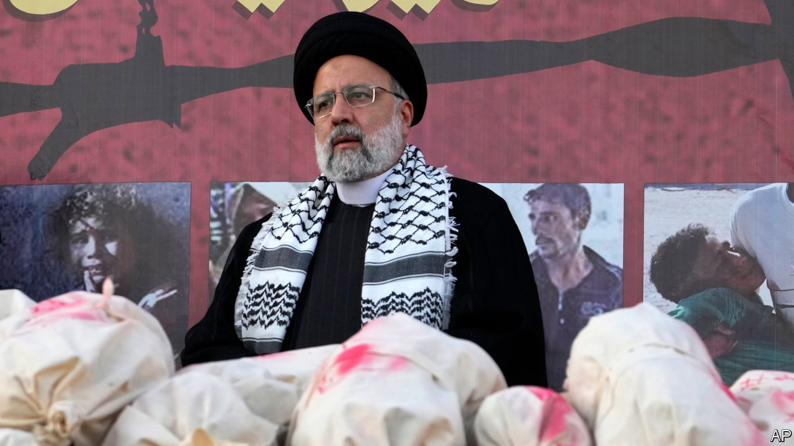
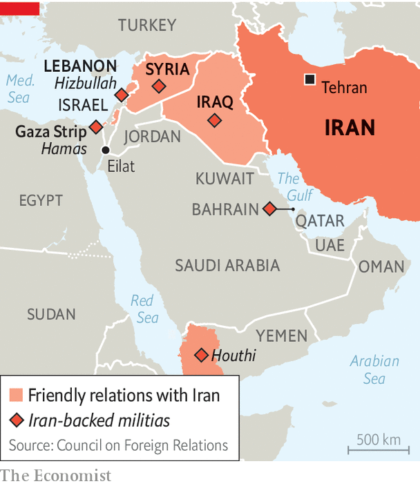

###### The scavenger power

# Iran’s ayatollahs play the Middle East’s most dangerous game 

##### They want to escalate without triggering full-blown war 

 

> Oct 23rd 2023 

THE WARNING SIGNS that  may become a  are flashing ominously. America has sent a second carrier strike group led by the  to the Persian Gulf. “There’s a likelihood of escalation,” said Antony Blinken, the American secretary of state, on October 22nd. The chances of further attacks by Iranian proxies on American forces are growing, he continued: “We don’t want to see a second or third front develop.” 

Fears are also growing in Lebanon that Israel could use America’s cover to launch a pre-emptive strike. Israel has evacuated its towns near the border with Lebanon and Binyamin Netanyahu, Israel’s prime minister, has cautioned that if , an Iran-backed militia in Lebanon, enters the fighting, the consequences for Lebanon will be devastating. One reason Israel has delayed its offensive in Gaza may be to bolster its preparations for escalation on its northern front. Iran’s foreign minister has said the region is like a “powder keg”. 


Iran’s autocratic rulers hold one of the matches that could set it alight: an “axis of resistance”, or network of violent proxies across the region. They have spent two decades building this up in Iraq, Lebanon, Syria and Yemen. Iran preys on places where the local polity is weak, where it is easy to funnel in personnel and weapons and where no external actor can challenge it, according to the International Institute for Strategic Studies, a think-tank based in London. Iran’s ability to cause mayhem at arm’s length—through Hamas, Hizbullah, Iraq’s plethora of Shia militias and Yemen’s Houthis—may even give it more leverage than its conventional military capabilities, which are relatively weak. 

Iran’s goal right now, as it has been over the past decade, is not to provoke outright war with the West and its allies but to sow uncertainty and instability. Just as it has hovered on the threshold of becoming a nuclear power, so it maintains strategic ambiguity with the axis. It denies it is in charge while supplying armed groups like the Houthis with arms, giving them training and using them as fronts to conduct attacks, such as a missile strike on Saudi Aramco in 2019 which temporarily shuttered 5% of global oil production. The purpose is to intimidate while complicating the West’s calculus. That strategy pleases Iran’s ever-closer friend, Russia. Similarly isolated from the West, it engages in weapons trade and sanctions-busting with the Islamic republic: think of Iranian-designed Shahed-136 kamikaze drones killing Ukrainians. 

The present crisis shows the opportunities and problems of Iran’s approach. It has long sponsored Hamas but did not appear to know in advance about its attack on Israel on October 7th, according to Western officials familiar with the matter. Yet it has sought to capitalise on Hamas’s atrocities and mobilise the axis of resistance. Hizbullah and Israel have exchanged fire, with the explicit support of Iran and America, respectively. As many as 19 of Hizbullah’s fighters have been killed. The Houthis, who control Yemen’s capital, have launched three medium-range cruise missiles, recently acquired from Iran, and a number of drones towards Eilat, Israel’s port city (they were intercepted by an American destroyer). And Iranian-backed Shia militias in Syria and Iraq have broadened the struggle by repeatedly targeting bases housing American troops with rockets and drones (America has drawn down its diplomatic presence in Iraq as a result).

 


For Iran, there are some obvious benefits. The conflagration in Gaza has halted—even if only temporarily—talks on normalising relations between Israel and Saudi Arabia. Any such agreement would mark a further step in the Abraham accords through which Bahrain, Morocco, Sudan and the United Arab Emirates have since 2020 established diplomatic ties with Israel. Iran’s Shia ayatollahs cannot stand the idea of being isolated as Sunni-led Muslim states and Israel co-operate more. A push to delegitimise the Abraham accords continues: at a meeting of Muslim foreign ministers in Saudi Arabia on October 18th, Iran called on Muslim countries to impose an oil embargo on Israel. The Iranian regime is backing calls to push Egypt to take in Palestinians from Gaza, perhaps in the hope of aggravating tensions between Israel and its oldest Arab ally.

Regional turmoil also means more cash for Iran, at least for now. Oil prices have climbed by over $5 per barrel since October 7th. America is anxious to tamp down inflation in the run-up to its election next year and has been tacitly allowing Iran to export more oil, despite formally retaining sanctions. “Those Iranian barrels are very important” to Joe Biden, says Ahmed Mehdi, a London-based oil analyst. Production has topped 3m barrels per day, its highest levels since the Trump administration imposed sanctions in 2018. Year on year, Mr Mehdi says, exports are up by over a third.

Yet the escalating proxy war with America and its friends comes with big risks for Iran. At home officials crow that they have become “statesmen” again, with president Ebrahim Raisi—viewed by many in the West as a hardline pariah—speaking to the French president, Emmanuel Macron, in recent days. Ordinary Iranians are less impressed. A regional war could prompt a new cycle of protests at home. Armita Geravand, an Iranian schoolgirl who collapsed on October 1st after a beating from the morality police, according to local activists, has been declared brain-dead—news that could revive the outrage that brought Iranian protesters into the streets in 2022 after the death in custody of Mahsa Amini, detained for “improperly” wearing the mandatory veil. Iranians are exhausted by their regime’s adventures abroad and reluctant to endure more suffering for Palestine. Government-organised protests have been sparsely attended. A minute’s silence at a football match in Tehran for those killed in Gaza was interrupted by raucous guffaws. “Neither Gaza nor Lebanon,” protesters chanted from their windows. “We sacrifice our lives for Iran.”

Iran’s shadow war is a delicate game and it is not clear that the country can control its proxies. Since America’s assassination of Qassem Suleimani, one of the masterminds behind the axis of resistance, three years ago, Iran’s satellites have increased their autonomy. As they hurl threats of war along with their rockets, they may find it hard to step back from their rhetoric. Each has set “red lines” for intervention against Israel and the West. A failure to respond could puncture their credibility with local supporters. An Israeli ground invasion of Gaza could force their hand. 

The proxies must also balance their military aspirations with the interests of their host countries. According to Iranian officials, Bashar al-Assad, the Syrian president, has told Hizbullah he has no desire to heed its calls to attack Israel from his territory. In his view, Hamas betrayed him by siding with the rebellion against him in 2011 after he gave them sanctuary. He does not want to fight for them now. 

Lebanon fears being another sacrificial pawn. Its Shias are the country’s largest sect, but its other 17 official denominations form a majority. Tellingly, Hassan Nasrallah, Hizbullah’s leader famed for his belligerent speeches, has shied from addressing his public from his bunker in Beirut since the fighting began. The threat of war has kiboshed Lebanon’s hopes of a tourism revival. Lloyd’s, an insurance firm, has signalled it could withdraw cover, and Middle East Airlines, Lebanon’s national carrier, is docking some of its fleet in Turkey. America has told its citizens to leave. The Lebanese prime minister has said “the decision regarding war and peace” is out of his hands.

If Iran’s proxies attack American interests, or possibly Israel, it is most likely that America retaliates against them, rather than their sponsor Iran, in the first instance. Still, that is a high-stakes gamble. And in the long run Iran’s decision to mobilise the axis of resistance signals it is heading towards isolation and autocracy. Only a month ago, the regime was celebrating a prisoner exchange with America and the imminent transfer to Iran of $6bn of frozen oil revenues. Ayatollah Ali Khamenei had blessed direct talks for the first time since the Trump administration withdrew from a nuclear deal. Some spoke of a new detente. Now that lies in tatters—and the chances of a catastrophic wider war, while still low, are far too high for comfort. ■

