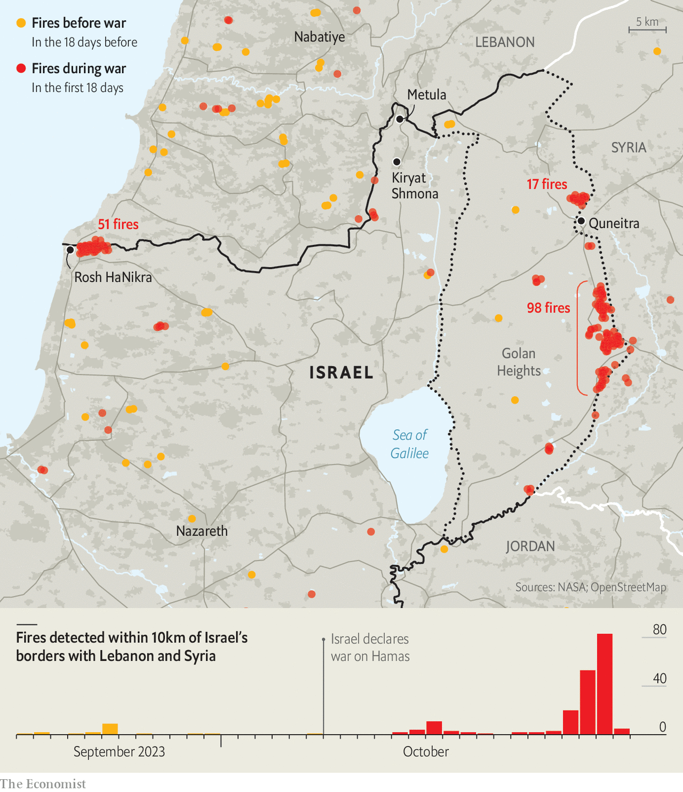
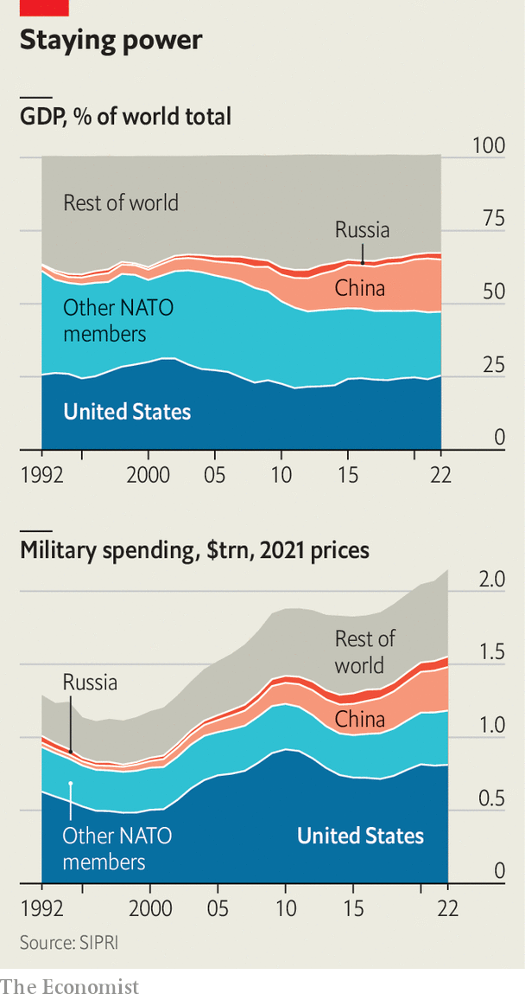

###### Biden’s bandwidth

# The overstretched superpower 

##### America could face wars in the Middle East, Ukraine and Taiwan 

 

> Oct 24th 2023 

THREE DAYS after Hamas fighters swarmed across the security fence of the Gaza Strip, killing more than 1,400 people and kidnapping about 220 more, the , America’s most modern aircraft-carrier, arrived in the eastern Mediterranean, accompanied by its fleet of warships. A second carrier strike group, led by the , is sailing to the Middle East, presumably to move closer to Iran. Aircraft and air-defence systems are being dispatched to the region, and troops are being readied, too.


It is a striking demonstration of the speed and scale with which America can deploy military power far from home. The show of force sends two messages. To Iran and its proxies: stay out. To Israel: you are not alone. American forces may yet be ordered into action amid signs that the war could spread. Israel is girding itself for a ground operation; violence in the West Bank is intensifying; and exchanges of missile and artillery fire between Israel and Hizbullah, a Lebanese Shia militia allied with Iran, presage a possible second front (see map).

 


On October 22nd Lloyd Austin, America’s defence secretary, warned of the “prospect of a significant escalation” against American forces. Three days earlier an American warship in the Red Sea shot down cruise missiles and drones aimed at Israel by the Iranian-aligned Houthi militias in Yemen. American bases in Iraq and Syria have also been coming under attack by rockets and drones, presumably fired by other Iranian proxies. “This is the most dangerous moment since the cold war,” argues Matthew Kroenig of the Atlantic Council, a think-tank in Washington, DC. “If Iran and Hizbullah get involved, America may feel compelled to respond. And does China then see an opportunity to try something against Taiwan?”

President Joe Biden is thus turning into an unlikely wartime president. He was not exaggerating when he told Americans in a recent televised address that the world was at an inflection point. When America acted to help Ukraine resist Russia’s invasion many asked whether it had the wherewithal to deter a looming Chinese assault against Taiwan. The question is all the more acute now that America also seeks to defend Israel. In Mr Biden’s view, helping friends is not only possible but necessary. “American leadership is what holds the world together,” he declared. “American alliances are what keep us, America, safe.” 

Yet academics debate whether and when the “unipolar” world, in which America bestrode the globe after the cold war, reverted to a “bipolar” one, in which America is challenged by China rather than the Soviet Union; or whether it is already a “multipolar” world. Joseph Nye, a Harvard academic, defined national power in three dimensions: military, economic and “soft power”, ie, the ability, among other things, to co-opt others to do your bidding.

 


In military terms, America remains a colossus (see chart). Economically, the world is bipolar in a way it never was during the cold war, with China’s economic output somewhat smaller than America’s at market exchange rates, and surpassing it at purchasing-power parity (though Americans remain far richer than Chinese). Soft power is harder to measure, but it is probably fair to say the world is more multipolar, says Mr Kroenig.

That said, in the Middle East, America is still the “indispensable nation”, a concept popularised by the late Madeleine Albright, a former secretary of state. It is the only country willing and able to mediate between regional leaders and shape events. That includes securing the opening of a (still inadequate) humanitarian corridor in Gaza. “The phone in Beijing didn’t ring. The phone in Moscow didn’t ring. But the phone in Washington has been ringing off the hook,” notes Ivo Daalder, formerly America’s representative to NATO.

Set against that central role, though, is the fact that three Arab leaders—King Abdullah of Jordan, Abdel-Fattah al-Sisi, the Egyptian president, and Mahmoud Abbas, the Palestinian one—have been frosty towards Mr Biden. He had been due to meet them in Amman on October 18th, after visiting Israel. But a day earlier a blast in the grounds of a Gaza hospital killed scores if not hundreds of Palestinians. Palestinians say the carnage was caused by an Israeli strike; Israel said it was the result of an errant Palestinian missile. Mr Biden seemed to give Israel the benefit of the doubt (and later said more firmly that it was not responsible). The Arab leaders did not. They cancelled the summit after Mr Abbas declared three days of mourning and returned home. Just then America looked like the dispensable power.

Not where he would start

In office, Mr Biden’s priority has been revitalising the American economy. He borrowed the protectionist mindset of his predecessor, Donald Trump, and added large doses of subsidies and industrial policy to promote, among other things, green technology and the manufacture of semiconductors. Gratifyingly, the American economy has outperformed that of its rich-world peers. He hoped such policies would reduce social and political polarisation. He also hoped they would fortify America in its contest with China. Describing the era as one of “competition in an age of interdependence”, Mr Biden’s national security adviser, Jake Sullivan, says foreign and domestic policies are more interconnected than ever, for instance in efforts to restrict China’s access to advanced technology.

Abroad, Mr Biden sought to revitalise alliances that Mr Trump had either neglected or threatened to undo. He renewed the New START agreement with Russia, limiting long-range nuclear weapons, as part of his effort to establish “a stable, predictable relationship” with the Russian leader, Vladimir Putin. 

Above all Mr Biden’s foreign policy meant doing much less in the Middle East, a region that had consumed the energies of many an American president. He sought to end the “forever wars” in Iraq and Afghanistan. He promised to restore the nuclear deal with Iran, which Barack Obama had signed in 2015 and Donald Trump abandoned in 2018, to contain the danger of a nuclear Iran. He initially said Saudi Arabia should be treated as a “pariah”. He reverted to America’s long-standing support for the “two-state solution”, ie, the creation of a Palestinian state alongside Israel, though he put little effort into it.

Much of this has gone awry for Mr Biden. Far from being stable and predictable, Mr Putin invaded Ukraine and information exchanges under New start are suspended. America’s chaotic departure from Afghanistan allowed the Taliban to return to power instantly. In the Gulf, meanwhile, China took the plaudits for the restoration of diplomatic relations between Iran and Saudi Arabia, appearing to fill a vacuum left by American indifference.

Changing focus

Mr Biden flew to the Saudi city of Jeddah in July last year to make up with Muhammad bin Salman, the crown prince. The president could not persuade the de facto ruler of the world’s biggest oil exporter to help moderate oil prices; instead, Saudi Arabia cleaved to a production deal with Russia to keep prices high. Moreover, he set a high bar for the normalisation of relations with Israel that Mr Biden hoped to bring about: concessions on the Palestinian question; a mutual-defence agreement with America; and uranium enrichment at home to counterbalance Iran’s nuclear programme. Often Team Biden fell back on benign neglect. “The Middle East region is quieter today than it has been in two decades,” declared Mr Sullivan—just days before Hamas’s onslaught. 

America’s allies around the world, especially in Asia, ask two seemingly contradictory questions, says Kori Schake of the American Enterprise Institute, an American think-tank. First, will American resources and attention be diverted to the Middle East? Second, will America’s resolve in one or other crisis fail? “If we allow the security of Europe to be destabilised by Russian aggression, or allow Israel to suffer a terrible terrorist attack, they will believe that we don’t care about any other problem,” she argues.

America’s reliability as an ally comes down to both credibility and capacity. Given America’s many alliances, academics have long debated the importance of credibility: does a failure to live up to obligations to one ally affect commitments to others? America’s abandonment of the war in Vietnam, for instance, did not much damage its will to defend western Europe. The West went on to win the cold war.

These days the question is whether America’s pell-mell departure from Afghanistan undermined American credibility and encouraged Russia to invade Ukraine. Tod Wolters, a former military commander of NATO forces, suggested last year that it had been one of several factors. But Mr Sullivan insists that, in fact, leaving Afghanistan “improved our strategic capacity” to respond to the invasion of Ukraine and the threat to Taiwan. 

As for military capacity, America must supply weapons to Ukraine, Taiwan and now Israel. That raises doubts about whether its defence industries can meet their needs as well as its own. In general America sends different weapons to the three countries, but some demands overlap. For instance, 155mm artillery shells are in short supply, and America is reported to have diverted a consignment intended for Ukraine to Israel. The war in Ukraine has shown how big state-on-state conflicts consume vast quantities of munitions. War games suggest that, in a war over Taiwan, America would quickly run out of the long-range anti-ship missiles that would be most useful in repelling a Chinese invasion of Taiwan.

Such problems can be solved with time and money, but both are in short supply because of  and congressional paralysis. Republicans, especially those of Mr Trump’s “America First” tendency, have grown ever more sceptical about supporting Ukraine in its war. And Congress, unable to pass bills since the removal of the speaker of the House of Representatives, Kevin McCarthy, on October 3rd, got a new one, Mike Johnson, only this week.

Mr Biden hopes cross-party sympathy for Israel will unblock things. He has asked Congress for a massive $106bn in supplemental national-security spending. He seeks to pre-empt future divisive votes on Ukraine by allocating $61bn in military and economic aid to the country, to tide it through America’s febrile 2024 election season. To make it more palatable, he has wrapped it in other spending that Republicans should find more appealing, including $14bn for Israel; $2bn for military-equipment transfers in the Indo-Pacific (probably to Taiwan); nearly $12bn in various measures to strengthen the processing of migrants on the southern border; and $3bn for the submarine defence-industrial base. 

“Hamas and Putin represent different threats, but they share this in common: they both want to completely annihilate a neighbouring democracy,” declared Mr Biden. Yet Israel’s war is different from Ukraine’s in several respects. One concerns international perceptions. America helps Ukraine in the name of the UN charter, the inviolability of sovereign borders and human rights. In defending Israel, America is backing a country that breaches international law by building Jewish settlements in occupied territories, rejects statehood for Palestinians and stands accused of imposing collective punishments on Palestinians, if not committing war crimes, in its bombardment and siege of Gaza.

Middle East rules

Whereas the Western allies are almost united in defence of Ukraine, they are split on the question of Palestine. A UN Security Council resolution calling for “humanitarian pauses” in the fighting in Gaza was supported by France and 11 other countries, but drew an abstention by Britain (alongside Russia) and was vetoed outright by America, on the ground that it did not recognise Israel’s right to defend itself. 

A second factor is America’s own role. In Europe it is acting at arm’s length, sending weapons, intelligence and money to Ukraine, but not troops. In the Middle East it is deploying its own forces to protect Israel from attack by Iran and its allies. Mr Biden’s embrace of Israel is sincerely felt—Mr Biden calls himself a Zionist—but is also an attempt to influence and restrain Israel. “If Biden’s hugging strategy works in delivering a more calibrated Israeli response, people will see it as Biden’s special flair,” says Emile Hokayem of the International Institute for Strategic Studies, a British think-tank. “If it does not work, America is going to be seen as a warring party.”

Regional dynamics add a further element. Arab states are ambiguous. Many detest Hamas, as a branch of the Muslim Brotherhood that challenges their rule, and have made peace with Israel, or have tacit relations with it. Yet when Palestinians fight, these countries are compelled to champion the Palestinian case. Having taken in successive waves of Palestinian refugees, they don’t want more. Indeed, they fear Israel secretly wants to resolve its problem by pushing out more Palestinians.

The crisis in Gaza, notes Mr Hokayem, has shifted attention back to Palestine after years of American efforts to ignore it, or to solve it from the “outside in”, ie, normalising relations between Israel and Arab states and only then dealing with the Palestinians themselves. Yet the endgame in Gaza is being left intentionally blank. Israel insists Hamas must not rule Gaza again; America says Israel must not occupy it again. Neither says what the alternative might be. Mr Netanyahu, moreover, has done his utmost to sabotage Palestinian statehood. After Hamas’s onslaught he, and many Israelis, will be even more convinced that it poses a mortal danger. 

American officials readily admit they don’t have a strategy for the “day after”. The two-state model, says Mr Hokayem, “was a preference, not a policy”. If a solution seems impossible, it is only in part because of the inherent difficulty of reconciling two nationalist imperatives, Israeli and Palestinian, on the same hallowed land. It is also “the cost of American retrenchment”, says Mr Hokayem. “It is more difficult for America to come back into the game having been outside for a long time.”

China and Russia may offer no substitute for America’s diplomacy, but they will be more than happy to see American discomfiture and will play up the claims of American double standards. Ahead of his visit to Washington this week, Wang Yi, China’s foreign minister, described Israel’s actions as “beyond the scope of self-defence” and did not mention Hamas.

The impact of the crisis may be more tangible among some “swing states”, says Richard Fontaine of the Centre for a New American Security, a think-tank in Washington, DC. These are countries that are “multi-aligned”, and for whose allegiance America, China and Russia compete ever more intensely. Saudi Arabia may demand a higher price from Israel and America if it is ever to follow its Gulf neighbours, Bahrain and the United Arab Emirates, in establishing formal ties with Israel.

Turkey, an equivocal ally of the West’s in the Ukraine crisis, could turn more hostile. Though he has tried to patch up relations with Israel, and condemned the killing of Israeli civilians, President Recep Tayyip Erdogan hosts Hamas leaders and has sharpened his denunciation of Israel’s response as “amounting to genocide”. Indonesia, the world’s most populous Muslim country, inevitably sympathises with Palestinians. Though India thinks of itself as non-aligned and a friend of anti-colonial movements, it has expressed solidarity with Israel, feeling sympathy for it as a fellow victim of Islamist terrorism. 

South Africa sees Israel’s treatment of Palestinians as akin to apartheid. African countries, more broadly, feel America either ignores conflicts on their continent—such as the war in Sudan—or is hypocritical when it comes to human rights. They regard America not so much as indispensable as absent. Many fear Mr Biden will not keep his promise to visit Africa this year.

Countries of the global south have also been courted more avidly by big powers. Though critical of Russia’s invasion they do not want to be trapped in a new cold war. America has been trying to woo them through such things as boosting the lending capacity of the IMF and World Bank, and creating a global infrastructure fund to compete with China’s Belt and Road Initiative (BRI). But it has a long way to go. On the same day as Mr Biden was in Tel Aviv, 20-odd leaders were in Beijing for a BRI summit hosted by China’s leader, Xi Jinping. 

A day later, in a televised address, Mr Biden made the case for America as the world’s “essential nation”. In Europe and the Indo-Pacific his administration has acted nimbly, knitting existing alliances more tightly and creating new partnerships, helped by the aggression of Russia and China. In the Middle East, though, America is more alone in its defence of Israel, and more liable to lose friends and partners than win over new ones. ■


