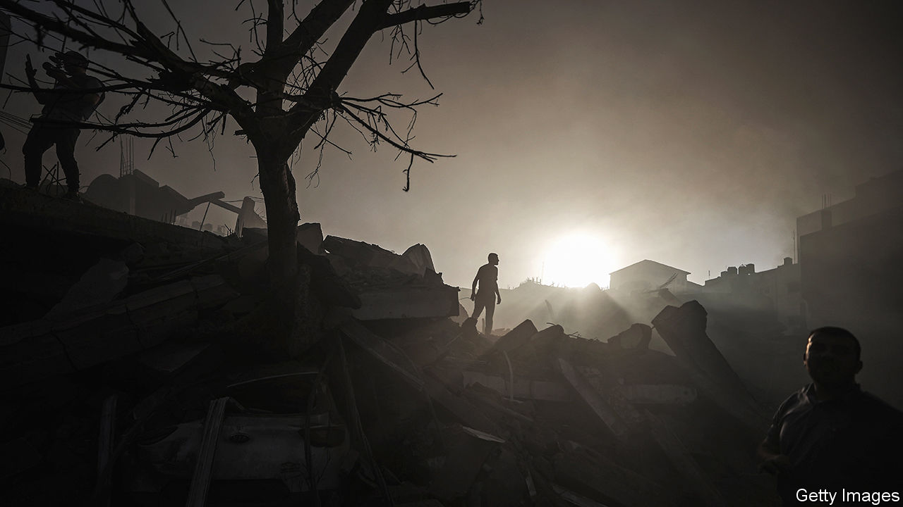

###### Dread and disagreement

# Why Israel’s invasion of Gaza has been delayed 

##### Bibi and his generals are divided 

 

> Oct 26th 2023 

IT ALL BEGAN so fast. An unprecedented barrage of rockets served as cover for a murderous rampage, which led to a frantic manhunt and ferocious air strikes. Reservists rushed to don uniforms and report for duty. Generals promised a massive ground offensive. What began as a sleepy autumn weekend ended with Israel making ready to invade Gaza.


Nearly three weeks after the October 7th massacre in Israel, however, that offensive has yet to begin. Israel’s bombardment of Gaza continues, killing thousands and destroying around . A near-total siege has left civilians short of food and water and hospitals unable to function. 

Apart from a few small raids, though, the ground troops have yet to move. Some of the 360,000 reservists called up in Israel’s largest-ever mobilisation have been sent home. Tens of thousands more are still in southern Israel, awaiting orders that have been delayed and delayed again.


Officers grumble that they cannot maintain their readiness forever. One frustrated commander took his troops to a building site to run up and down half-finished high-rises—ostensibly an urban-warfare drill. In reality, he says, it was a way to let off steam. “Hurry up and wait” is a perennial maxim of military life; but an especially stark one in Israel today.

There are many reasons to delay: continuing talks to free the array of hostages held by Hamas, the militant Islamist group that runs Gaza; American pressure, motivated by fears of a regional war; the dire conditions inside Gaza; and the chronic dithering of Binyamin Netanyahu, Israel’s long-serving prime minister. On October 25th he confirmed that a ground offensive is still planned. But it will be smaller and slower than anyone would have expected in the days after the massacre, in which Hamas militants murdered more than 1,400 people, most of them civilians.

According to the latest count from Israeli officials, the tally of at least 220 people seized during the attack includes scores of children and old people, and citizens of at least a dozen foreign countries. The hostages have become a source of pressure on Mr Netanyahu’s government. The captives’ families have waged an effective public-relations campaign, and foreign leaders have pushed him to try to free their citizens.

Vigils have been held across Israel. The hostages’ relatives often give television and radio interviews. The issue is deeply political. Many of those from the kibbutzim that were attacked are the secular, left-leaning sorts of Israelis most likely to have joined protests against Mr Netanyahu’s government throughout the year. They feel his government forsook them on October 7th and is still failing them. Pressure from the families has already forced the government to change its plans. Originally inclined to rush into Gaza without regard for the hostages’ safety, it has since declared that their rescue is a “top priority”.

Qatar, host to some leaders of Hamas, is also feeling the heat. Its ties with the group have come under scrutiny since the massacre; it is desperate to show its Western partners, particularly America, that it can serve as an interlocutor.

On October 25th Tzachi Hanegbi, the head of Israel’s national-security council, posted an uncharacteristic message on X (formerly Twitter): “I’m pleased to say that Qatar is becoming an essential party and stakeholder in the facilitation of humanitarian solutions,” he wrote. Israeli officials had been scathing about Qatar in recent weeks. That Mr Hanegbi praised it (in English, rather than Hebrew) suggests progress towards a deal to release at least some of Hamas’s captives.

Hamas has already let a handful go. On October 20th it freed a mother and daughter who hold dual American and Israeli citizenship. Three days later it freed two elderly Israeli women who were abducted from Nir Oz, a kibbutz on the Gaza border. It got nothing in return—a sign that American pressure on Qatar is having an effect.

One of the women, Yocheved Lifshitz, 85, spoke of her ordeal at a press conference the next day. Her captors, she said, beat her on the journey to Gaza. Once inside the territory she was led into a “spiderweb” of tunnels; after walking for hours, she wound up in a room where around two dozen other hostages were being held.

 


Ms Lifshitz said they were treated decently: medics tended to the wounded, and captives ate the same simple meals of bread, cheese and vegetables as their captors. When she was turned over to the Red Cross on Gaza’s border with Egypt, she shook hands with one of her captors. She said that was because the hostages were treated with “sensitivity”. But her husband is still in captivity: she had good reason not to antagonise Hamas.

That the group behaved humanely to a grandmother, moreover, does not mitigate the outrage of having kidnapped a grandmother in the first place, tossing her across a motorbike and beating her with sticks. Nor does it excuse the horrors of what Hamas did in Israeli towns.

On October 23rd the Israeli army screened 43 minutes of raw footage from the massacre for foreign journalists. Some was taken from the attackers’ body cameras, the rest from surveillance cameras and mobile phones. No recording was allowed at the screening, in a nondescript auditorium on an army base: this was a sadistic snuff film not for the public’s eyes.

In one harrowing clip a father rushes his two young sons, all of them clad in their underclothes, to a hiding place. A terrorist throws in a hand grenade after them. The father is killed. The bloodied boys—one appears to have lost an eye—are led back into their house at gunpoint, where their father’s killer asks them for water, calmly raids the fridge and starts drinking a cola. (An army spokesman was unable to say if the boys survived.)

The atrocities go on. A gunman tries to behead a Thai labourer who has been shot in the stomach; unable to find a knife, he hacks away at the man’s neck with a garden hoe. Other images show burned babies and children with their brains spilling from their heads. Several of the attackers proudly pose for photos next to their victims.

The barbarity sparked rage in Israel and abroad. There is broad support for a military campaign to topple Hamas in Gaza, which it has controlled since it ousted the Palestinian Authority (PA) in 2007. But there are also powerful voices urging caution—Joe Biden’s most of all.

His fear that Israel is rushing into a war with no clear endgame is a valid one. The Israeli security establishment would like to see the PA, which governs parts of the occupied West Bank, also retake control in Gaza. But one senior official admits that no serious planning has been done. Mr Netanyahu even denied that such a plan exists.


Mr Biden also fears that the war will not stay in Gaza. On Israel’s northern border with Lebanon, there have been daily exchanges of fire. Hizbullah, the Shia militia cum political party, has attacked Israeli towns and army posts with anti-tank missiles, and Israel has shelled and bombed southern Lebanon. Hizbullah admits that some 40 of its fighters have been killed (the real toll is probably higher). It is the most sustained fighting since the war they fought in 2006, though it has yet to escalate beyond tit-for-tat bombardment.

Militias in Syria and Iraq have used drones to attack American bases, where two dozen soldiers were lightly injured. On October 19th the Pentagon said an American destroyer, the   had shot down missiles and drones launched from Yemen over the Red Sea. America believes their target was southern Israel, a remarkable entry into the war by the Houthis, an  in Yemen.

Dangerous calibrations

All of these escalations are small—signs that Iran wants to show the reach of its proxies, not plunge the region into war. But they are risky. A strike that kills a lot of people in either Israel or Lebanon would be enough to upset the balance. To make that less likely, Israel has evacuated around two dozen communities in the north, including Kiryat Shmona, a city of more than 20,000 people near the Lebanese border. Villages on the Lebanese side have also emptied as residents flee farther north.

Israel has hardened its border too: many reservists called up this month were sent north, not south. America has deployed two aircraft-carrier strike groups, one to the eastern Mediterranean, the other to the Persian Gulf. On October 21st it said it would deploy more Patriot air-defence battalions and a THAAD anti-ballistic missile battery. Another 2,000 troops are on standby for a possible deployment.

Israel’s assessment is that these reinforcements have deterred Hizbullah from ramping up the fighting. Talk in the war cabinet of launching a pre-emptive strike on the group has died down. Of late, oil markets seem more sanguine, too. The price of Brent crude, which spiked from $85 a barrel before the Hamas attack to $92 on October 19th, has slipped to below $90.

 is fought watching the clock, as international condemnation grows and eventually America qualifies its support. In 1973 America urged a ceasefire ending the Yom Kippur War, even though Israeli forces were on the advance. In 2006 it imposed a ceasefire before Israel could achieve its objectives in Lebanon. As one Israeli official puts it, “Our window of international legitimacy is limited.”

The scenes of horror in Gaza mean the window is already closing. The UN says 1.4m people in the territory have been displaced; its shelters are crammed to two-and-a-half times their capacity. On October 13th Israel told the entire population of northern Gaza to flee south. Thousands who heeded that order have since travelled back the other way. If nowhere feels safe, they reckon, better to be in one’s own home than a tent or a crowded shelter.

Israel refuses to allow any supplies to cross its border until Hamas releases all the hostages it holds captive. On October 21st the first shipment of aid, a convoy of 20 lorries containing food, water and medicine entered Gaza from Egypt. Several more deliveries followed. This is only a small fraction of what the territory needs (the UN says at least 100 lorries a day are required). Families have cut back to one meal a day. People have resorted to drinking salty water from wells. Aid workers say poor sanitation has led to cases of scabies and diarrhoea and fear that even more serious diseases will spread.

No fuel has entered Gaza since October 7th. The sole power plant is offline and Israel has  of electricity that it normally provides. The World Health Organisation says six of Gaza’s 13 hospitals have run out of fuel. Most bakeries are closed for the same reason; queues at those still working stretch up to six hours. Israel refuses to allow fuel shipments.

Arab states want an immediate ceasefire. The European Union is split, but Josep Borrell, its top diplomat, has called for a “humanitarian pause” to allow more supplies to enter. Rishi Sunak, Britain’s prime minister, has signalled support for one too. America still offers Israel staunch backing, but will not do so indefinitely.

Yet Mr Netanyahu faces mounting pressure from his hard-right base to prove he is clobbering Hamas, and is loth to admit that Mr Biden or the hostages’ families have stayed his hand. Instead, using proxies, he has begun to brief that the army is not ready for a ground campaign. Rather than risk soldiers’ lives, it is argued, Israel should launch more devastating air strikes, including the use of bunker-busting bombs, to destroy Hamas’s tunnel network.

The army has pushed back, saying it is “fully ready” for an invasion. There have been days of ugly but accurate headlines in the Israeli media about discord between Mr Netanyahu and his defence minister, Yoav Gallant. Mr Netanyahu tried to fire Mr Gallant in March, after the latter voiced criticism of the government’s plan to weaken the supreme court. He was forced to retreat after massive public protests. There has been growing distrust between the two ever since, and it is now hampering Israel’s war-planning effort.

On October 11th leaders of one opposition party, Benny Gantz and Gadi Eisenkot—both former army chiefs—joined the war cabinet. But they have failed to restore unity. “The [army] and the intelligence community were severely hit by their failure to detect and prevent the Hamas attack,” says a defence official. “But they’ve got back on their feet and are now just waiting for a clear idea from the government what to do.”

General confusion

The army’s orders remain to destroy Hamas’s military capabilities and end its control of Gaza. Some within the army and the wider defence establishment believe a more gradual ground campaign would be better. But generals were told to prepare for a broad offensive; they cannot change that plan unless the cabinet gives them a different timetable or a different goal. And the cabinet is dithering.

General Herzi Halevi, the army chief, has acknowledged the army’s failure to prevent the massacre. So has Ronen Bar, the director of Shin Bet, Israel’s internal-security service, and General Aharon Haliva, the head of military intelligence. All three are expected to do the honourable thing and resign after the war. Most Israelis want their prime minister to accept similar responsibility—but he has not.

Instead Mr Netanyahu spends most of his time huddling with political advisers and briefing journalists. He has assembled his own shadow cabinet of former generals and security officials to second-guess Mr Gallant and the army. “There are many who shoulder the blame for thinking that Hamas wouldn’t dare do something like this,” says one Knesset member from Mr Netanyahu’s coalition. “Obviously Bibi is more to blame than all the others, but don’t wait for him to say so.”

Even a well-oiled government would struggle to navigate between so many competing priorities—and Israel, these days, barely has a government at all. ■

