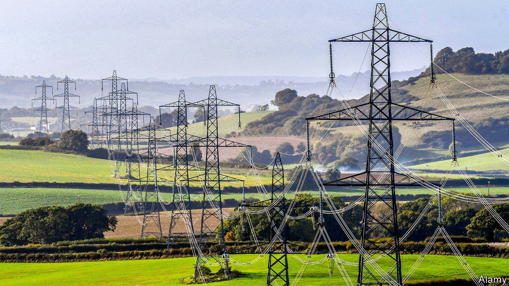
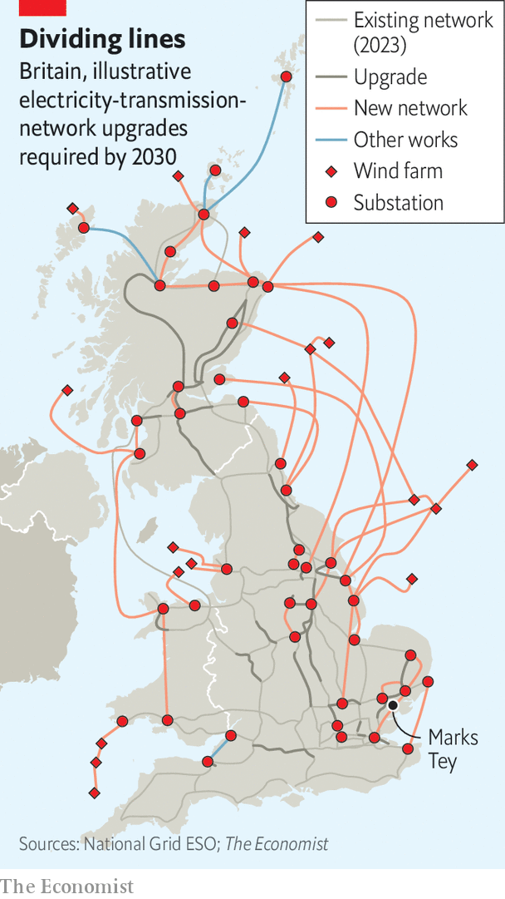

###### Fight for the power

# Britain must overhaul the way it approves infrastructure 

##### Electricity pylons will be the next battleground 

 

> Oct 26th 2023 

“SAY NO!” Blare orange placards along the road out of Marks Tey, a village in Essex. Rosie Pearson, a consultant-turned-campaigner, points to where a planned chain of pylons will cut through a field next to the house she grew up in. Pulling out maps and annotated documents, she recounts skirmishes with National Grid, which wants to build the line to carry wind and nuclear power from East Anglia to London. The real battle will not come until 2025, when a final decision beckons.

Building infrastructure in Britain has become painfully slow. Since the planning system was last reformed in 2012, the time it takes to secure consent for national infrastructure projects has risen by two-thirds, to over four years. That is on top of a “pre-consent” stage that averages two. Power lines should be relatively easy things to put up, but they still take around 13 years from start to finish. 

Pylons have always sparked particular controversy. A “permanent disfigurement” was the verdict of John Maynard Keynes, a great economist, when they first appeared on Britain’s skyline in the 1920s (the Electricity Board brushed off its critics as “impractical aesthetes”). “Bestride your hills with pylons, O age without a soul”, wrote John Betjeman during a pylon boom in the 1960s in response to the growing demands of consumer appliances. The poet’s sardonic protest was ignored, too. 

 


A new age of pylons is now required to meet the country’s net-zero commitments. In the coming decades electricity will not only keep the lights on; it will also be needed for people to drive to work and stay warm. That means  must double in capacity, as well as morphing in shape, to draw power from hundreds of wind and solar farms. In the next seven years Britain will need to build four times more grid infrastructure than it has managed in the past 30. The line through Essex is one of 17 marked for urgent completion (see map).

Already, bottlenecks are building up. Wind and solar farms are told to wait more than a decade to feed their power into the grid; around £200bn ($243bn) of such projects sit in the queue. In turn there is too little power where it is needed: housing developments in west London were paused in 2022 because of a lack of capacity. 

The government is supposed to set out its approach to infrastructure in a set of . The energy one has not been updated since 2011. That gives developers, including National Grid, little sense of how to approach trade-offs—such as how wiggly a route should get to avoid houses or woodlands—and opens the door to judicial reviews. A tangle of agencies have responsibilities; none has a convincing plan for where power lines and substations should go as part of a coherent system, according to a review by Nick Winser, Britain’s electricity-networks commissioner. Ofgem, the regulator, and the arms of National Grid contradict one another. 

All of which is ammunition for determined activists like Ms Pearson. Some 14 East Anglia MPs (including two in the cabinet) back her campaign, which also counts on the help of a small army of (semi-)retired lawyers, engineers and accountants. Such outfits can hardly be blamed for poking holes in plans. Yet the result is that much-needed projects are held to ransom, says Jeegar Kakkad of the Tony Blair Institute, a think-tank. Groups of volunteers hold up tens of billions in investment. 

In the case of power lines, one alternative is putting the cables underground. That already happens in designated Areas of Outstanding Natural Beauty. But it is five to ten times more expensive, not a cost most want to see appear on their electricity bills. Putting them in the sea, as Ms Pearson suggests, has a high price tag, too. 

Developers know that any hold-up adds lots of cost so they spend vast sums consulting and assessing. Yet councils or lawyers can still find faults, particularly when national policies are a muddle. , a half-abandoned high-speed rail scheme, was backed by an Act of Parliament but its developer had to buy off local opposition to each section of track—one reason why the surviving leg of it will cost eight times more than comparable projects in Europe. 

Politicians have at last woken up to the problems. The government is working on a plan to speed up power lines. Labour promises to streamline infrastructure consultations by offering communities off-the-peg options. Advisers hope a clearer national policy would reduce the scope for judicial reviews; there is talk of a quick-fire planning bill. In effect, Labour wants to stop local groups from vetoing national projects. (It may also have noticed that the power lines needed are almost all in Tory and Scottish National Party seats.)

Politicians and regulators talk of “community benefits” for those who do their civic duty by hosting infrastructure. But payments can backfire if they are seen as bribes. Essex villagers reacted badly to the idea that their principled opposition to pylons could be bought off with a measly heat pump. Better to make it much harder to block projects and then use compensation to soften the blow for affected locals. Currently, only the farmer whose field a pylon squats in gets paid. Mr Winser proposes a lump sum for everyone close to new lines. Ireland already has such a system of standardised proximity payments. If Labour wants to “get Britain building” and remain in power, that model could spread. ■


