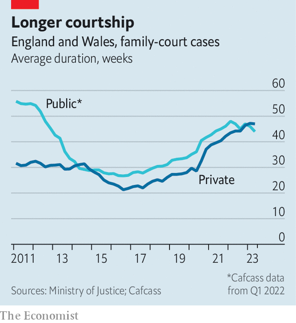

###### Family division

# Britain’s family-court system is overwhelmed 

##### The justice system is leaving children in limbo 

 

> Oct 23rd 2023 

Child x is a polite and articulate teenager, his solicitor told the judge. He is grateful to his carers for looking after him and is settled in their home. The boy understands, the lawyer went on, why the local authority believes he should see his mother once a month rather than more often, as she had requested. But he would like it to be known that he would prefer to live with her, because he misses her.

This was part of the final hearing in a case at the family court in Leeds, where your correspondent spent a day as part of a pilot project giving journalists unprecedented access to a process long shrouded in secrecy. More than eight months previously the boy had been removed from his mother, an alcoholic who had neglected him. He had been waiting to hear where he would spend the rest of his childhood. The judge ruled he would remain with his carers and see his mother once a month. 

 


His long wait was shorter than that many children endure. Delays in Britain’s overstretched family courts mean cases take much longer to resolve than they did a few years ago (see chart). The target for the resolution of public-law family cases (those involving children in care) is 26 weeks; they now take an average of 44 weeks. Private cases, which mostly concern parent-child custody and contact arrangements after separation and , now take 47 weeks, more than double what they took seven years ago.

The human cost of these delays is extremely high. Children whose lives are put on hold are more likely to experience mental-health problems and fall behind at school, says Phuong Truong, a lawyer for Coram Children’s Legal Centre, a charity. Delays often worsen quarrels between parents. That makes separations unhappier for children; it also makes it harder for a judge to discern their best interests.

How did things get so bad? The covid-19 pandemic meant many hearings were postponed. That exacerbated deeper financial problems. Between 2010 and 2019 the budget for the Ministry of Justice (MoJ) was reduced by 25% in real terms. The effects are , from fewer courts (roughly a third closed between 2010 and 2022) to fewer staff—including judges, on whose know-how the system depends. 

Cuts made during the years of austerity appear to have had a particularly bad effect on family courts. In 2013 a new law removed legal aid (means-tested legal representation that had been available in all areas of law) from all private family cases. That meant battling parents started going to court without lawyers; the number of private cases in which neither party has a lawyer has risen by 26% over the past decade. Because judges, rightly, hate to preside over courts in which no one understands what is going on, hearings are often paused while legal points are explained. If the court runs out of time the hearing is rescheduled, often for months later. 

There is an exception to the withdrawal of legal aid: it remains available to those who have accused a former partner of domestic abuse with some substantiation. Some solicitors feel this encourages allegations that would not otherwise be made. When it is awarded, legal aid goes to the alleged victim but not the alleged perpetrator. It should go to both, says Jenny Beck of the Access to Justice committee of the Law Society, which represents solicitors.

Better yet, she says, the government should restore legal aid for private family cases. If that is too costly, funding for legal advice in the early stages of a separation would help by preventing some warring parents from going to court at all. Many lawyers attest that at least half of those who take their rows to court would not have done so if they had received advice earlier. Once in court, they rarely retreat. 

Avoiding court is worthwhile for another reason. Although children in care are represented by lawyers and social workers who recommend the best course of action, private cases are often fought between parents, with no third parties representing their offspring. “The voice of the child is grossly unrepresented, risking a disproportionate focus on the parents’ needs rather than the children’s welfare,” says Joanne Edwards, a partner at Forsters, a law firm. She and others believe the government should do more to educate people about the costs of going to court when they separate, especially for children.

The government is trying to plug the gap left by the withdrawal of legal aid with mediation, a process in which a trained mediator (often a former lawyer or social worker) helps a couple agree on arrangements for their children and finances. In 2021 it introduced a voucher scheme that gives couples £500 ($608) towards the cost of mediation. The MoJ says about two-thirds of voucher-users reached at least a partial agreement without the courts. 

The transparency project is meant to increase public confidence in family courts. Your correspondent was impressed by judges’ expertise and the care taken over complex cases. But unless the system gets more money, and ex-couples fight their battles differently, the delays—and the human costs they entail—will not go away. ■ 


