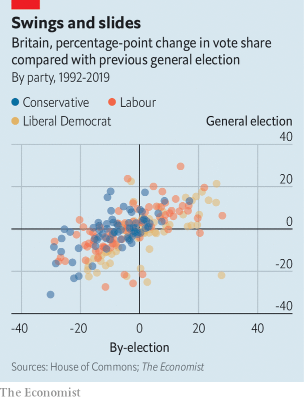

###### Not that by the by

# Do by-election results in Britain matter? 

##### Our model suggests they should not be dismissed as aberrations 

 

> Oct 26th 2023 

Political superlatives were being thrown around like confetti on October 20th, after two by-election victories for Labour in safe Tory seats. In Mid Bedfordshire Labour set a new record for overturning the largest absolute majority in a by-election. In Tamworth the party bettered its huge by-election victory in the same town in 1996, just a year before Tony Blair’s landslide general-election win. Is history set to repeat itself? 

 


Tory optimists say it is unwise to extrapolate from by-election results. Turnout is poor: among the 110 by-elections since 1992 just 43% of the constituency electorate have shown up, on average, compared with 64% for general elections. Of the two dozen seats gained by a party at by-elections between 1992 and 2019, half were lost at the subsequent general election. 

To find out if by-elections do act as bellwethers for future general elections, built a simple model to predict a party’s general-election vote share in a given seat based on its performance in a by-election in that same seat. As a rule of thumb, roughly half of the change in a party’s vote share is carried over from by-elections to general elections (see chart). That suggests the Tories may not be penalised by voters quite so badly in Tamworth and Mid Bedfordshire at the next election; as things stand, they may well regain both seats. 

But our model also suggests that it is wrong to discount by-elections. Some parties, most obviously the Liberal Democrats, do outperform in by-elections. But the victories for Labour this month corroborate what the 17-percentage-point gap in the  indicates: the party is on course for victory. ■


