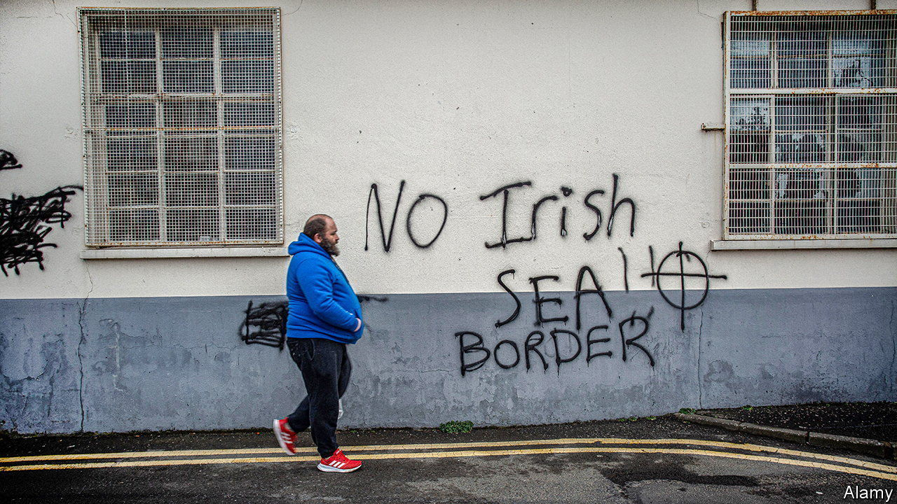

###### Still knotty

# Is the Windsor framework in Northern Ireland working? 

##### The new rules soften the Irish Sea border, but do not make it disappear 

 

> Oct 26th 2023 

The Windsor framework was agreed on , but its first practical test came at the start of this month. The deal—negotiated by Rishi Sunak, the British prime minister, and Ursula von der Leyen, the European Commission president—set up green and red lanes for goods passing from Great Britain to Northern Ireland. Green lanes are for goods that will stay in the province, and impose only minimal customs checks on trusted traders. Red lanes, for goods that might cross the land border with Ireland (and so enter the EU), involve more rigorous inspections. 

The government says the system, which started on October 1st, is working. Supermarket shelves in the province now stock meat products stamped with labels saying “NOT FOR EU”. The port of Larne has set aside land for a new border facility designed to support real-time sharing of trade data with Brussels. After years of bad-tempered confrontation between the EU and the government in Westminster over the Northern Ireland protocol—a part of the Brexit deal that, in effect, drew a border in the Irish Sea—.

But the Windsor framework cannot, as Mr Sunak once said, eliminate “any sense of a border” between the province and Great Britain. Green lanes are good for big retailers and supermarkets that can afford to register as trusted traders. But they are less suitable for smaller firms that are uncertain where their products might end up. Indeed, some now face more controls because grace periods allowed under the protocol have ended. Particularly tricky problems include plants, online sales, veterinary medicines and organic eggs. 

Nor has the framework removed the biggest concern for Northern Irish businesses, which is uncertainty. There is still the risk of future regulatory divergence between the EU and Great Britain, which would only make the Irish Sea border thicker. As a report from UK in a Changing Europe, an academic think-tank, notes, little divergence has happened in practice; most British firms do not want it, and Britain has not yet imposed customs checks on imports from the EU. But over time the rules on both sides may change. 

The continued existence of the Irish Sea border also explains why Northern Irish politics is still in limbo. The biggest unionist (pro-British) party, the Democratic Unionist Party (DUP),  the province’s power-sharing executive since February 2022 because it wants all border controls scrapped. Some close to the DUP leader, Sir Jeffrey Donaldson, say he would like a way to back down. The missing executive makes it harder to run fraying public services. It also kiboshes use of the “Stormont brake”, a part of the framework that in theory allows the Northern Irish assembly to object to single-market rule changes. 

But there are other reasons for the DUP’s reluctance to end its boycott, not least that it would mean accepting a first minister from Sinn Féin, a party favouring Irish reunification, for the first time. Many analysts think the impasse will last until the next general election, in which Labour is expected to take power. Sir Keir Starmer, the Labour leader, has said he would like to move closer to the EU, starting with a veterinary and food-standards agreement, but negotiations would be very testing.

The Windsor framework has clearly improved relations with the EU. And public opinion in the province is favourable: the latest poll for Queen’s University Belfast found that 56% of respondents agree or strongly agree that the framework is on balance a good thing for Northern Ireland, against 34% who disagree or strongly disagree (though a narrow majority of unionists are against it). But Brexit was always going to be problematic for the province, and for years Northern Ireland has been treated as collateral damage in internecine Tory wars. The framework is up and running. But it cannot unravel every knot. ■


