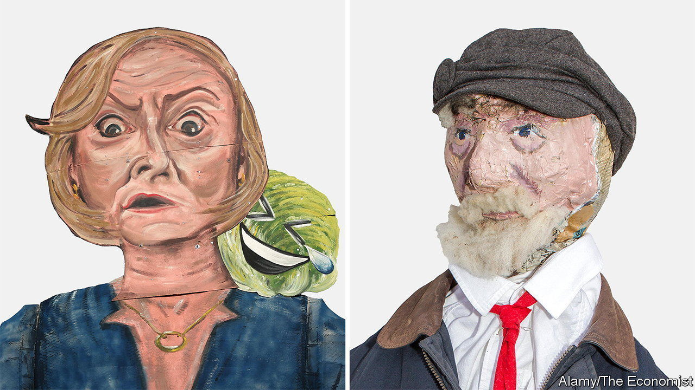

###### The ghosts at the feast

# Liz Truss and Jeremy Corbyn still haunt British politics 

##### Two former leaders that their parties would rather forget 

 

> Oct 24th 2023 

Welcome to the haunted house of Westminster. It is a year since  left office, after serving as prime minister for 49 days. Britons are going to keep hearing about her for a lot longer than that. At the Labour Party’s conference this month, few shadow-cabinet ministers missed a jibe at her expense—and, by extension, at that of her successor, Rishi Sunak. The message: that he is weak and she is still running the show. “We all know that he’s just Ken in her Barbie-world,” said Angela Rayner, Labour’s deputy leader.

The compliment is returned. At the Tory party conference, speeches were replete with references to Jeremy Corbyn. Never mind that he quit as Labour’s leader more than three years ago, and that he is barred from running as a Labour MP. The message: that by having loyally served under him, his successor is an untrustworthy shape-shifter. “Rather like Jeremy Corbyn, Keir Starmer truly is a Marxist. Because as Groucho Marx put it, ‘I have principles, but if you don’t like them, well, I have others’,” zinged Mel Stride, the welfare secretary.

Targeting such calamitous predecessors makes sense for both parties, notes Tom Hamilton, a former Labour adviser. Whatever their faults, Mr Sunak and Sir Keir “pass a basic test of looking as if they can more or less do the job”. Sir Keir has higher approval ratings now than Mr Corbyn did at the last election, at -22% to -50% respectively. Mr Sunak’s wilting ratings outstrip Ms Truss’s, at -40% to -70%. 

In both cases the attacks contain some fragments of truth. Repudiating Mr Corbyn and his followers has been  since he became party leader. The shadow cabinet has been remade. So have local Labour branches: votes at conference suggest the proportion run by the “hard left” has fallen from 80% in 2018 to 23% this year, according to Luke Akehurst, a Starmerite member of the party’s governing body. Yet Sir Keir has never given a compelling explanation for why, unlike many colleagues, he served in his predecessor’s shadow cabinet for over three years. The charge of opportunism lingers. 

Mr Sunak ran against Ms Truss in the Tory leadership contest in 2022, adhering to the “abacus economics” that she rejected. Although Ms Truss is an unpopular figure among Tory MPs, the prime minister has criticised her disastrous term in office only in mild terms (“some mistakes were made”). The charge of weakness sticks. “When is he going to say ‘Liz Truss can’t stand for the next election?’ That would be bold,” Sir Keir told an interviewer. 

The parallels between the two former leaders go well beyond their roles as campaign fodder. Undeterred by their failures at home, both hanker to fix the world. Ms Truss is working on a book entitled “Ten Years to Save the West”. The fact that Labour rejoices with every public appearance won’t silence her as the election approaches. Mr Corbyn’s “Peace &amp; Justice Project”, a sort of campaign group, has similarly vaulting objectives—among them ending conflict and achieving “climate justice”. Quite how is left unsaid. It hosts a conference in London on November 18th; he toys with a run to become the city’s mayor.

Both figures press on something neuralgic in their parties. Ms Truss is a reminder of a double Tory failure: the acute blunder of the mini-budget of September 2022, and the chronic inability to restrain the ballooning tax burden. Shortly before the Treasury’s autumn fiscal statement on November 22nd, Ms Truss’s supporters will lay out a rival tax-cutting manifesto. Mr Sunak can hardly discipline her for preaching lower taxes, since he and the rest of the party agree with that goal in principle. 

As for Mr Corbyn, it has been easy to see his  as an aberration. But he did not come from the moon. His vague homilies on peace appealed to Labour members who had grown sceptical of British foreign policy, especially in the Middle East, since the Iraq war of 2003. Before him came Ed Miliband, who had opposed air strikes against the Syrian regime in 2013 in light of “the lessons of Iraq”. 

That all seemed like ancient history, until now. Sir Keir has been determined to show Labour’s support for Israel after the attacks by Hamas, and to stamp out a reputation for anti-Semitism that grew during Mr Corbyn’s tenure. But his suggestion, later clarified, that it would be legitimate to cut off water and electricity to Gaza caused a ripple of anger among Labour’s rank and file, Muslims in particular. Mr Corbyn, meanwhile, could be found at the head of large pro-Palestinian demonstrations in London. Neither ghost is fully exorcised. ■


