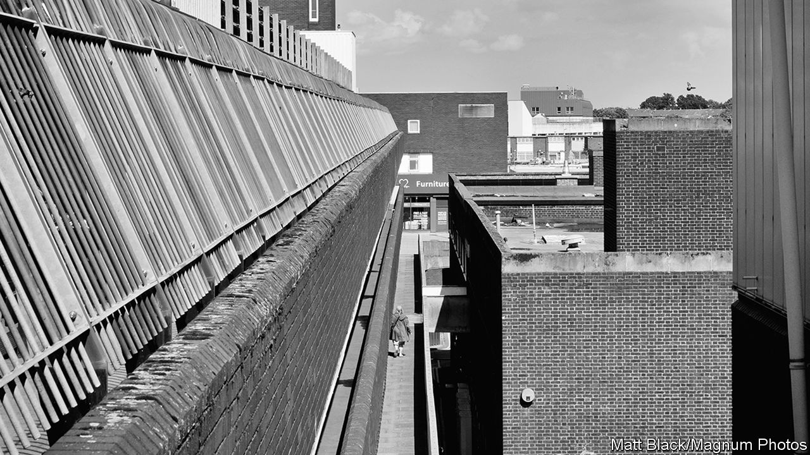
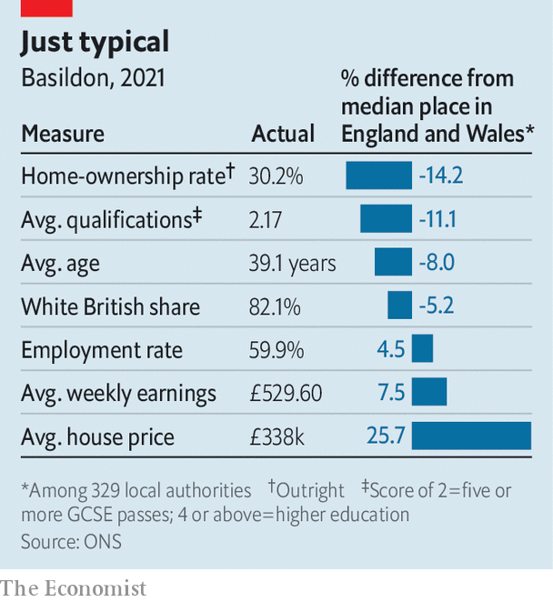
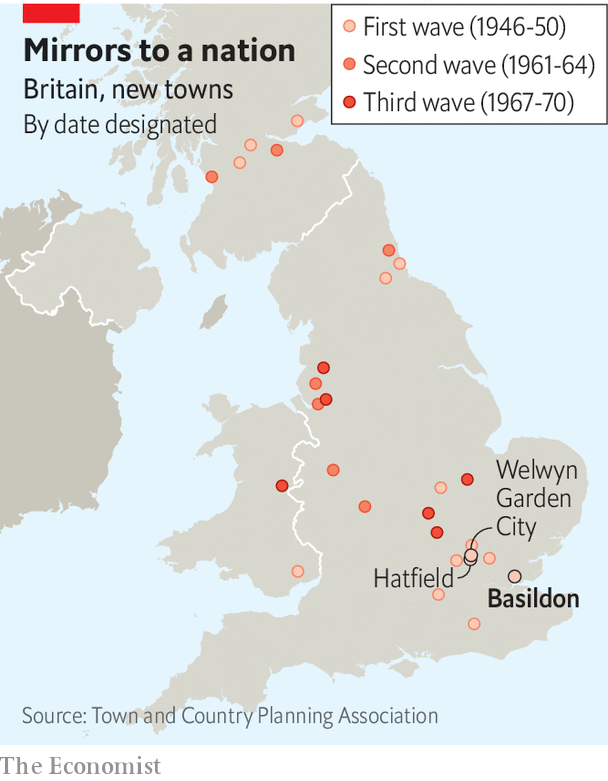

###### Magic town

# The most typical place in Britain is Basildon 

##### The Economist has crunched the numbers to find the most median spot in the country 

 

> Oct 25th 2023 

Basildon, a town about 40km to the east of London, was supposed to be a Utopia. In 1948 Lewis Silkin, the then minister for town-and-country planning, proclaimed that “Basildon will become a city which people from all over the world will want to visit”. Seventy-five years later those hoped-for visitors from around the globe have failed to arrive—and standing in the town centre on a windy and wet October day, it is hard to imagine why any would choose to come here.

 


That is partly because it is difficult to see what makes Basildon different from lots of other places. The architecture, a jumble of grey concrete and glass which blends into the autumn sky, is the same as that found in dozens of post-war developments across Britain. The shops are equally familiar. Watching the lunchtime trade at the sprawling branch of Primark, a discount clothing store that dominates the town square, you could be anywhere; only the distinctive Essex twang of the locals gives the game away. But normality is also what makes Basildon special, for it is Britain’s most typical place. 

Basildon is one of 28  created by government planners after the second world war (see map). In 1947, just as the first plans for it were being drawn up, the film “Magic Town” was released. James Stewart plays a down-on-his-luck pollster who stumbles upon a community whose demography exactly matches that of America as a whole. Rather than carry out time-consuming national surveys, he undercuts his rivals by sampling opinion there. Basildon, by accident rather than design, is Britain’s magic town.

 


 looked at the data for 329 local authorities across England and Wales (Northern Irish and Scottish data were not comparable) across seven metrics: home ownership, house prices, median age, employment levels, average earnings, educational background and ethnic make-up. Each variable for each place was then compared with the median value of all the local authorities (see chart). 

By averaging how far, in percentage terms, each local authority was from the median place across all seven categories, Basildon, with an overall distance of just 0.1% from the typical place, came out bang in the middle. Carrying out the same exercise for 2011 marked out Welwyn Hatfield in Hertfordshire, made up of the new towns of Hatfield and Welwyn Garden City, as Britain’s most typical place then.

An alternative methodology, of ranking each location by each variable and then taking the average of the combined rankings, would move Britain’s most typical place 22km to the west and into the east outer London borough of Havering. Regardless of the exact methodology, then, “magic town” is now to be found somewhere around Essex. (We gave Basildon the same weighting as urban areas with many more inhabitants; that makes the typical British place older, whiter and less well-educated than the population as a whole.) 

Basildon is no stranger to finding itself cast as a national barometer. Between 1983 and 2010, at which point the parliamentary constituency was merged with its neighbours, the town always voted for the party that won the general election. Political strategists believed that “Basildon Man” was a key demographic cohort, who encapsulated the Conservatives’ capture of the aspirational middle class in the 1980s under Margaret Thatcher and their return to Labour under Tony Blair in the 1990s. 

Disappointingly for political sociologists, but typically of most Britons, today’s Basildon men and women do not seem to be following the twists and turns of Westminster politics that closely. Ask locals in the town about politics, and their most likely response is to berate the local council’s move to fortnightly bin collection. Fear of the spread of  (ULEZ), a charge on older and more polluting vehicles recently expanded in the capital by its Labour mayor, is another preoccupation. 

Economically, the town is representative of the bigger picture. The centre of Basildon has seen better days. Since 2021 the Eastgate shopping centre, home to that Primark, has lost high-profile stores, including Debenhams, H&amp;M, Top Shop and Next. “To let” signs are a common sight around the centre. A report in 2022 found that more than a quarter of the town’s retail sites were vacant, and that 16.2% of them had been empty for over three years. 

But high streets are no longer the best indicator of prosperity. The rise of internet shopping and the impact of the pandemic has reshaped how people spend their time and money. A few kilometres to the north, on the edge of town, the Festival Leisure Park was this week doing a booming half-term trade. The sprawling car park was almost full as families ventured to the multiplex cinema, bowling alley, soft-play area and indoor mini-golf course. The highlight for some was the new branch of Five Guys, an American burger chain—“only the second one in all of Essex”, as one mum put it.

Even the prospect of American burgers, or a planned £3m ($3.6m) branch of Wetherspoons, a cheap pub chain, does not seem to be enough to drag new residents to Basildon. Despite its  and the post-pandemic trend of office workers moving further out to get more space, local estate agents say they see little interest from relocating Londoners. “Well-off people want Victorian houses, not the 1950s stuff we have here,” says one. Told that Basildon is Britain’s magic town, he pauses briefly before answering: “Yeah, I don’t think that is a selling-point.” ■


