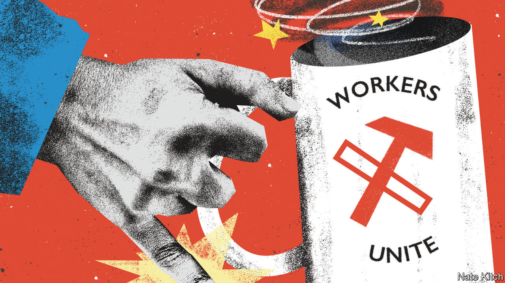

###### Bagehot

# The rise and fall of class dysphoria in Britain 

##### British politicians have stopped pretending when it comes to class 

 

> Oct 26th 2023 

For a brief period in the middle of the last decade, the easiest way to flummox a Labour politician was to offer him a cup of coffee and a choice of biscuit. In an interview in 2016 Owen Smith, a former Labour MP, panicked when a waiter brought him a “frothy coffee” in a cup and saucer. “Seriously, I would have a mug normally,” he said, playing up his credentials as a mug-toting, working man and forgetting the word for “cappuccino” in the process. 

This was an era when anything slightly middle-class was to be spurned. When  was campaigning to be Labour leader in 2015, he was asked to name his favourite biscuit. He replied: “Give me a beer and chips and gravy any day.” It did not make him sound working-class; it made him sound like an alcoholic. Politicians struggled with their identity. Class dysphoria reigned.

Class was once a source of certainty rather than confusion in British politics. “Class is the basis of British party politics,” wrote Peter Pulzer in 1967. “All else is embellishment and detail.” In this rough-and-ready telling, working-class voters backed Labour and middle-class ones supported the Tories. This changed after 1979, when Margaret Thatcher lured the skilled working classes to her cause, throwing allegiances into flux. Parties have been riddled with class dysphoria ever since, confused whether to portray themselves as soft-handed professionals or doughty sons of toil. 

In the 1990s and 2000s, appearing middle-class was the order of the day. Sometimes this meant travelling down the social ladder. When  first entered the Labour Party he sounded like an Oxford-educated barrister who had attended Scotland’s poshest boarding school. By 1997 he sounded like an Essex grammar-school boy. When he led the Tories in opposition, David Cameron, an Old Etonian, pledged to send his children to state school. No one admitted to being a member of the working class, who were increasingly portrayed as fecund jobless scroungers in BBC comedies and Channel 4 documentaries. “We’re all middle-class now,” declared John Prescott, Mr Blair’s deputy, who left school at 15 to join the merchant navy.

By the mid-2010s, a sort of inverse aspiration had taken over. “Chavs: The Demonisation of the Working Class”, a book by Owen Jones, a left-wing writer, proved a surprise hit. In Westminster Britain’s working classes were transformed from underclass to noble savages and a source of political wisdom. Boris Johnson, another Old Etonian, painted himself as their whisperer. After the Brexit referendum in 2016 policies were analysed only as to whether they appealed to an imagined working-class voter: generally a Leave-voting man in his 50s with reactionary views. It was this voter, in the eyes of British politicians, who handed the Conservatives a fat majority in the 2019 general election. 

Skip forward four years and class dysphoria is, mercifully, on the wane. Partly it is disappearing due to its own absurdities. With a net worth of about £529m ($642m), Rishi Sunak and his family are simply too rich to pretend to be anything else. “You’re stinking rich, right?” asked one interviewer. “I think most people would consider I’m financially fortunate,” replied Mr Sunak. Mr Sunak flies in a helicopter because he is the prime minister of a G7 country and his time is short, stumping up himself when the trips are personal. His negative ratings rival Boris Johnson’s at his nadir, but taking the train will not reduce the strain. 

Voters are less resentful about this than politicians have long assumed. Mr Sunak spends £45,000—or a little under half his net salary as prime minister—on sending his two children to prep schools, with little protest from political opponents. At the start of the year he admitted he had used private health care; polls suggested a majority were perfectly fine with that. In contrast, at the height of the banking crisis in 2008, an ill Peter Mandelson, a former cabinet minister, asked Gordon Brown for permission to see a private doctor (“I’m dying”). Mr Brown refused and instead suggested the then health minister, a surgeon, should have a look. 

The proverbial , who delivered Labour heartlands to the Tories in the last election, matters far less than he did. Labour is so far ahead in the polls that the Conservatives have to focus on defence rather offence, ensuring long-held seats in southern England do not fall rather than maintaining the gains of 2019. What placates a 54-year-old man in Sedgefield in the north-east may not appeal to a 38-year-old woman in Surrey. To govern, the Conservatives have to win seats like Sedgefield. To continue to exist, the party must hold Surrey. The latter question is more pressing. A middle-class party has to look after the middle classes. 

Class dismissed 

Labour, too, no longer has to pretend to be something it is not. The shadow cabinet has a working-class background. In Mr Blair’s government about a third of ministers were educated privately; Harold Wilson’s cabinets boasted a similar proportion. Only four of the current 31-strong shadow cabinet went to private schools. Some in the shadow cabinet have genuinely deprived origins. Angela Rayner, who would be deputy prime minister in a Labour government, grew up on a council estate and was a teenage mother. One grandparent of Wes Streeting, the shadow health secretary, was an East End armed robber, notorious for wearing a grotesque rubber mask he nicknamed “Claude”. 

Voters do not seem to have noticed. In focus groups, people assume Sir Keir Starmer’s knighthood was inherited. That may be because the Labour leader’s sincere interest in football sounds confected (when asked what he liked most about the sport, Sir Keir chose “goals”). Or because he talks about growing up in a perfectly normal pebble-dash semi-detached house, when there is nothing weirder than talking about being normal. But given the polls, it may also be that they don’t care. When standards of living are being squeezed and public services are failing, questions of identity fall by the wayside. Never mind how people take their coffee. ■


