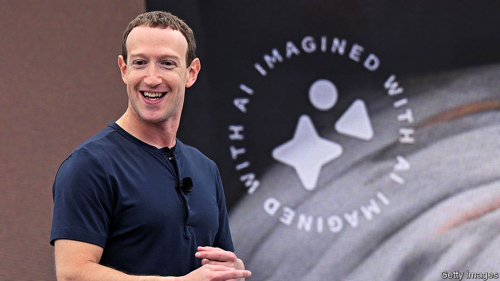
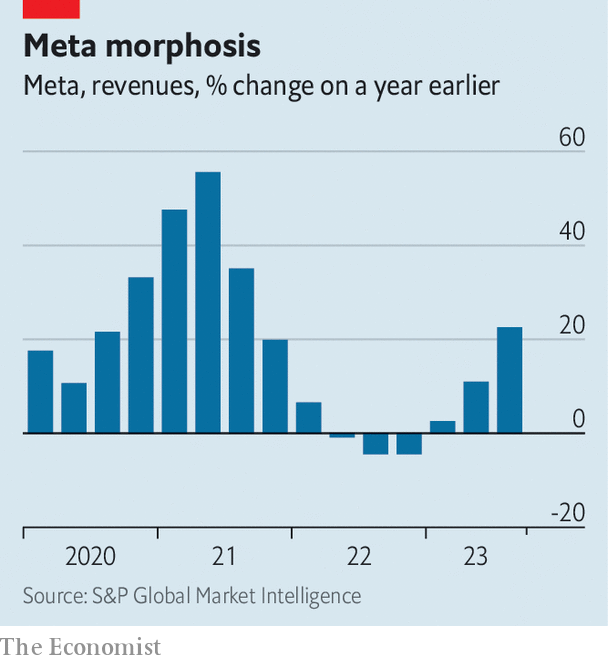

###### A year in the life of Meta

# How Mark Zuckerberg escaped a metaverse-sized hole 

##### His long-term bet still stands, though 

 

> Oct 26th 2023 

IT HAS BEEN quite a year for Mark Zuckerberg. The co-founder of Facebook, a social-media Goliath now called Meta, is no stranger to public rebuke. But exactly a year ago even investors appeared to throw in the towel, accusing him of trashing the core business while lavishing money on his pharaonic dreams for the metaverse, a virtual world where he alone appeared to float in a deluded fantasy realm. On the day Meta issued weak third-quarter earnings last year, its share price fell by more than a fifth. Zuck’s name was mud.

In the year since it has been rehabilitated. Meta’s core business—engaging 3.1bn people a day on Facebook, Instagram and WhatsApp, and selling advertisers access to their attention—is back to rude health. On October 25th the company reported revenues of $34.1bn in the third quarter, up by 23% year on year. That was the sharpest rise since the digital boom of the covid-19 pandemic. Net profits more than doubled to $11.6bn. Meta’s share price has risen by 250% since last year’s nadir. 

 


In the media, Mr Zuckerberg gets little credit for his business nous. There is more focus on other stuff: his recent passion for martial arts; the cage fight with Elon Musk that never happened; public haranguings, such as lawsuits filed by dozens of American states on October 24th, alleging that Meta intentionally sought to make users addicted to Facebook and Instagram. And yet, in the space of a few months late last year, he made two transformative business decisions that were remarkable for their humility and agility—all the more so, given that he controls 58% of the firm’s overall voting rights and barely needs to work, let alone listen to shareholders. 

In response to investor pressure, Mr Zuckerberg performed one of the fastest pivots in tech history. Within a fortnight of the third-quarter rout he slashed Meta’s spending plans, cut costs and fired staff. And in response to OpenAI’s ChatGPT and the blaze of excitement around generative artificial intelligence (gen AI for short) he launched an internal revolution aimed at using the technology to galvanise Meta’s core business. Those manoeuvres reveal a lot about Mr Zuckerberg’s leadership style. They may even end up vindicating his faith in the metaverse.

When Mr Zuckerberg realised he had incensed investors, those around him say, he did not panic. He became methodical. As Nick Clegg, a close adviser to Mr Zuckerberg, explains, his boss doesn’t like people around him “shouting and yelling”. He prefers, like an engineer, to break down a problem to its component parts and decide on a course of action. In this case, he understood that his long-term focus was at odds with investors’ short-term horizons. So he decided to “cut his cloth accordingly”. But he kept many of his long-term investment plans intact, emphasising that they mainly concerned AI, not the metaverse. That emphasis looked shrewd weeks later, when ChatGPT burst onto the scene.

Meta had spent years building up its AI infrastructure. Rather than creating chatbots, it was looking for ways to use AI to improve engagement and make its ad business more efficient, as well as working on mixed-reality headsets for the metaverse. Its top brass soon realised they had all the ingredients—enough data centres, graphics processing units (GPUs) and boffins—to make the most of gen AI. By February they had worked out what to focus on. By July they had made their Llama 2 large language model available free of charge to developers. In September they announced the first gen-AI-related gadgets, such as smart spectacles. Mr Zuckerberg, for his part, threw himself into the technical nitty-gritty. His competitive instinct awakened. He appears to have been rejuvenated by working on a new technology rather than on the irksome task of cost-cutting.

Making Llama open-source helped turn Mr Zuckerberg from Silicon Valley’s villain to its hero. Leigh Marie Braswell of Kleiner Perkins, a venture-capital firm, says startups “really applauded” the move, which helped many develop AI-related businesses. And gen AI may be no less transformative for Meta itself than for Microsoft and Alphabet, owner of Google, whose early bets on proprietary large language models have attracted most of the attention.

Start with engagement. Meta is populating its social-media platforms with chatbot avatars which, it hopes, will increase the amount of time people spend on their feeds, and help businesses interact with customers on messaging apps. Some users call them a bit humdrum, probably because the firm is worried about AI’s “hallucinations”. Nonetheless, there is potential. Take Jane Austen, an avatar that emulates the author’s haughty humour. When asked to describe Mr Zuckerberg, she says he is “bright, driven but perhaps a bit too fond of his own ideas”. She describes the metaverse as a “virtual world where people can escape reality and live their best lives. Dear me, how…unromantic.” 

More compelling in the near term is AI’s potential for advertising. Since Apple restricted Meta’s ability to track user data across third-party apps on iPhones, Mr Zuckerberg’s firm has had to overhaul its advertising business “down to the studs”, says Eric Seufert, an independent analyst. It has done that fairly effectively, he thinks, by using AI to model user behaviour, rather than tracking the behaviour itself. Last year the company rolled out ad technology called Advantage+, which used AI to automate the creation of ad campaigns. Brent Thill of Jefferies, an investment bank, says that advertisers are impressed. J. Crew Factory, a clothing retailer, has told Meta that the features boosted its return on ad spending almost seven-fold. 

Gen AI could take automation further. This month Meta launched tools that let advertisers instantly doodle with different backgrounds and wording. These are baby steps so far, but Andy Wu of Harvard Business School likens them to the start of a gold rush. He says that by creating gen-AI-infused ad campaigns Meta could benefit from the technology as much as Nvidia, the leading maker of GPUs. 

Advertisers have their concerns. An ad man at AdWeek NYC, an industry jamboree, described Meta’s AI-assisted campaigns as “black boxes” where it controls all the data. That gives it huge influence over a brand’s identity, which could be tarnished if the AI goes rogue. Others worry about AIs doing untoward things to boost engagements on Meta’s social networks, which could hurt brands by association. Controversies over fake images of the conflict in Gaza on social media illustrate how fraught the terrain remains. Not everyone is convinced by Mr Clegg’s insistence that Meta is prepared for this thanks to years of investment in safety and platform integrity.

Some investors, too, remain sceptical. Mark Mahaney of Evercore ISI, another investment bank, reckons that 95% of them would prefer Mr Zuckerberg to spend less on the metaverse. Many are wary of investments in hardware, such as virtual-reality headsets, which tend to generate lower margins than digital products. 

Still, Mr Zuckerberg has “not resiled at all” from his long-term bet, Mr Clegg says. Some VR enthusiasts see AI as the metaverse’s saviour, helping with the development of crucial hand-tracking technologies and making it cheaper for creators to build three-dimensional worlds. Meta’s Smart spectacles, integrated with its chatbot, MetaAI, and built by Ray-Ban, offer a hint of things to come. They capture what the wearer sees, can live-stream it on social media, and answer questions. Asked for sources on critical thinking in business, the AI replied “”. Smart, smarmy or scary? Take your pick. ■


