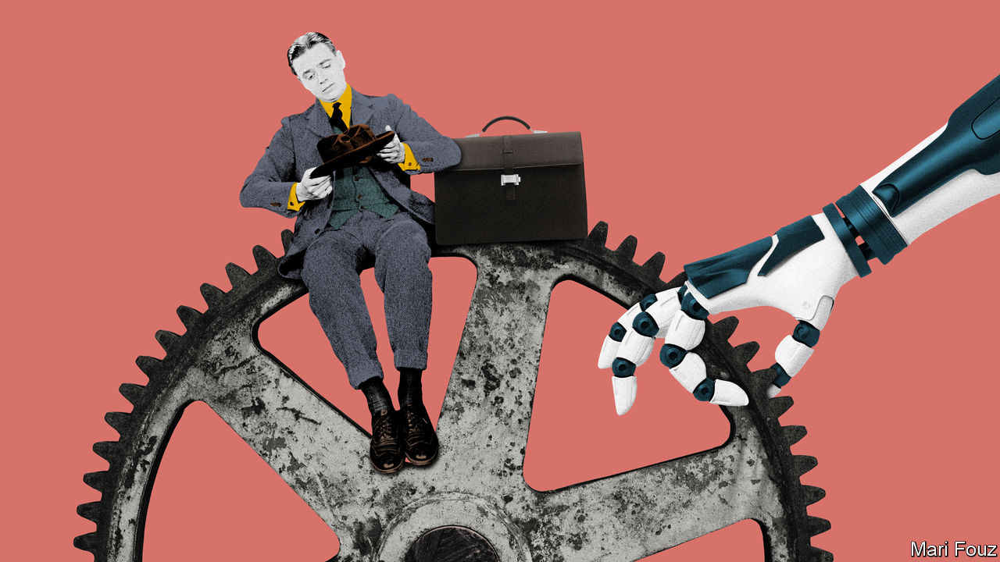
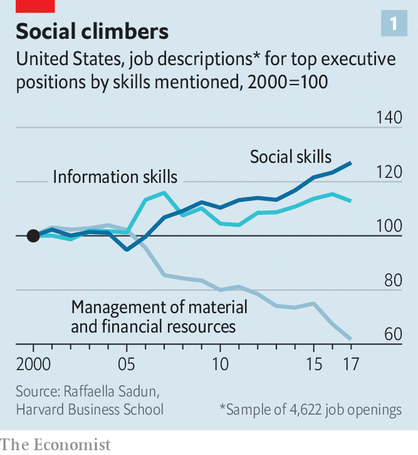
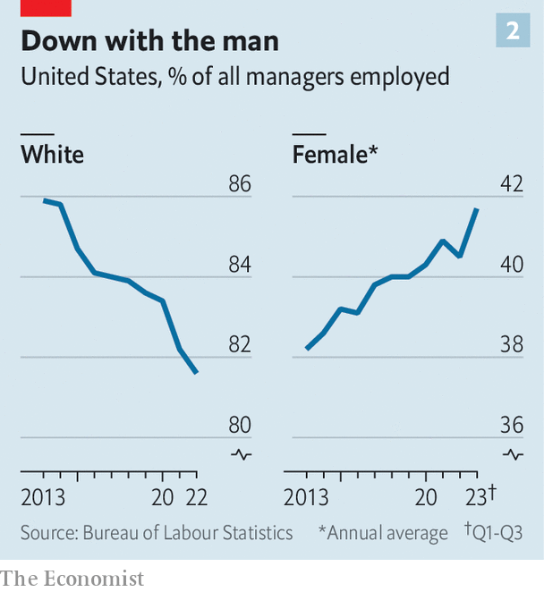

###### The impossible job

# Pity the modern manager—burnt-out, distracted and overloaded 

##### Corporate leadership is more daunting, but also more important, than ever 

 

> Oct 24th 2023 

MANAGERS DO NOT make for obvious objects of compassion. It is hard to feel sorry for the , let alone the big-shot chief executive who pockets millions of dollars a year in compensation. Yet their lot deserves scrutiny and even some sympathy. From the corner office to the middle manager’s cubicle, the many  are intensifying. 

A recent survey of workers in 23 countries by Adecco Group, a recruitment and outsourcing firm, found that 68% of the 16,000 managers in the sample suffered burnout in the past 12 months, compared with 60% for non-managers, and up from 43% the year before. “I feel like I jumped on a treadmill where someone controls both the incline and the speed,” says a big-tech executive with a sigh. Plenty of his peers share the sentiment. Managers increasingly require literal stamina: recruiters report that firms often ask candidates for executive positions how much they exercise.

That is a problem not just for the haggard individuals, but also for their employers and, given the boom in management jobs in recent decades, whole economies. Today America has 19m managers, 60% more than in 2000. One in five employees at American companies manages others. 

As firms in knowledge industries automate routine tasks and rely on the same digital tools—Amazon Web Services, Gmail, Microsoft office software—it is better management, not investments in technology, that can give them a competitive edge. Poor management can blunt it, by killing productivity and raising staff turnover. According to a Gallup survey from 2015, half of Americans who left a previous job did so because of a bad manager. Last year McKinsey, a consultancy, found that a similar share of job-leavers said they did not feel valued by their managers.

The value of good management, then, is rising. At the same time, the environment in which managers do their job is being transformed. This new landscape rewards some skills more and some less than in the past. As a result, your manager tomorrow will not look the same as your parents’ did. 

Until the 2000s, remembers Christoph Schweizer, boss of BCG, a consultancy, “CEOs were superheroes”: larger than life, seldom wrong, never in doubt. For all manner of executive, “the highest compliment was ‘brilliant’,” says Hubert Joly, who ran Best Buy, an electronics retailer, and now teaches at Harvard Business School (HBS). 

 


Intellect still matters. A study of Swedish bosses found that the typical head of a large firm was in the top 17% of the population by IQ. But across all layers of management, the emphasis has gradually shifted towards softer social skills, such as clear communication, ability to build trust and willingness to show vulnerability. Executives, including CEOs, need to be comfortable with uncertainty, and happy to delegate even the strategic responsibilities that they would once have hogged, observes Nitin Nohria, a former dean of HBS. (Mr Nohria is also chairman of Exor, which part-owns ’s parent company.)

David Deming of Harvard University has found that the number of jobs that require social interaction is rising faster than average, as are wages for such roles. A study of executive job listings, by Raffaella Sadun of HBS and colleagues, found that between 2000 and 2017 descriptions mentioning social skills rose by nearly 30%. Those singling out an ability to manage financial and material resources declined by 40% (see chart 1). The most common goals requested by firms that employ management coaches for their managers on EZRA, Adecco’s coaching platform, include communication, emotional intelligence, building trust and collaboration. One of the hottest courses at Stanford University’s Graduate School of Business is “Touchy Feely”, which teaches students to assess how they come across to others.

Social skills are increasingly sought-after because they enable better co-ordination of people, goals and resources. And 21st-century business requires more such co-ordination than ever. Managers once used to supervise individuals performing repetitive tasks. Today they often oversee professionals working in teams on complicated projects with outcomes that are hard to measure with precision. The world outside the firm is becoming more complex, too. All this means that, as Mr Deming remarks, “it takes more time to converge on a decision.” A good manager, whose main role boils down to that of co-ordinator, can cut this time. This ability to get disparate people and goals to coalesce smoothly is thus at a premium, especially relative to purely intellectual and technical skills. 

One thing making co-ordination harder is an otherwise welcome development—greater workforce diversity. For much of the 20th century in America the manager and the managed were the same white men. “You used to run mini-mes,” says Nicholas Bloom of Stanford University. That, Ms Sadun notes, meant managers could be assumed to possess an implicit “theory of mind” of their underlings—an intuitive understanding of how they thought and felt about the world. 

 


This is, thankfully, no longer a safe assumption. In America, women make up 42% of managers, up from 38.5% in 2010. Between 2013 and 2022 the share of non-whites in managerial posts has risen from 14% to over 18% (see chart 2). Women and non-whites are still underrepresented in such roles, relative to their share of America’s population; non-white employees in particular are likelier than white colleagues to leave a job because they didn’t feel they belonged at their companies. But progress is undeniable. Diversity has, says Mr Nohria, “caught up with us”.

The problem for managers, be they women or men, white or not, is that putting yourself in subordinates’ shoes is no longer automatic. Because you cannot assume you know what others are thinking, you need keen social “antennae”, Mr Nohria observes. Hybrid work, where managers, in Mr Bloom’s words, “adjudicate private lives” via decisions about home-working, makes the task even more delicate.

Like diversity, the post-pandemic spread of remote work brings benefits while raising co-ordination costs. Running a workforce virtually imposes what organisational scholars call “management overhead”. Even when the network connection is not patchy and people don’t forget to unmute themselves, virtual meetings strip out lots of signals, such as eye-contact and gestures. They are more tiring; one study found that people speak more loudly on Zoom than face-to-face. 

And they are taking up more and more of managers’ time. A study by Microsoft of 31,000 corporate users of its 365 office software in 31 countries found that in March 2023 the average person participated in three times as many Teams video-conferencing meetings and calls as in February 2020. In roughly the same period the typical user sent 32% more chat messages. 

The number of unscheduled calls rose by 8% between 2020 and 2022, to 64% of all Teams meetings. Some 60% of such encounters are now under 15 minutes. Shorter activities probably mean more interruptions, says Ms Sadun. Two in three workers in the Microsoft study complained they did not have enough uninterrupted focus time during the workday. “Work has become more staccato,” sums up Jared Spataro, who oversaw the research at Microsoft. That, Ms Sadun adds, imposes a heavy cognitive cost—and may explain some of the troubling burnout numbers. 

Focus is scarcer for executives, too, including CEOs. When Ms Sadun and co-authors looked at how 1,100 bosses in six countries spent their time, they discovered that only a quarter of their working days involved being alone, and some of that was taken up by writing emails. A long-running study of 27 leading chief executives’ time use by Mr Nohria and Michael Porter found that bosses often used long-haul travel to think. The post-pandemic decline in business trips means there is less of this time to recoup. If the composition of executives’ working hours reflects the relative value of the things those hours consume, then co-ordination outweighs pondering strategy. 

 


A final thing that may lift the premium for social skills is technology. Ever since ChatGPT, an artificially intelligent chatbot developed by a startup called OpenAI, took the world by storm a year ago, progress in AI has kicked up a notch. Boosters argue that machines can take on some of the tasks that would in the past have required “brilliance”, to echo Mr Joly. The comparative value of the non-artificial intelligence required to perform them may decline. OpenAI’s boss, Sam Altman, went so far as to declare that the cost of intelligence is “going to be on a path towards near-zero”. 

It is unclear when—if ever—AI will live up to such bold forecasts. But it is likely to have at least some effect on the practice of management and the competences required for it. Fully 70% of respondents told the Adecco survey that they were already using “generative” AI at work. Mr Spataro of Microsoft (which has a big stake in OpenAI) says that managers are such tools’ most effective users. “They treat it as the newest member of the team, and delegate tasks to it.” And not just routine administrative chores: nearly 80% of people in Microsoft’s study said they would be comfortable using AI for analytical work; three-quarters said the same of creative work. 

Managers are not about to become clueless empaths. Many still seek old-school markers of good management. Those on Adecco’s EZRA platform are much likelier than their employers to ask for coaching on strategy, individual development and articulating ambition, and much less likely to pick emotional intelligence, trust-building and collaboration (see chart 3 on previous page). Maybe more popular still than Stanford’s “Touchy Feely” course is “Paths to Power”, in essence a how-to guide for aspiring Machiavellian princes.

These competing priorities may be why so many managers feel overwhelmed. The new model of management, which favours social aptitude and co-ordination skills, is taking hold before the old one, which rewarded expertise and intellect, has loosened its grip. Amid all this managers are, in the words of Denis Machuel, head of Adecco Group, “lost in translation”. The quicker they find themselves, the better: for them and their employers alike. ■


