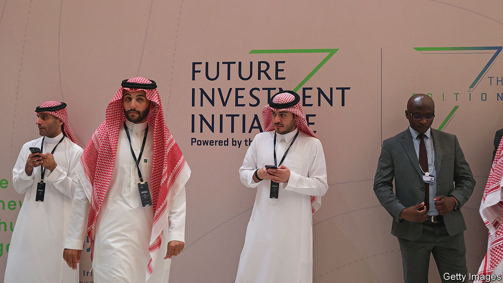

###### Business oasis

# The mood at Davos in the desert is one of anxiety 

##### A postcard from the Middle East’s premier business gabfest 

 

> Oct 26th 2023 

IN SOME ways, big business pow-wows are all alike. Talking heads make over-the-top predictions. The world’s problems are packaged into bite-sized quotes. Chief executives vie to use as many words as they can to say as little as possible. So too at the seventh Future Investment Initiative in Saudi Arabia’s capital, Riyadh, on October 24th-26th. 

Dancers in space-age suits rocked the stage and a young operatic star wowed the audience at the opening session. Large futuristic screens flashed buzzwords —AI, data, sustainability—in an arena fit for e-sports. Corporate and financial bigwigs engaged in a pretend boardroom dialogue at a roundtable in the centre of the conference’s main hall to discuss the state of the world. Drones hovered overhead.

But Davos in the desert, as the event is better known, is singular. Unlike at others, including its European namesake, billions of dollars in deals get signed on the sidelines. It is also even harder to get in. This year, for the first time, the organisers charged a fee of as much as $15,000 per person—steep as talkfests go. That, as one financier put it, filtered for “more high-quality people”. 

The mood among this select crowd was unusually tentative. Techno-optimism about artificial intelligence and medical advances was tempered by an acceptance that the energy transition is perhaps not just around the corner. The metamorphosis of Saudi Arabia from a joyless outpost of orthodox Islam into a bustling business hub—”so dramatic”, gushed Jamie Dimon, boss of JPMorgan Chase, America’s biggest bank—stood in contrast to the war raging in Gaza between Israel and the militant Islamists of Hamas. Business leaders worried how quickly the conflict was escalating. They pondered Saudi Arabia’s role in navigating the tensions. It is the regional giant and the hostilities threaten its ambitious economic blueprint, which seemed like it might involve normalising relations with Israel. 

Beyond the regional turmoil, inflationary pressures, especially on wages, and huge fiscal deficits in many countries weighed on participants’ minds. Ray Dalio, founder of Bridgewater Associates, the world’s biggest hedge fund, declared that he was pessimistic about the global economy in 2024. The chief executive of Goldman Sachs, David Solomon, pointed to deep uncertainty that has left business bosses feeling on edge. 

Another Wall Street stalwart, Jane Fraser of Citigroup, summed it up. “It’s hard not to be a little pessimistic,” she said, noting that global risks were increasingly interconnected and that security was becoming one of the biggest concerns. As Ms Fraser put it, businesses will increasingly need “big ears and thick skin”. Not just to prosper, she might have added, but to survive.■


