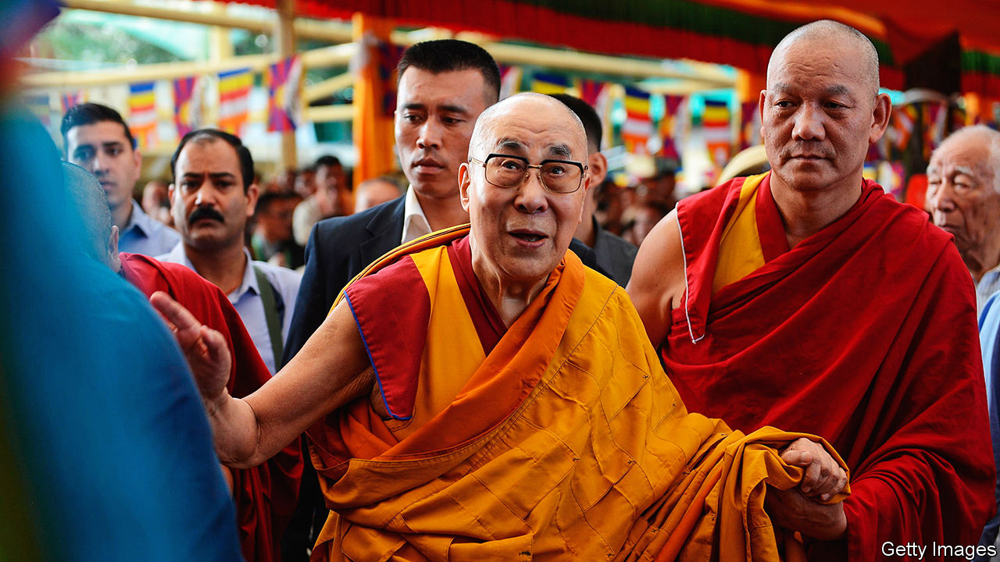
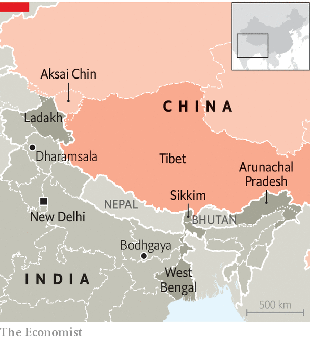

###### Treading gingerly

# Why China and India are watching the Dalai Lama closely 

##### As he ages, his movements and health are under scrutiny 

 

> Oct 26th 2023 

Not so long ago, the Dalai Lama’s travel schedule was packed. In the six decades after Tibet’s spiritual leader fled to India in 1959, he visited dozens of countries, meeting royalty, religious leaders and four sitting American presidents along the way. Recently, he has slowed down. One reason is his age (he is 88). Covid-19 complicated travel too, as did the penalties exacted on his hosts by China, which considers him a separatist. But while he has not been abroad since 2018, he has committed to keep travelling within India. 

So there was understandable concern among exiled Tibetans and their sympathisers in October when the Dalai Lama cancelled four trips in India. They included one to the north-eastern state of Arunachal Pradesh that was particularly sensitive. China claims the state as its territory and briefly occupied much of it during a month-long war with India in 1962. The dispute over it and other border areas has reignited since the Dalai Lama last visited Arunachal, to China’s fury, in 2017.

 


The Dalai Lama’s representatives blame the cancellations on a recent bout of flu. But they are quick to add that there is no serious threat to his health, noting that he has resumed regular activities in his adopted home of Dharamsala in northern India. They are tight-lipped on whether India’s government, which they normally consult before any such travel, requested that he put off the Arunachal trip. 

Indian officials did not respond to requests for comment on the issue. They have in the past said the Dalai Lama is free to travel anywhere in India. Last year they helped to arrange his visit to the Indian region of Ladakh, the site of recent border clashes with Chinese troops. 

Either way, the cancellations hint at the fraught geopolitics surrounding the Dalai Lama in his later years. Not only could his activities, especially in border areas, provoke a fresh crisis in volatile India-China relations. His health is also a growing concern for Indian and Chinese officials, not to mention Tibetan Buddhists. All are bracing for a potentially disruptive period after his death, when China is expected to appoint a rival successor to the one who, according to Tibetan Buddhist tradition, is likely to be  by his aides.

The first sign of change in the Dalai Lama’s plans came when his office announced that a visit scheduled for October 16th-22nd to the north-eastern state of Sikkim and neighbouring West Bengal was postponed because of flooding. Then local media reported on October 10th that he had cancelled a visit to Arunachal that its chief minister had said would occur in October or November (and for which a preparatory meeting was held in September). 

The Dalai Lama’s office issued a statement on October 20th saying that because of his recent flu he would not visit Sikkim in November either, and would cancel a planned trip to southern India in the coming weeks. The Dalai Lama’s doctors “have strongly advised that any travel will be taxing”, said the statement. It added that he would go to Bodhgaya, in eastern India, in December, but did not mention Arunachal, the birthplace of a previous Dalai Lama.

Tenzin Lekshay, a Tibetan government-in-exile spokesman, says the Arunachal trip was never officially confirmed by the Dalai Lama’s office and that several factors might have affected discussions about it, including his health, Arunachal’s harsh terrain and the diplomatic implications. Wherever the Dalai Lama travels, he “does not want any inconvenience to the host country,” says Mr Lekshay.

The timing is sensitive for both China and India, whose territorial dispute also involves the Chinese-held region of Aksai Chin, which India claims. In recent years the dispute has flared anew with several clashes along the de facto border. One in 2020 killed 20 Indian troops and four Chinese ones in the worst violence there since 1967. Another on the frontier with Arunachal in December last year caused minor injuries on both sides. 

China has also recently reasserted its claim to Arunachal, which it calls Zangnan, meaning South Tibet. The country has issued its own names for villages there and an official map showing Arunachal within its borders. In response, India lodged protests and sent its defence minister, Rajnath Singh, to Arunachal on October 24th. 

Stepping back

Despite such dust-ups, neither side seems to want a conflict. Indeed, as a result of talks between military commanders since June 2020, China and India have pulled troops back from most of the border flashpoints, establishing buffer zones free of any patrols. The gradual detente suggests that Xi Jinping, China’s leader, is keener than in recent years to stabilise relations with India, perhaps to discourage it from forging closer military ties with America. Chinese officials also hope to undermine international support for Tibet, especially in India, after the Dalai Lama’s death.

Stabilising the border appears to be a priority for India’s prime minister, Narendra Modi, as well. He needs Chinese imports to achieve his economic goals. With a general election due in 2024, he might also fear that, given China’s military superiority, further clashes could undermine his popularity. But he does not want to be seen as capitulating to China’s demands. Political opponents accuse him of ceding territory too easily. And the Dalai Lama is broadly popular in India.

Meanwhile, the Tibetan government-in-exile has to balance concerns about the Dalai Lama’s health with the need to promote its cause, including among Tibetans in India (tens of thousands of Tibetans have left India in the past decade or so). But it must also maintain support from India, which it hopes will help legitimise and provide refuge for a reincarnation of the Dalai Lama chosen by his followers. “We would like to believe that India will extend the same accord to the next Dalai Lama,” Penpa Tsering, the head of the Tibetan government-in-exile, said in September. As for the current Dalai Lama, he says he will work out details of his reincarnation once he is “about 90”. He often predicts that he will live beyond 113. ■

