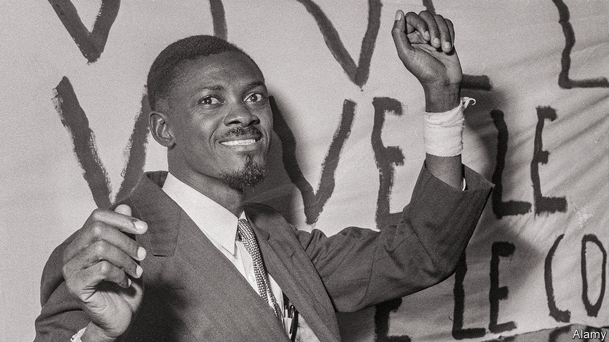

###### A true-life African murder mystery

# CIA plots, coups and a gold-capped molar in Congo 

##### A new book traces the rise and demise of Patrice Lumumba 

 

> Oct 26th 2023 

 By Stuart Reid. 

Patrice Lumumba was prime minister of newly independent Congo for less than three months in 1960, before he was murdered at the age of 35. Yet his —and gruesome death—set a pattern for coups and post-colonial interference that shaped Congo’s torrid path, as well as the gameplan for CIA interventions and assassinations worldwide. 

“The Lumumba Plot” by Stuart Reid, an editor at is many things at once: a biography, a history of Congo’s chaotic independence, a dissection of the ’s first big peacekeeping mission and a thriller about plots to kill Lumumba. There are villains of every stripe, from rogue Belgian pilots to shamelessly scheming UN officials and racist ambassadors. This is a tragic tale but also a rollicking read. 

Heroes are in short supply. The charismatic Lumumba repeatedly auditions for the role with stirring calls for Congolese independence and unity, but he is too egotistic and impulsive. As a young postal clerk he embezzled two years’ worth of salary from his job. As prime minister, he agreed to a 50-year, $2bn contract for the country’s mineral and hydroelectric resources with a dodgy financier in Delaware—without consulting his economy minister. (He managed to wriggle out of it.) 

The overwhelming tension in post-independence Congo, a country four times the size of France, was between , and the elected prime minister, Lumumba. Frequently racist Belgian officials were angered by Lumumba’s anti-colonial rhetoric, including an unscheduled speech at the independence ceremony. “We have suffered contempt, insults and blows morning, noon and evening, because we were Negroes,” he declared in front of the fuming Belgian king. Lumumba, having won independence on paper, wanted it in practice. 

He did not get it. Belgium was soon plotting to assassinate him, at one point hiring a Greek hitman who took the money and ran, and backed the secession of an eastern province, Katanga, in order to retain influence and loosen Lumumba’s grip on power. Lumumba then called the UN, which launched its first big peacekeeping mission. That descended into chaos, as Lumumba railed against the UN’s reluctance to kick out the Belgians immediately and reconquer secessionist Katanga.

Ignorant American officials interpreted Lumumba’s anti-imperialism as communism. Mr Reid argues convincingly that Lumumba was willing to appeal to the Soviets to help chuck out the Belgians but that he was not red. Even , the Soviet leader, was baffled that America did not see Lumumba as a natural ally. (“Really, are the Americans that stupid?” he asked.) The CIA’s fears of Lumumba’s communism eventually led Dwight Eisenhower, America’s president, to order his assassination. (Some dispute how direct the order was, but Mr Reid leaves little doubt.)

What followed was a string of failed CIA plots involving injecting poison into his toothpaste and trying to snipe him. “The hunting is good here when the light’s right,” wrote , the CIA station chief, and asked headquarters to send him a “high-powered, foreign-make rifle with a telescopic sight and a silencer”. 

Lumumba was ultimately undone by a coup, the first in post-colonial Africa, carried out by  and backed by the CIA. The American ambassador told Washington that Mobutu was “completely honest”. (He would later rule Congo kleptocratically for 32 years.) Lumumba was handed over to secessionists in Katanga where, within hours, he met a predictably grisly death. Congo has been ruled despotically ever since. 

Mr Reid seems keen to pin the blame for Lumumba’s demise on Americans. Yet Belgium, like America, had tried to assassinate Lumumba and also backed the secessionist province where he was murdered. Two Belgians oversaw his torture (which included stuffing splinters under his toenails) and murder by gunfire. Two of Lumumba’s gold-capped molars were all that remained after another Belgian dug up his body and dissolved it in acid to hide the crime. One tooth wound up in Brussels—until its return to Congo last year. 

Lumumba’s life might seem of a distant, dramatic era. Yet this story feels timely. In Africa coups are back in fashion, as is anti-colonial rhetoric, especially against France. Western fears about Russian  are rightly resurgent. And as Congo prepares for an election in December, another disappointing UN peacekeeping mission has been asked to leave. 

People trying to understand Congo today should glean lessons from Lumumba’s short life, such as the danger of seeing Africa solely through the lens of great-power rivalries. But memories are short. Some 15 years after Lumumba’s death, Richard Helms, a CIA official, told a Senate inquiry: “I am relatively certain that he represented something that the United States government didn’t like, but I can’t remember any more what it was.” Stumped, he asked for help. “What was wrong with Lumumba? Why didn’t we like him?” ■

