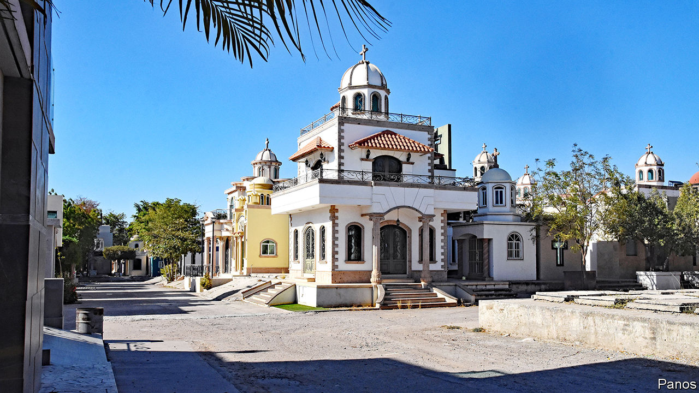

###### The architecture of death

# Drug lords’ tombs are monuments to opulence 

##### In a Mexican cemetery, bling-bling burials lionise the dead 

 

> Oct 26th 2023 

On November 1st and 2nd millions of Mexicans will visit cemeteries to celebrate the Day of the Dead. The tradition, a fusion of Catholic and indigenous belief, holds that the dead briefly come back to join the living. Families play music and decorate loved ones’ graves with orange  flowers, banners and . 

The celebration will be extravagant in Jardines del Humaya (Humaya Gardens), which is the country’s most visually spectacular burial ground. It is in the north-western state of Sinaloa, a hub of Mexican drug gangs, which started off growing marijuana before turning to cocaine trafficking and, more recently, . Humaya Gardens hosts a “who’s who” of dead narcos. Many were members of the Sinaloa cartel, formerly run by Joaquín “El Chapo” Guzmán, who inspired a television series and now festers in an .

The cemetery itself looks like a swanky nouveau-riche development. (Some refer to this flashy style of architecture as “narcdeco”.) The multi-storey, multi-plot mausoleums are larger than most Mexican homes. Many are gaudy. There is a mini Taj Mahal and an imitation Greek temple. Some have cupolas; others boast angels or statues of saints. There is a lot of marble and some stained glass. At least one has bulletproof-glass windows. Rumour has it that some of the mausoleums cost hundreds of thousands of dollars to build. 

The tombs are as luxurious inside as outside. Many have air conditioning, water and Wi-Fi—incentives for relatives to visit. Some have bedrooms or benches outside to bask in the sun. The main chamber features a photo of the dead—almost always a young man. Many pose with guns; one has a display of knives in the tomb. Around them sit knick-knacks, from teddy bears to bottles of tequila. 

Throughout history wealthy and powerful people have erected impressive tombs: consider the pyramids for Egyptian pharaohs and the Taj Mahal, where the Mughal emperor Shah Jahan and his wife are buried. “Like the real Taj Mahal, these are monuments to a person,” says Juan Carlos Ramírez-Pimienta of San Diego State University-Imperial Valley, who studies Mexican culture.

While alive drug barons are immortalised in , ballads about the drug world. “It is part of a masculine culture of legend and honour,” says Deborah Bonello, the author of  about women in the drugs trade. Their lives are often short: most photos show men in their 20s or 30s. But like others in Mexico, narcos are often religious and want a proper burial. 

The first construction in Humaya Gardens began in 1969. (Ordinary people are buried there, too, in much more modest one-plot graves.) But it was in the 1990s that many of the grandest tombs started to be erected. This coincided with a crackdown on gangs, known as the “war on drugs”, which left more people dead, as well as the development of a more flashy and excessive (the lifestyle of drug traffickers). 

A trade that originated with farmers is now urban and more violent. According to Ms Bonello, “El Chapo was respected and feared, while the Chapitos [his sons] are only feared.”  Mexico has more vigorously policed drug cartels, so narcos have had to become more discreet; once they die, the need for discretion perishes. 

Some feel the tombs glorify narcos and have criticised Mexico’s government for not shutting down the cemetery. In Chile the government has recently demolished several narco burial sites. But it is harder to do this in Sinaloa, because the power of drug lords is so entrenched there, says Juan Carlos Ayala, a professor at the Autonomous University of Sinaloa. 

Many men in Sinaloa aspire to join gangs and do not struggle to find wives. Unlike gangs elsewhere in Mexico, the Sinaloa cartel has convinced locals that it does not prey on them. “Here they are part of the social fabric,” says Mr Ayala. “There is no clear line between them and us.” Until death, that is, when some get tombs fit for kings and others simple graves. Death is not such a great equaliser after all. ■


