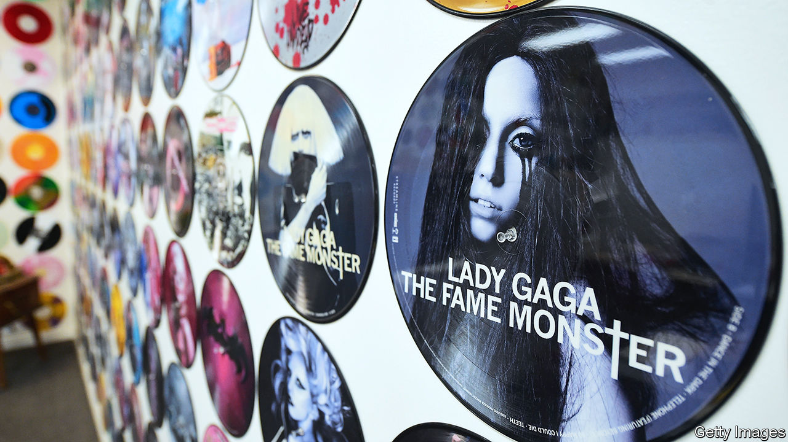

###### In a spin

# How superstars and heritage acts hijacked the vinyl revival 

##### Smaller names are being squeezed out of the format they regenerated 

 

> Oct 23rd 2023 

WHEN THE  released their debut album in 1964, fans rushed out to shops to buy the LP. When the rockers put out “Hackney Diamonds” on October 20th, their first album of original material since 2005, some acolytes chose convenience and streamed it. But many also will buy the record , just as admirers did almost 60 years ago. It will be available in standard black, as well as blue and green. In America people can also get it adorned, for some reason, with the logo of a . 

The idea, no doubt, is that vinyl is a heritage format befitting a heritage act. But the ongoing vinyl revival, now well into its second decade, crosses generations, genders and genres. In America, 25- to 34-year-olds buy as much vinyl as the over-55s. 

Rock has long been dominant, but other genres are making noise, too. Last year , pop’s reigning queen, sold almost 1m copies of “Midnights” on vinyl. In August Travis Scott’s “Utopia” moved more vinyl copies in a single week than any  since data collection began in 1991. 


Vinyl was music’s leading physical format until the 1980s, when cassettes displaced it (and, later, CDs). But now it is top of the charts again. According to Luminate, an analytics firm, Americans bought 43.5m vinyl albums in 2022, up from 41.7m in 2021. (CDs, meanwhile, sold 35.9m units, down from 40.6m.) The vinyl market was valued at $1.7bn last year; by 2028 it is expected to be worth $2.8bn.

Small record shops and independent labels led the renaissance. A group of shop owners set up  (rsd), an annual event, in 2007 to promote overlooked musicians and offer limited-edition releases. But now giants of the music industry have commandeered the gig. Last year the official RSD releases included records by Paul McCartney and u2.

The economics of vinyl have come to resemble those of streaming. Artists including Olivia Rodrigo, Harry Styles and Ms Swift dominate both formats. This might not be an issue except that vinyl, unlike streaming, is a limited resource. It is estimated that there is demand for about 400m vinyl records annually, but pressing plants are able to manufacture only around 160m.  by the return of mass-market appeal, plants cannot expand fast enough. 

For star acts, vinyl offers not only profit but prestige. Even Ed Sheeran has lamented that it is difficult to get his work pressed in plastic. In 2021 he was competing for factory production with , Adele, Coldplay, Elton John and Ms Swift. If superstars are battling to get records pressed, that will leave others to deal with long turnaround times: up from four to six weeks in 2018 to between five months and a year today. 

The pandemic created a production bottleneck. But the situation has not eased since and has been exacerbated by vinyl’s popularity. Part of its resurgence in a digital age can be explained by nostalgia and fans’ (unproven) belief that music sounds superior in this format. But it is also because people want to own LPs or vinyl box sets as props that look cool in a living room. In America, for instance, half of vinyl’s buyers do not own a record player. 

In vinyl’s bygone era of dominance, success for bigger acts could carry smaller ones along with it. More sales for them meant a larger market for everyone. Vinyl today is, at least temporarily, a zero-sum game: when big acts win, small ones lose out. ■


