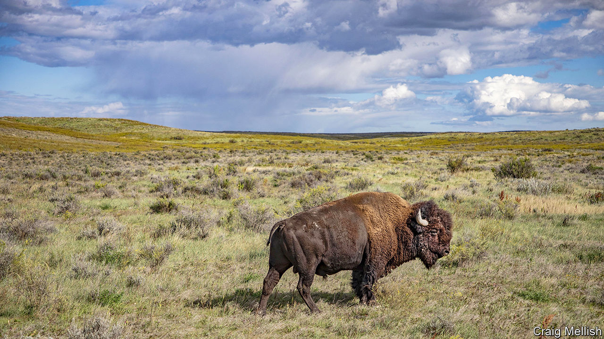

###### (Back) home on the range

# Ken Burns chronicles the sad fate of the American buffalo 

##### The beast’s near-extermination had a devastating effect on Native American tribes 

 

> Oct 25th 2023 

The “Ken Burns effect” is a film technique popularised by the American documentary film-maker, where a camera pans across a still photograph and makes it appear to move. However, there is another Ken Burns effect that is far more important. For 40-odd years Mr Burns has focused America’s attention on some of its most difficult chapters.

His breakout series, “The Civil War” (1990), was watched by nearly 40m viewers on public television, then a record; visits to battlefields more than doubled the next year, says Mr Burns. A bump in visitors also followed “The National Parks” series in 2009. Mr Burns’s subjects include biographies of  and Thomas Jefferson, as well as histories of baseball, jazz, slavery and the . His aim, he says, is to tell the unsanitised story of his country.

His latest, “The American Buffalo”, takes on a double tragedy: the wanton slaughter of buffaloes living in the Great Plains during the late 19th century and the parallel near-extinction of the Native American tribes that  these shaggy beasts for 10,000 years. Steeped in Native American perspectives, it is a tale of destruction and partial recovery unfamiliar to most Americans.

The Cheyenne had 27 words for the animal, which a Spanish conquistador in the 16th century described as numberless as the fish in the sea. The buffalo sustained Native Americans, who used every piece. “We are brothers, we are related,” M. Scott Momaday, a Kiowa poet, says in the film. “We have regard for each other.” 

That regard was trampled by the voracious appetite of an . Between 1805, when Meriwether Lewis and William Clark first traversed the continent, and the 1860s, the buffalo’s numbers fell from probably 30m-60m to fewer than 15m. Then, over the next decade, they were almost wiped out. Sharpshooters arrived on the new railroads, seeking hides for leather belts in industrial machines. Buffaloes were “like walking gold pieces”, exclaimed one of those hunters.

Years later, Theodore Roosevelt wrote that “the extermination of the buffalo was the only way of solving the Indian question.” Though never an explicit policy, historians agree that army and political leaders tacitly approved of exterminating buffaloes in order to force Native Americans to move to reservations. A quarter of the Blackfeet tribe starved; it was “a death wind for my people”, said Chief Sitting Bull of the . 

In its more uplifting second half, the film looks at efforts to save the buffalo from extinction: by tribal people, conservationists, white supremacists and former hunters haunted by regret. At a time when American history is often contested, Mr Burns says documentaries such as this one have “the possibility of reminding people how complex and contradictory our story is”.■


