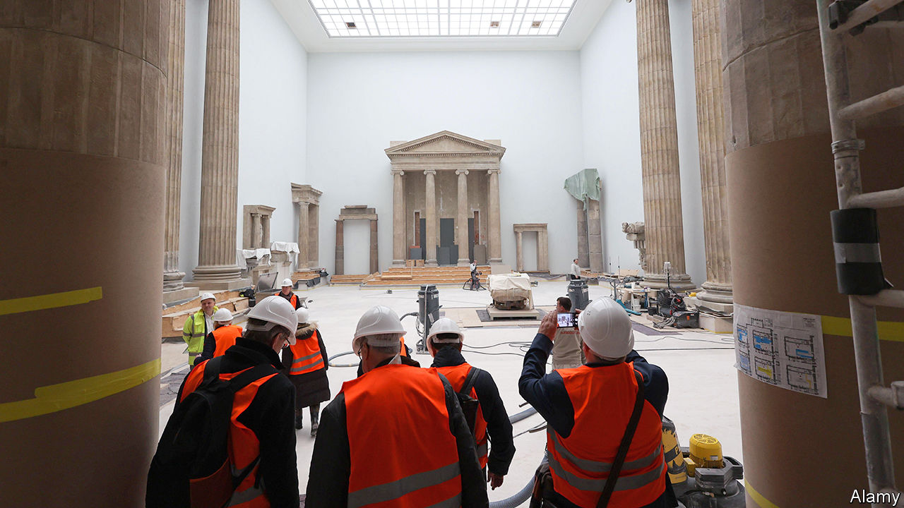

###### The long (over)haul

# One of Berlin’s star attractions is closing for 14 years 

##### Revamping the Pergamon Museum is a monumental task 

 

> Oct 26th 2023 

What is 14 years? A mere flash, compared with the antiquity of a 7,000-year-old female figurine from Syria, or a processional hallway from Babylon, or the façade of an ancient Roman market. But in the life of a busy city such as Berlin, the time between now and 2037 could feel like an eternity. To museum lovers it certainly will, because that is how long much of the Pergamon Museum, home to the treasures described above and many more, will stay shut once it closes for renovations on October 23rd.

The Pergamon is the most famous of the quintet of national museums that straddle , a tourist-thronged isle in the River Spree at the heart of Germany’s capital. But the century-old building, which houses a legendary collection of ancient Near-Eastern, Hellenistic and Islamic artworks, is in sad shape. The ceilings leak. Heavy nets on the museum’s exterior walls protect visitors’ heads from crumbling masonry. Indeed, half the Pergamon’s galleries have been closed for repair since 2014, including the biggest draw, a spectacular marble frieze from the Greek city of Pergamon (now in Turkey) depicting a battle between gods and giants.

If it took  just four years to reshape the Louvre around the iconic glass pyramid that opened in 1989, why must Berlin wait until 2037? Barbara Helwing, director of the Pergamon’s Near-East collections, explains the trouble started below ground. Central Berlin was once a bog, and the island is essentially a sandbank. The museums rest on rusted iron pilings that need to be replaced or meticulously repaired. A master plan for all five museums envisages linking them with underground passages, much like the Louvre. The Pergamon will be enlarged, with a light-filled gallery changing its U-shape to a square. All this must be done with minimum vibration.

The arrangement of exhibits also needs an overhaul. The Pergamon was, like most of Berlin’s museums, largely emptied during the second world war to protect against Allied bombs. But the building was damaged, along with monumental displays that had been too big to move, such as the 30-metre-wide, 17-metre-tall, 1,900-year-old market gate of , another Greek-speaking city in what is now Turkey. 

At the end of the war, Museum Island was in the communist east. Scarcity of funds and the scattering of its collection—Egyptian pieces had been stored in West Berlin, and others were taken to the Soviet Union—delayed the Pergamon’s reopening until 1959. East German curators did what they could with the materials at hand, but using cement and iron rods to stick chunks of the gate of Miletus to the museum walls was not ideal.  in 1990 saw the return of objects from West Berlin, such as the exquisite bust of Queen Nefertiti. But many of these pieces ended up in different museums. The puzzle of how to bring the works together more coherently is only now being undertaken.

Dr Helwing is sad that she will have retired long before the Pergamon reopens, but she is cheered by the work that will keep her busy in the interim. All the movable objects of the collection she oversees will be shifted to a hangar-like temporary site in Berlin’s eastern suburbs, with state-of-the art facilities for scientific analysis, documentation and restoration. Pieces that had been on public display can now be tested using new dating techniques, says Dr Helwing.

And the patient public may not have to wait until 2037 to see at least some of the Pergamon’s treasures. Its north wing, closed since 2014, is due to reopen in 2027. The small but fine Islamic collection will move to airy new galleries there. Choice pieces from ancient Pergamon are already displayed just across the river, in a specially built space that houses a giant, wraparound panorama of the city in 200AD. Other objects will be aired in a busy schedule of temporary exhibitions on the island and offered on loan to other museums. 

As for Berliners pining to stroll through the Ishtar Gate, flanked by a magnificent menagerie of sacred Babylonian animals, they should remember that for 2,500 years it was never possible. The gate lay strewn in pieces in what is now southern Iraq, until a century ago, when archaeologists lovingly picked them up, packed them off to Berlin and spent years diligently fitting them all together again. ■


