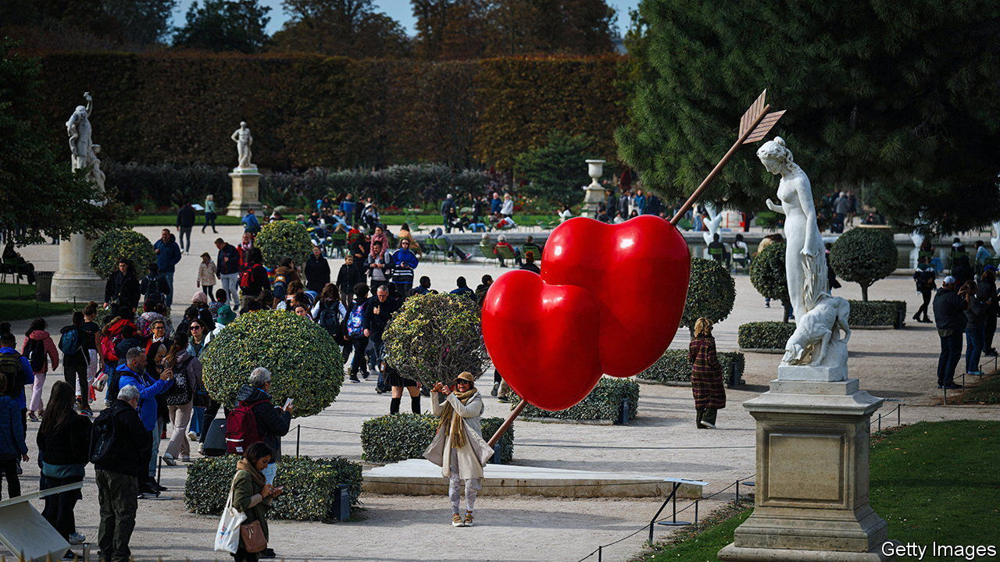

###### Of hubs and snubs

# The arts in Paris are booming—and trying to nip at London’s heels 

##### A long-running rivalry between London and Paris is playing out in the art market 

 

> Oct 21st 2023 

The rivalry between France and England is long-running and bitter. The Wikipedia entry for “France-United Kingdom Relations”, at more than 15,000 words, is almost the length of a novella. Since William the Conqueror did what his name suggests in 1066, the French and English have vied for superiority with swords, guns, words and—more recently—art auctions.

On October 20th a painting by Joan Miró, a Spanish artist, was sold at Christie’s in Paris. The work, with squiggly stick figures, stars and dabs the colour of macaw feathers, fetched €20.7m ($22m), making it one of the most expensive paintings sold in France in recent decades. For those watching, the paddle-populated auction of avant-garde and Italian work was a symbol of Paris’s growing clout in art. The Italian sale used to be held in London, before Christie’s shifted it to Paris last year because of Brexit. “A part of London’s attractiveness used to be its position at the centre of the European Union,” says Guillaume Cerutti, the boss of Christie’s, who adds: “The momentum is now more with Paris.” (Mr Cerutti is, coincidentally, a Frenchman living in London.)

Parisians in the art world are popping champagne corks even more than usual. Last year Sotheby’s had 70 auctions in Paris, 140% more than in 2013; in London there were 131 auctions, 75% more than a decade earlier. But auction houses are just one part of the picture. Recently prominent international galleries, such as Hauser &amp; Wirth, a Swiss firm, have set up shop. “The wave of galleries opening in Paris is extraordinary; we haven’t seen this in any other city,” says Thaddaeus Ropac, an Austrian gallerist, whose outposts include London and Paris.

France’s art market is still small compared with Britain’s, which claimed 18% of the $67.8bn in art sales worldwide last year. Britain is the second-biggest market after America, which has 45% of sales. London is also where most artworks in Europe that go for more than $10m are sold. France, , had a mere 7% of the global market. But Paris’s share is growing, and so is its place in the minds of art buyers and enthusiasts, who are often guided more by emotion than statistics. France now claims 54% of all art transactions by value in the EU, says Clare McAndrew of Arts Economics, a research firm. 

Some insist it is not a competition between London and Paris, which suggests it is. Paris+, an art fair, ends on October 22nd and takes place just after a rival event in London called Frieze, which celebrated its 20th anniversary this year. Many “artizens” do not have the time to go to both. Recently attendance at Frieze London has decreased. There were fewer Americans, who saved their trip for Paris, says Leslie Ramos of the Twentieth, an art-advisory firm. By contrast, Paris+ has been generating buzz since it was launched by Art Basel, a Swiss firm, last year.

Brexit is one reason for the attention Paris is getting. Britain’s withdrawal from the EU in 2020 has changed the dynamics for buyers and sellers of art. Before, Europeans could buy an artwork in London without any import duty; now 5-20% of the value is levied if a buyer imports it into an EU country from London. There is also more paperwork and red tape to contend with. “As an artist, getting your work in and out of the UK is so complicated now,” says Peter Doig, a Scottish painter who lives in London but is considering moving to Paris.

Some European artists have left London for other cities in Europe, says Noah Horowitz, the boss of Art Basel. Berlin, which has a vibrant contemporary arts and museum scene, has been a winner, but it does not claim as many buyers or vendors as London or even Paris.

Yet Brexit does not entirely explain Paris’s boom, says Charles Stewart, Sotheby’s chief executive, who thinks “the collision of luxury and culture, and luxury and art, plays into Paris.” Private foundations, fuelled by money-spinning luxury-goods firms, have upped the city’s artistic game. There is the Bourse de Commerce, a former commodities exchange, which houses the collection of François Pinault, one of the world’s richest men, who made his fortune from fashion brands. (He also owns Christie’s.) The Fondation Cartier, launched by a company known for panthers and its pantheon of jewels, will move its contemporary-art collection to a building opposite the Louvre.

And then there is the Fondation Louis Vuitton, the creation of Bernard Arnault, whose luxury firms have made him the second-richest man in the world. Museums’ exhibitions and ambitions are constrained by the price of shipping and insuring art. The Fondation Louis Vuitton, however, does not have to worry about costs. Its retrospective of Mark Rothko, an American painter, which opened on October 18th, features 115 works, many of them enormous colour-drenched canvases. The value of the borrowed works is in the billions of dollars. “The Rothko show couldn’t happen anywhere else in the world,” says Aurelie Cauchy, also of the Twentieth.

Paris’s revival has a quality of . From the late 19th century through the second world war, Paris was “the star of the art market” and “was more important than London, particularly in terms of modern art”, says Philip Hook, a former director of Christie’s and Sotheby’s and author of “The Rogue’s Gallery”, which examines the history of art-dealing. Artists flocked to Paris and so did buyers. But in the 1950s France started imposing new taxes on art transactions, which fuelled London’s growth.

Three factors make a strong art hub—wealth, cultural infrastructure and a seamless regulatory system, says Ms McAndrew. She argues that London and Paris both score well on the first two but less so on the regulatory front; America has less intrusive bureaucracy. The French government, aware of how the country lost its edge before, is more deliberate about trying to preserve France’s attractiveness, Ms McAndrew notes.

Some in Britain complain that funding cuts from the current government have hurt the arts, while others say that leaders should promote policies to help London retain its pole position. “The UK government needs to change some regulations if they want to regain their competitive advantage,” says Mr Cerutti. Anthony Browne, chairman of the British Art Market Federation, is trying to coax the government to eliminate import taxes on art, which he says would not have “any significant impact on the government revenues but would put us on a level footing with our main global rivals”, such as America and Hong Kong. But shielding art transactions from import tax, however small the financial cost, may look bad, as it is mainly the wealthy who would benefit.

Ultimately, policies may matter less than market forces. Art as an asset class has been surprisingly resilient in the face of higher interest rates, but there is no guarantee it will stay that way. Recently the Asian market has wobbled, due to real-estate and financial jitters in China. London’s recent sales have been mixed. Violence in Israel and Palestine has somewhat muted the freewheeling mood at the fairs and may have suppressed buying, some dealers murmur. But harder times can also encourage rivalries to be set aside. Perhaps for Paris and London, there will soon be a . ■


