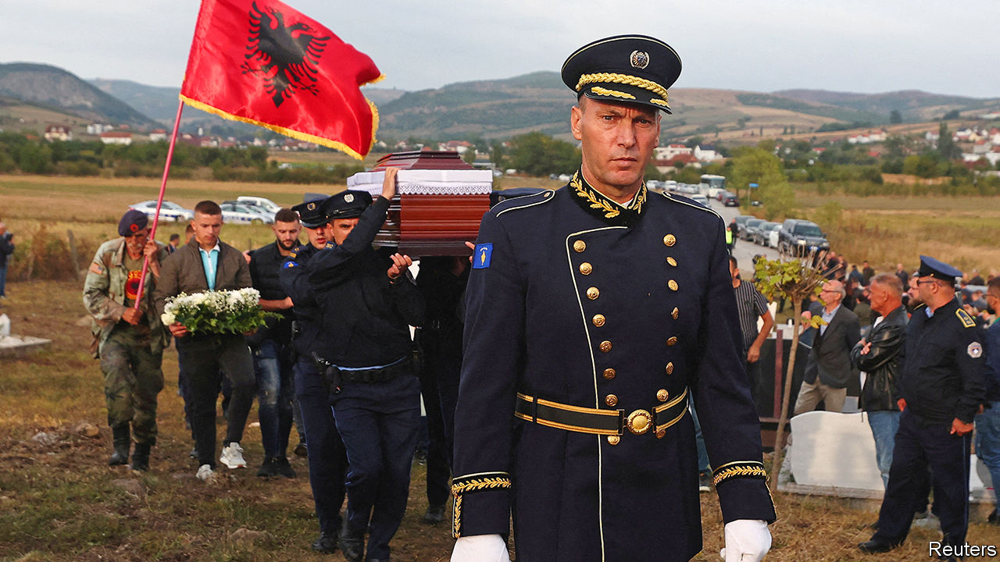
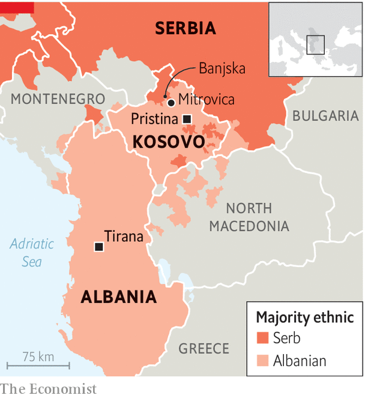

###### The same old Balkan tinderbox

# A mysterious attack in northern Kosovo rattles everyone 

##### Might civil strife resume? 

 

> Oct 26th 2023 

Serbia’s president, its intelligence services and its armed forces were all involved in a plot to seize control of the north of Kosovo last month. At least, so says Xhelal Svecla, Kosovo’s minister of the interior. A Serbian paramilitary group was discovered by a passing police patrol, three Serbs died in a shoot-out, a Kosovo Albanian policeman was killed by a remote-controlled mine, and a huge cache of weapons was left behind by the group as it fled. Mr Svecla says this was all part of a plan by the Serbian authorities to seize control of Kosovo’s north with a proxy force, in emulation of Russia’s grab of parts of Ukraine’s Donbas in 2014. 

Serbia denies involvement and blames Kosovo for provoking local Serbs. However, it is true that in the past Serbia’s president, Aleksandar Vucic, has said he would like a deal whereby Kosovo’s overwhelmingly Serb-inhabited north reverts to his country’s control (Kosovo was a province of Serbia until in 2008 it declared independence, which Serbia refuses to recognise). In 2018 Mr Vucic said that “All Serbs know they lost Kosovo, but I will try everything in my might to retrieve what I can, so in the end it is not a total defeat or total loss.” 

 


One month after the violent confrontation in the village of Banjska, nothing is clear. Milan Radoicic, a Serb politician and businessman in Kosovo, claimed through his lawyer that he was responsible for forming the paramilitary force which escaped to Serbia across the hills surrounding the monastery that dominates Banjska. The Serbian state had absolutely nothing to do with his plans, he said. Many in Kosovo find that hard to believe. Mr Svecla claims that records left behind when the group of some 30 men fled on September 24th show that their arms had been supplied by the Serbian army. Footage left behind in one of its drones, he says, shows that the group trained in a Serbian military base. Mr Radoicic is at liberty in Serbia. 

Whatever the truth of this murky affair, the north of Kosovo poses a problem. Overall, Kosovo’s population is overwhelmingly ethnic Albanian. Its government has struggled since its declaration of independence to control the Serb-dominated north. Serbian List, the mainly Kosovo Serb political party, is in effect a branch of Serbia’s own ruling party. Until he resigned in the wake of the September violence, Mr Radoicic was the deputy head of Serbian List but is widely regarded as the man in charge of it. He is under American and British sanctions for alleged corruption. 

A sign at the entrance of Banjska’s medieval monastery tells visitors that they are not allowed to bring guns inside. It stands on a high hill surrounded by other steep, lush green hills. The countryside here is criss-crossed by small roads that run across the border to Serbia and are well-established smuggling routes. Mr Svecla claims that Mr Radoicic planned to secure control of these roads and the border so that more men could cross over from Serbia and consolidate Serb control of the north, once the first group had seized the northern police stations. 

Preparations, he says, are in the offing for another attempt. Well-placed Serb sources in Kosovo, however, do not believe there was a plot to grab the north. But what the group was doing is a mystery all the same. One says that most of its members were locals who had been “manipulated”. For sure, Kosovo Serbs are frightened of Kosovo’s special police deployed to the north, most of whom do not speak Serbian. One theory is that the group was preparing to dish out arms but was surprised. 

Ever since Russia’s invasion of Ukraine last year, the EU and America have been eager to persuade Kosovo to do a deal to normalise relations with Serbia. The nub of it involves granting a measure of autonomy to ethnic Serb areas in exchange for Serbia’s de facto recognition of Kosovo as an independent country. Neither Mr Vucic nor Albin Kurti, Kosovo’s prime minister, have been keen on this. Since May the EU and America have both penalised Kosovo. Their diplomats are infuriated by Mr Kurti, whom they blame for the persistence of upheavals in the north. For this reason, say Serbian observers, it would have made no sense for Mr Vucic to have given a green light to Mr Radoicic to mount an insurrection right now, just when he had hitherto escaped any blame for the failure of the talks to bear fruit. 

Miroslav Lajcak, the EU diplomat who leads the dialogue between Kosovo and Serbia, is trying to resuscitate it. The two leaders were both due in Brussels as  went to press. Both sides need to hurry, because many Serbs and Albanians are not waiting for their leaders to bring them a better life. In 1991 Kosovo’s population was estimated at 1.9m. Now, as so many emigrate, there may be no more than 1.5m left in Kosovo, of whom Serbs may now number no more than 65,000 souls. ■

