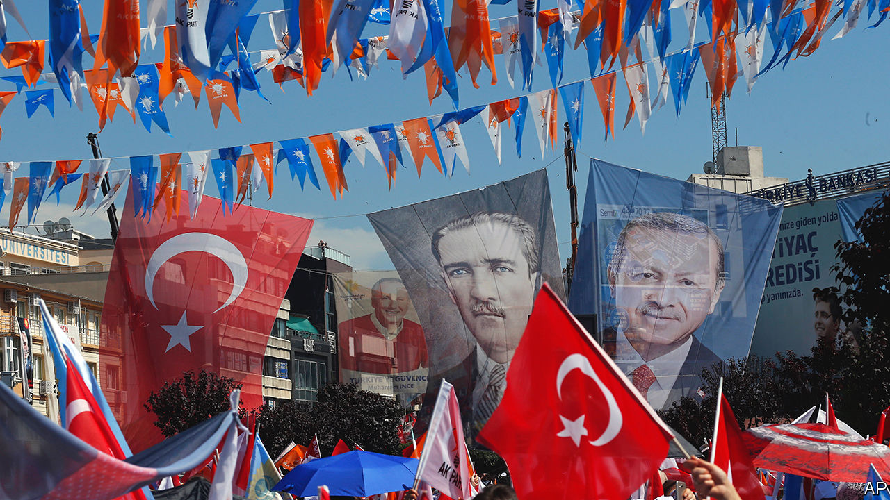

###### An Ataturk complex

# Instead of undoing Ataturk’s legacy, Recep Tayyip Erdogan has claimed it 

##### His secularism is played down, his nationalism celebrated 

 

> Oct 26th 2023 

NEARLY 60% OF Turks, including 46% of supporters of the ruling Justice and Development (AK) party, according to a survey published in August, consider him the country’s most beloved historical figure. More than nine out of ten say they are grateful for what he did for Turkey, shows another, less recent poll. And over 73% believe the values he represents are more relevant than ever. Turkey’s president and AK’s leader, Recep Tayyip Erdogan, though fresh from another election victory this summer, could only dream of such numbers. They are Kemal Ataturk’s. He may have been dead for more than 80 years, but he is still Turkey’s most popular politician.

That much will also be clear on October 29th, when Turks celebrate a hundred years to the day when Ataturk, having saved what remained of the Ottoman empire from an invading Greek army and abolished the sultanate, proclaimed the empire’s successor state as a republic. Turkey’s new parliament elected him president only hours later. What followed over the next decade was one of the most thorough, and occasionally ruthless, exercises in nation-building in history. By the time of Ataturk’s death, Turkey had a new alphabet, a new civil code, universal suffrage, and a new state religion, secularism, to go along with the old one, Islam. 

Mr Erdogan has often been viewed as the anti-Ataturk. After he became prime minister in 2003, his critics often accused him, as an acolyte of political Islam, of planning to turn Turkey into a second Iran. A few still do, but such fears have been misplaced. Mr Erdogan has had two decades in power, more than Ataturk had, to dismantle Turkey’s secular order. Had this been his plan all along, he does not have much to show for his efforts, despite his control over state institutions and much of the media. Mr Erdogan has chipped away at parts of Ataturk’s legacy. But he has also co-opted and redefined it. Ataturk’s legacy may have co-opted him too.

Under Mr Erdogan, Islam has a bigger place in public life than at any time since the Ottomans. Turkey’s leader has empowered a generation of pious businesspeople, and binned restrictions on women’s wearing of the headscarf. He has overhauled education, allowing more religious teaching, and opened thousands of  schools, designed to educate Islamic preachers. These now account for over 13% of all public schools. He has imposed some of the highest taxes on alcohol in Europe. 

But he has seen meagre returns on his investment. According to a study by Konda, a pollster, the share of Turks who identify as non-believers had risen to 7% in 2021 from 2% a decade earlier. The share of women who wear some form of the Islamic headscarf has dropped, not increased, from 63% to 59%. Despite rocketing prices and draconian restrictions on advertising, booze consumption has remained steady (though it is the lowest in Europe.)

Mr Erdogan and AK will never be the republic’s loudest cheerleaders. “To celebrate the republican regime, you need to come to terms with the failure of the Ottoman empire,” says Ali Carkoglu, a political scientist. “And they have not done so.” But they do not aspire to knock Ataturk from his pedestal either. Ataturk’s memory is some of Turkey’s most valuable and most abused political currency. The name of the country’s founder was on the lips of the generals who brought down four governments since 1960, and of those army officers, backed by the Gulen movement, a secretive Islamic cult, who tried to topple Mr Erdogan in 2016. Politicians from the right and the left, including Turkey’s two main opposition parties, as well as Mr Erdogan’s political allies, the Nationalist Movement Party and a group called Vatan, all claim to follow in Ataturk’s footsteps. 

So does Mr Erdogan himself. During his early years in power, Turkey’s leader was more openly critical of Ataturk, once going so far as to refer to him and his successor as “the two drunkards”. But over the past decade, after losing the support of Turkish liberals, the Kurds and the Gulen movement, and teaming up instead with nationalists, many of them embedded in the army and the police, Mr Erdogan has embraced Ataturk as a symbol of his own power. “Twenty years ago Erdogan was the outsider and Ataturk was the state,” says Halil Karaveli, of the Central Asia-Caucasus Institute. “And now Erdogan is the state.”

But the embrace is selective. Ataturk’s image as a secular reformer, state-builder and supporter of Turkey’s European vocation has taken a back seat. Mr Erdogan has instead emphasised Ataturk as the , the war hero who saved Turkey from the Greeks, the British, the French and the Italians, who tried to partition the country after the first world war, notes Lisel Hintz, an academic at Johns Hopkins University. “That image suits Erdogan’s narrative of Turkey as a rising power, pushing back against the West and the liberal international order,” she says.

Turkey’s leader has created a nationalism that transcends old divisions between religious and secular, says Mr Karaveli, and has made the redacted Ataturk one of its emblems. Mr Erdogan has made a career out of polarising the country. He will continue to do so. But his vision of a new “Turkish century” combines strategic autonomy from the West, the pursuit of economic expansion powered by new infrastructure and defence projects, and a whitewashed version of the Ottoman past. All this appeals to many outside his own party. It may endure, even after he is gone. 

Mr Erdogan would not have felt at home in Ataturk’s Turkey, and Ataturk would not have felt at home in Mr Erdogan’s. But as the champion of a new brand of state nationalism, Turkey’s strongman in his new incarnation no longer views himself as Ataturk’s challenger, but as his heir. ■

