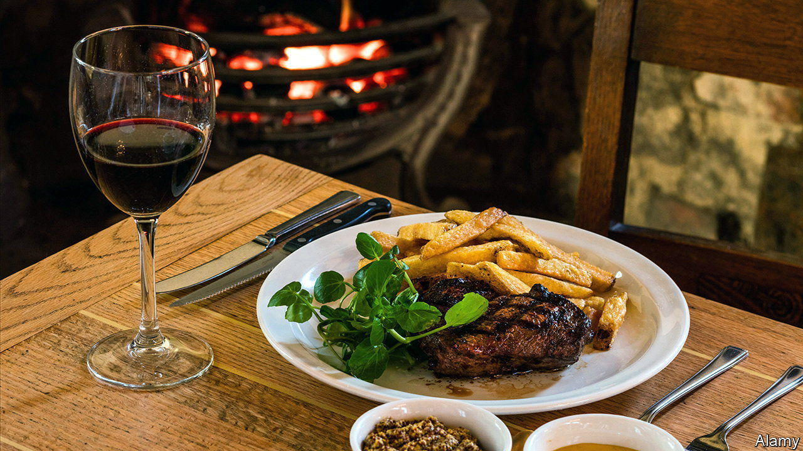

###### Much at stake

# The French debate the future of steak frites 

##### Can you be left wing and eat red meat? 

 

> Oct 26th 2023 

In Europe today, meat is politics. Britain’s ruling Conservatives recently accused the Labour opposition (falsely) of plans for a “meat tax”. Poland’s outgoing governing party claimed (absurdly) that its opponents would force people to eat “worms instead of meat”. In France, where consumption per person of meat is twice the global average, the debate has taken a different twist: is it possible to be left-wing and still eat meat?

In the home of , red meat is more than a mere source of protein. It is an expression of muscular national identity; the farming of cattle, a guarantor of rural tradition. Steak, wrote Roland Barthes, a French literary theorist, in 1957, “communicates its national glamour” to its junior partner, the self-effacing chip. Over the past decade, however, worries about health and climate change have pushed even the French to eat less red meat. Last year their consumption of chicken overtook that of beef for the first time. In left-leaning, kale-eating quarters,  is on the rise. 

So when Fabien Roussel, leader of the Communist Party and champion of the carcass-handling trades, last year confessed his enduring taste for a good steak, fellow left-wing leaders were horrified. In the fight against climate change, Sandrine Rousseau, a Green party figure, told the Communist chief last month: “You will not win with a steak.” It was high time, she snapped last year, for the French to stop treating steak as a “virility symbol”. Meat-eating, retorted Mr Roussel, has nothing to do “with what you have in your underwear”. 

If France is to respect its net-zero pledges, the national auditor concluded in May, it will in future have to raise fewer cattle. It says they produce 12% of its greenhouse-gas emissions. A third of the French, it also noted, still eat more than the recommended weekly helping of 500 grams of red meat. For now, steak has not entirely lost its glamour, even as it becomes increasingly rare.■

