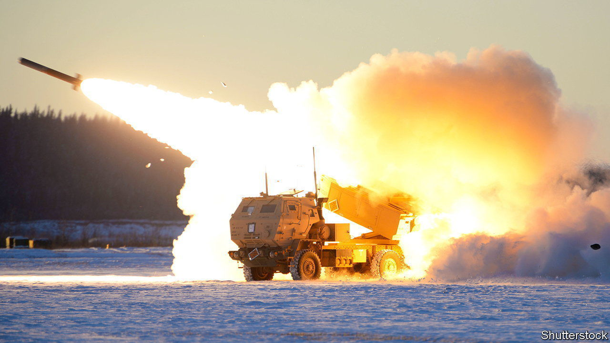

###### What have you got left?

# Ukraine’s allies are scrambling to bolster its air defences 

##### The country is bracing for another winter onslaught of Russian missiles 

 

> Oct 24th 2023 

MUD AND EXHAUSTION are pushing the Ukrainian  towards its close. The focus is thus shifting to protecting the country’s cities, infrastructure and vital production facilities from a renewed Russian missile and drone campaign, aimed at eroding Ukraine’s will and capacity to fight. 


On October 11th the Ukraine Defence Contact Group, an alliance of 54 countries providing military support to Ukraine, convened in Brussels for its 16th meeting. President Volodymyr Zelensky left the group in no doubt that his country’s most urgent needs are air defence and artillery munitions. But earlier this month, Admiral Rob Bauer, NATO’s most senior military official, said of the West’s ammunition stockpile that “the bottom of the barrel is now visible.” 

Last winter, after some difficult months when Ukraine’s power grid came under frequent assault by salvoes of Russian cruise missiles and Iranian-supplied Shahed drones, the country’s . The vast majority of Russian missiles were shot down before reaching their targets. Western ground-based air-defence systems, such as Patriot and IRIS-T missile batteries, arrived in the nick of time, and Ukraine showed considerable skill in integrating a wide mix of platforms and radars. Its repair teams confounded expectations by managing to restore energy supplies rapidly, even after multiple attacks—and despite becoming targets themselves.

But this winter Ukraine is braced for more of the same, or worse, from an enemy that has learned from last year’s campaign. Ukraine has built concrete defences around important parts of its electricity grid, and has acquired emergency generators to prevent total blackouts. But just as the ground war is essentially attritional in nature, so is the air war. 

Douglas Barrie, an air-power specialist at the International Institute for Strategic Studies, a think-tank, says the question for both the defenders and the attackers is, “What have you got left?” In other words, will Ukraine run out of anti-missile munitions before Russia runs out of cruise and  and attack drones? And will Ukraine have enough batteries to cover the targets that the Russians are able to hit? 

Nico Lange, a Ukraine expert at the Munich Security Conference, worries that Ukraine has neither enough platforms nor sufficient munitions for those that it does have. The country is now almost entirely dependent on Western systems, having used up nearly all of the mostly Soviet-era S-300 and Buk missiles it was able to get its hands on. The deficiency is especially acute for short-to-medium range systems, such as the Kongsberg/Raytheon National Advanced Surface-to-Air Missile System (NASAMS), made in Norway and America. 

Lloyd Austin, America’s defence secretary, has hinted that more NASAMS, and the AIM-7 missiles it can fire, will be sent to Ukraine from existing stocks. However, Mr Lange says that production rates are not increasing quickly enough to meet Ukraine’s needs this winter. Defence companies in Europe are willing to crank up production on existing lines, but, says Mr Lange, still appear reluctant to invest in new lines to increase longer-term capacity.

So even when Ukraine has been promised the kit it needs, there is no guarantee it will arrive in a timely way. Take the IRIS-T batteries, two of which have already shown their effectiveness. Germany has promised to send more to Ukraine, but it is not clear when they will arrive. After the Brussels meeting Germany issued a list of everything it has sent, or is about to send, to Ukraine. The list included two more IRIS-T batteries. The system’s manufacturer, Diehl Defence, has committed to doubling production from four systems a year to eight, but not until 2025. 

Six IRIS-T systems are due to be delivered this month, but to Germany’s own air force rather than to Ukraine. Other European air forces are also scrambling to place orders for IRIS-T, impressed by its near 100% hit rate in defending Kyiv. 

One short-term answer to the shortage of cutting-edge air-defence systems is to send older systems that the West and its allies no longer want but are held in storage. An example is Patriot’s predecessor, the Hawk medium-range surface-to-air missile that entered service in the 1960s, but which remains effective if fitted with updated radar. Spain has sent some Hawks to Ukraine, and America may provide many more, some via Taiwan. 

Similarly, the RIM-7 Sea Sparrow, an equally whiskery short-range anti-ship missile, has turned out to work well with Ukraine’s Soviet-era Buk launchers. More could be dusted off for service. 

And Ukraine needs whatever it can get. The West once thought its sanctions might deny Russia the components it needs to make more missiles. But those hopes have dimmed. In May Ukrainian intelligence sources estimated that each month Russia is able to manufacture around 60 land attack cruise missiles, five Iskander ballistic missiles and two Kinzhal hypersonic glide weapons. Mr Barrie says that debris recovered from recent strikes by KH101 cruise missiles confirms that they were recently produced. 

Russia is repurposing surface-to-air and anti-ship missiles for land attack roles. It can also call on innumerable cheap loitering munitions and Shahed drones, which are now being built in Russian factories. 

An emerging threat is air-launched “glide bombs” guided by GLONASS, the Russian equivalent of GPS. They have a range of 50km, are accurate to within ten metres and are far cheaper than missiles. Mr Lange says that Ukraine has a desperate need for more and better electronic-warfare equipment that can counter both guided bombs and drones. But he fears that donor countries may be reluctant to share it.

By stockpiling missiles during the summer, Russia should be able to resume attacks at a similar level of intensity to last year’s, and maintain them for several months. There are also some indications from recent strikes that Russia will opt to hit targets less well defended than Kyiv, such as Odessa and other port cities. As Mr Barrie says: “Ukraine is a big country. There are lots of things the Russians can go after.”

Russia, it appears, is not going to run out of missiles. The question is whether Ukraine will retain the means to keep shooting them down. ■


