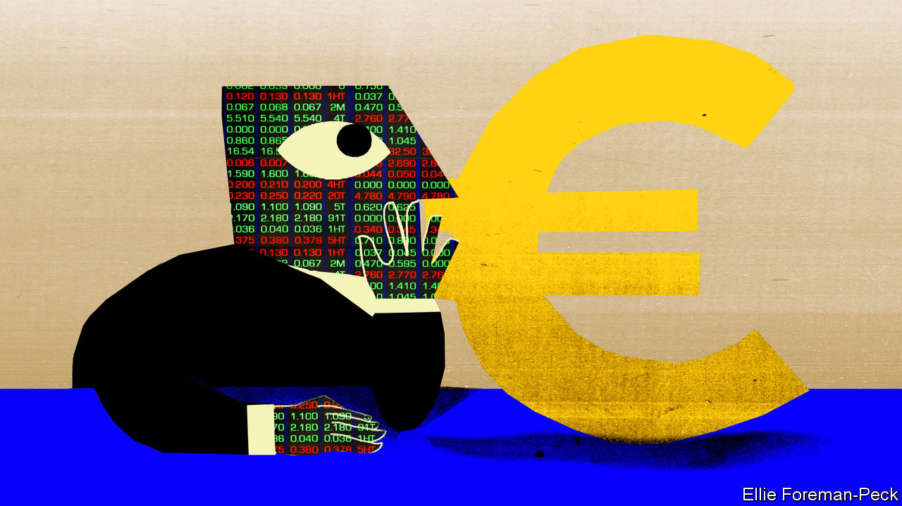

###### Charlemagne

# What markets are trying to tell Europe—and why it should listen 

##### There’s gold in them thar market signals 

 

> Oct 26th 2023 

When Europeans turn their attention to what markets have to say, it is usually because trouble is brewing. A decade ago, as the euro-zone crisis raged, politicians obsessively checked the “spread” between the annual interest on bonds issued by Italy or Greece over those of Germany to gauge just how nervous investors were about lending to profligate southern countries compared with frugal northern ones. More recently they obsessed over the short-term price of gas, often imported on ships, that was urgently needed to replace the Russian methane no longer flowing through pipelines. Such experiences have left policy types wary of markets, which they naturally think of as fickle, “Anglo-Saxon”, and to be controlled. That is a shame: there is a great deal to learn from the signals coming from investors in anything from debt to currencies and much else besides. Politicians should listen.

First, a caveat: the old curves whose signals they once heeded are no longer worth hourly scrutiny. Spreads between the bonds of southern countries and Germany are nowhere near the levels of the euro-zone panic these days. In some cases, such as Spain and Greece, it is because investors think the prospects for those economies have improved. In the case of Italy, however, there is still plenty of concern left over how it can repay an ever-larger debt pile, given a budget deficit of over 5% this year, and ho-hum growth prospects. 

Investors will currently lend money to Italy at an annual rate of around two percentage points more than they do to Germany. That does not reflect their optimism. Rather, the European Central Bank has indicated it is on hand to snap up Italian bonds if other investors will not. Policymakers did not like what markets were once saying about Italy, and (perhaps sensibly) partly blunted the signal instead. Still, there is no escaping that Italy’s debt is a looming problem. The nominal interest rate it pays on new debt of around 5% is up from 1% around two years ago and the highest for a decade. As its borrowings are gradually refinanced at this level it will cost Italy a mint, worsening its debt position (though still-high inflation could help bring down the real cost). Other countries have similar headaches. Balanced budgets in France are something that is endlessly talked about but seldom indulged in (its last surplus was in 1974). 

Information emanating from a new form of debt that investors are buying and selling is sending another message EU politicians may not want to hear: that their ambitions to build an ever-closer union are not credible. That signal comes from the price of the roughly €400bn ($423bn) of bonds issued by the EU to fund an economic jolt in response to the covid-19 pandemic. This new financial arrangement—of debt contracted jointly, not attributable to any one EU country—was hailed as a watershed of integration, a “Hamiltonian moment” that would lead to further such borrowing. (The club had in fact issued debt before, but on a far smaller scale.) A quick look at market data suggests that investors think this grand project is a fantasy.

The bonds are guaranteed by all 27 EU national governments, albeit in a slightly circuitous way. That might suggest they should be no riskier to investors than the safest debt of the club, that of prudent Germany. But the yields demanded by buyers are much higher, around the level for France or even Spain at times. Two lessons are being telegraphed here. One is that investors are indicating it is unlikely that there will be more such joint debt issuance in future, as many once believed was inevitable. If the pandemic-era response is indeed a one-off, that will result in a shrinkage in the total value of the bonds outstanding as early as 2026. That reduces investors’ ability to buy and sell the bonds over time, which in turn explains the higher yield they are now demanding as compensation for reduced liquidity. The second lesson is that markets think of the EU as something that differs from a top-notch sovereign issuer like Germany or America—the safest bets when it comes to lending money. Such governments have the power to raise taxes when they need funds to repay creditors. The EU, by contrast, needs to ask nicely for national capitals to send a cheque.

Another market that is relatively new is the one for carbon credits—and the verdict here is far jollier. In 2005 the EU set up an emissions trading system, whereby large-scale polluters such as power plants need to pay for the right to belch carbon into the atmosphere. For years the price of these pollution credits languished at €10 a tonne or less. Such a low price gave no incentive for dirty factories to invest in green technologies, and suggested that Europe was not serious about cleaning up its act. No longer. Credits have soared since about 2018, briefly passing €100 earlier this year, and are now at €81. This helps fill state coffers. Better still, it suggests investors believe Europe’s environmental ambitions are credible. In recent times voters in many rich countries, including Germany and the Netherlands, have lashed out at costly green policies. Markets, crunching the views of countless participants, are indicating carbon credits do in fact have value—ie, the ambitious carbon-cutting agenda is here to stay.

Busy signal

The hardest market signal to fathom is the most basic gauge of economic stature: the value of a euro against the mighty American dollar. Alas, that message is blunt. The euro has fallen by around a quarter against the greenback over the past decade, though it remains higher than at the launch of its coins and notes in 2002. Many factors go into currency prices, including interest rates. (America’s are higher, which juices the dollar.) But the level of a currency over the long term is a crude gauge of an economy’s prospects, its dynamism and potential for innovation. For most Europeans the single currency is the most tangible upshot of belonging to the EU. A devalued euro is not just a pain for those holidaying around the world: it is a signal policymakers should heed, too. ■


