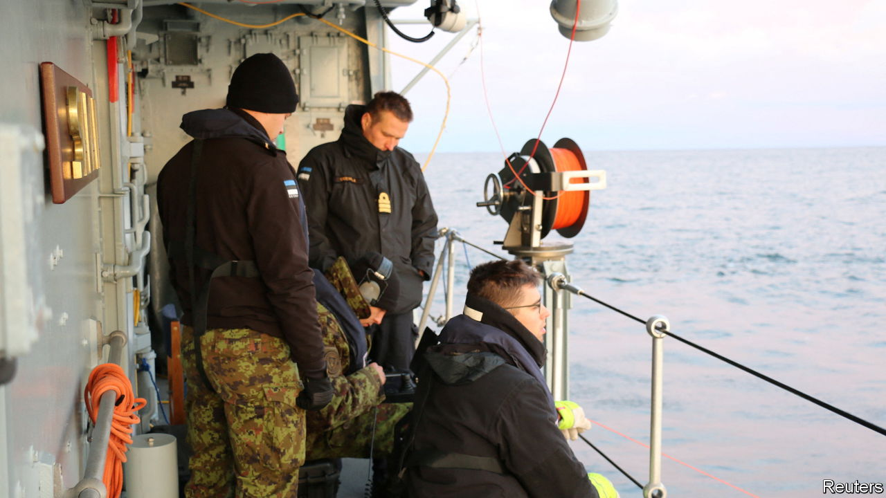
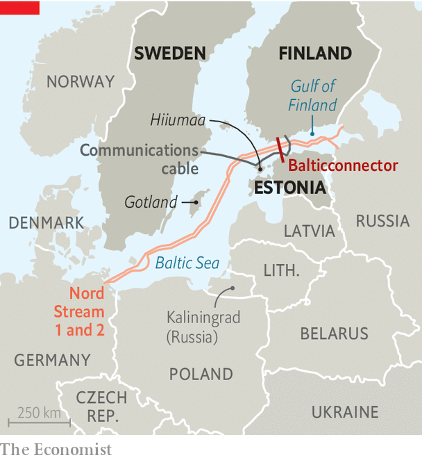

###### Seabed skulduggery

# Who is sabotaging underwater infrastructure in the Baltic Sea? 

##### Russia is the prime suspect, but a Chinese-flagged ship is also thought to have been involved 

 

> Oct 22nd 2023 

PITY THE Baltic sea-creatures who just want a quiet life; their patch has never been busier. On October 17th Carl-Oskar Bohlin, Sweden’s minister for civil defence, said that a communications cable between Sweden and Estonia had been partially damaged earlier in the month. It was the latest of several suspicious incidents that have given rise to fears that Russia is making mischief underwater. 

On October 8th the nearby Balticconnector gas pipeline and a communications cable between Finland and Estonia were damaged due to what Sauli Niinisto, Finland’s president, called “external activity”. The two cables were some distance from one another. Finnish police later said the cause was “an external mechanical force”, with signs of an “extremely heavy object” left on the seabed.

 


These events have come just over a year after the Nord Stream 1 and 2 gas pipelines from Russia to Germany were damaged by . Initial suspicion fell on Russia, but Western intelligence agencies have uncovered signs that Ukrainians might have been behind the Nordstream blasts. The situation remains murky. 

In the latest incident, Estonia’s government learnt on October 11th of a drop in capacity on the cable, which is located in its territorial waters around 50km off the coast of Hiiumaa, an island at the mouth of the Gulf of Finland. Mr Bohlin said that the incident occurred at roughly the same time and in the same area as damage to the Balticconnector pipeline. 

The problem was quickly repaired and the cable is running again. In public, regional officials are treading carefully. In private, however, officials strongly suspect that Russia is involved. The worry is that Russia is flexing its muscles to intimidate Baltic countries. “The security policy situation in our immediate area has deteriorated,” declared Pal Jonson, Sweden’s defence minister, speaking alongside Mr Bohlin. , along with , applied to join NATO last year, overturning centuries of military non-alignment.

American and European military-intelligence agencies say that their primary concern is Russia’s Main Directorate of Deep-Sea Research, known by its Russian acronym GUGI. It is essentially a mini-navy unto itself, with a variety of spy ships and specialist submarines. Among them is the , the world’s largest operational submarine, capable of reaching considerable depths. These vessels can deploy divers, smaller submarines or underwater drones, which could be used to cut cables or to lay explosives. 

There has also been a twist in the story. Finnish police looking into the Balticconnector damage were investigating the , a Russian nuclear-powered cargo ship, and the , a Chinese container ship. Both were present in the area at the time. But the Chinese ship, flagged in Hong Kong, was closer to the crime scene and, according to public ship-tracking data, slowed down near the pipeline. On October 20th Finnish police said it was their investigation’s focus. The prospect of China trying to sabotage European maritime infrastructure would be devastating; but military sources say the ship’s complex ownership structure has connections to Russia. Even more sinister, the  appears to have stopped at the Russian enclave of Kaliningrad shortly before the incident and taken on fresh crew there.

European allies have grown increasingly concerned about the difficulty of stopping potential attacks before they occur and about identifying the perpetrators if they do. A paper published in 2021 on Russian military robotics by the International Centre for Defence and Security, an Estonian think-tank, noted that Estonia and other Baltic states had only a limited grasp of what was going on under the Baltic Sea, thanks to tricky hydrology and a lack of monitoring equipment.

Now that the danger is more tangible, allies are scrambling to address these gaps. On October 13th leaders of the Joint Expeditionary Force (JEF), a British-led alliance of ten northern European countries, including Estonia, Finland and Sweden, discussed the issue during a summit on Gotland, a Swedish island. Their joint statement invoked the Balticconnector damage: “The incident demonstrates that threats to critical undersea infrastructure are real.”

A few days later, Antti Hakkanen, Finland’s defence minister, said that his country was stepping up its undersea surveillance in the Gulf of Finland and Baltic Sea, in part by acquiring new underwater sensors. On October 19th Finland’s defence ministry blocked three transactions in which Russian buyers had attempted to purchase real estate, on the grounds that these would “hinder the organisation of national defence or the surveillance and safeguarding of territorial integrity”. And on the same day NATO, having established an underwater protection cell earlier in the year, said it had stepped up air and maritime patrols in the Baltic Sea, and had sent additional minehunters to the area. 

They may need to stick around. “A crippling effect on infrastructure operations in Finland remains unlikely in the immediate future,” noted SUPO, Finland’s intelligence service, on October 12th. But the days of stable Russia-Finland relations were over, it warned. “Russia is currently treating Finland as an unfriendly country.” ■

