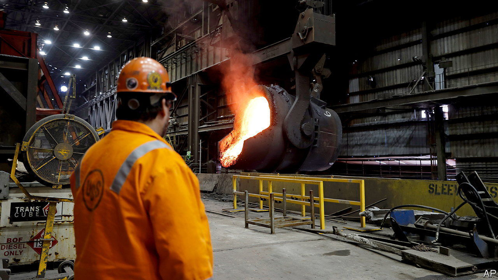
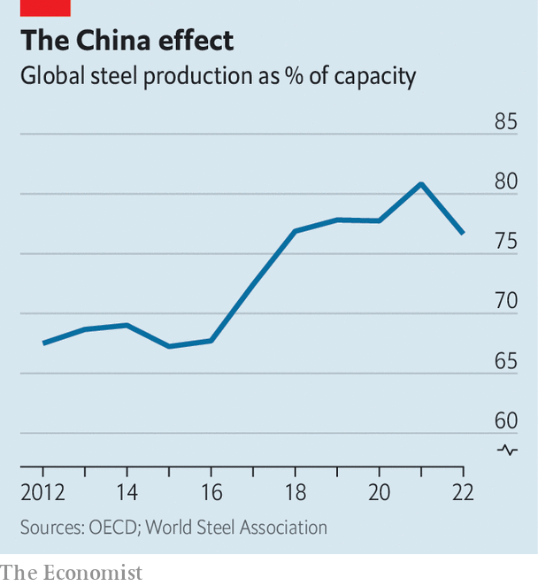

###### Trade nightmares

# America and the EU demonstrate protectionism’s ratchet effect 

##### Negotiations over metal tariffs are going nowhere 

 

> Oct 26th 2023 

As america unleashes a barrage of new protectionist measures under President Joe Biden, it continues to be dogged by past efforts—not least the tariffs on aluminium and steel that President Donald Trump thought necessary. These “section 232” levies, named after the trade act under which they were introduced, are scheduled to return to their original scope at the start of 2024, when a deal agreed by Mr Biden and the eu is due to run out. 

The deal allows the vast majority of eu exports to America to continue as before the tariffs. It was intended to give the two sides time to weld a comprehensive pact called the “Global Arrangement on Sustainable Steel and Aluminium” (gsa). This would, negotiators hoped, reduce excess capacity in steel markets and set out a joint way to decarbonise without crushing domestic producers. “These negotiations should be on the simpler end of the spectrum. They are only about two products, and America and the eu have a very similar profile in these industries,” says Todd Tucker of the Roosevelt Institute, a think-tank. But at a summit on October 20th the eu’s top brass and Mr Biden admitted that they needed more time to negotiate.

 


It is not clear whether such an agreement will ever be struck, or whether, when it comes to excess capacity, it is even needed. Paul Butterworth of cru, a consultancy, notes that data from the oecd club of mostly rich countries shows that steel mills around the world are being used at the highest levels since 2000. In part, this is because China restructured its steel industry in 2017, killing unlicensed producers (see chart). Still, America and the eu have put in place an arsenal of measures to protect domestic markets from state-sponsored imports. Steel shipments from China to the eu have halved since 2015-16, and play hardly any role in America. Despite the harm such measures do, neither side wants to get rid of them altogether. European negotiators argue current policies are sufficient to resolve excess capacity, and are unwilling to commit to additional tariffs. American ones want more barriers.

An agreement on carbon levies is an even more difficult task. The eu’s plan to tackle climate change is based upon a carbon price that applies to aviation, electricity generation and industry, and will soon cover more of the economy. The natural complement, its officials argue, is a tariff on the carbon content of imported steel and other high-energy goods in line with the eu carbon price. This is being introduced and the only exception will be for places that levy their own carbon prices—something most of America does not, and never will, do. It uses regulation and subsidies to push industry to be greener. Reconciling these two approaches into a common trade policy is a nightmarish task. 

The American proposal is for a club that levies a common carbon tariff on aluminium and steel, with higher tariffs for non-members. For its part, the eu would prefer a completely different sort of club, based on legally binding targets for decarbonisation and state-aid restrictions. Members of the club would be free to impose carbon tariffs, but only in line with the World Trade Organisation’s rules, which the eu believes would permit its border adjustment.

In theory, then, both sides still want a gsa. Reality may be different. “The eu will now resort to what it knows best: damage control by continuing to negotiate and kicking the can down the road,” says David Kleimann of Bruegel, another think-tank. The result will probably be an extension of the current fix, and no agreement. ■


