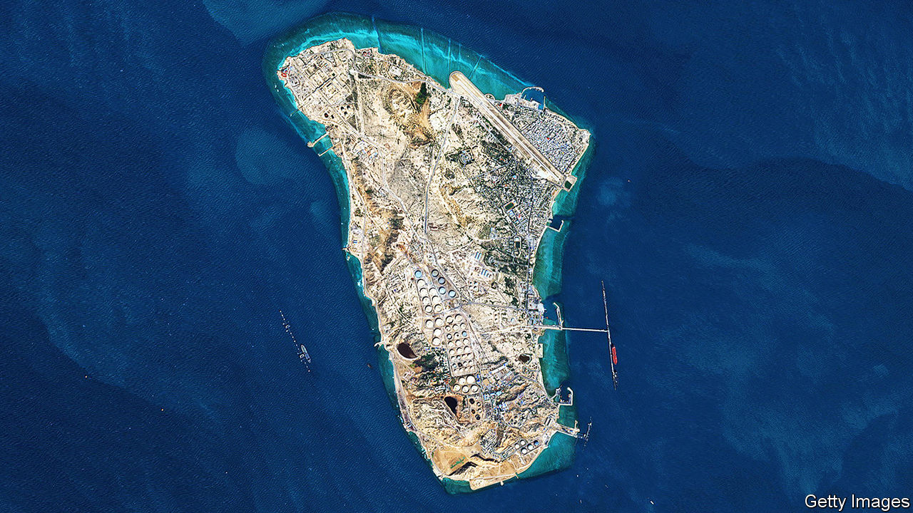
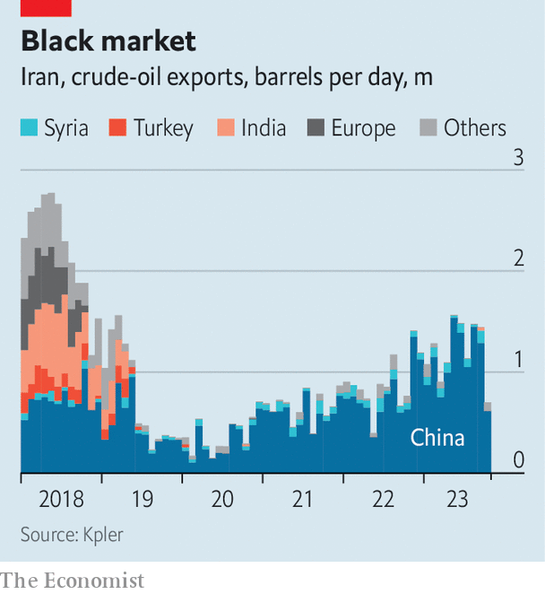

###### Fleet-footed

# America would struggle to break Iran’s oil-smuggling complex 

##### After years of sanctions, it has become a sophisticated operation 

 

> Oct 25th 2023 

In february dilro, an obscure company based in Dubai, bought the , an 18-year-old tanker. Since then the Panamanian-flagged vessel has been given a new name, , and a new job. In April the ship delivered its first load of Iranian oil to the port of Dongjiakou in northern China. After completing a similar trip in September, it now lingers off Malaysia, where it may pick up yet another Iranian cargo. The ship is one of many to have recently joined the “dark fleet” tasked with moving , exports of which have surged from 380,000 barrels per day (b/d) in 2020 to 1.4m now (see chart).

 


Although America retains harsh sanctions that target anyone helping to produce, ship or sell Iran’s petroleum, the superpower’s officials last year eased enforcement. They were hoping to clinch an accord on e—and, probably, to suppress prices in the run-up to America’s presidential election. The number of people and firms added to Iran-related blacklists by ofac, America’s enforcement agency, has dwindled. 

Yet following Hamas’s attack on Israel on October 7th, the Biden administration has come under pressure to shut loopholes, as Iran is Hamas’s sponsor and oil proceeds fill the country’s coffers. So far traders are unfazed: oil sells at $90 a barrel, down from $97 in September. But could a sanction snapback inflame markets?

Iran’s smuggling network has become sleeker and more sophisticated since President Donald Trump put in place fresh sanctions in late 2018. The country’s petroleum business is run by the National Iran Oil Company (nioc), a state monopoly. Its main customer is China—not the country’s large, state-owned firms, which are exposed to Western sanctions, but “teapot refineries” that snap up 95% of Iranian supplies. A glut in refining capacity is pushing these outfits to seek the cheapest crude available. Iran’s trades at a $10-12 discount to the global benchmark, against $5 for Russia’s as delivered to Chinese ports. The teapots make transactions in Chinese currency, rather than American dollars, which insulates them from sanctions.

Old tankers, acquired by little-known middlemen, link the ends of the chain. Most would have gone to scrap because blue-chip charterers do not want them. Of the 102 extra-large tankers that have ferried Iranian oil in 2023, 42 did not do so last year and 27 have no history of ever carrying dodgy oil, according to Kpler, a ship-tracking firm. Often they do only a few voyages a year, for just a few years. But those who buy them see a return fast, because clandestine shipping commands extortionate rates. 

Ownership is disguised through shell companies registered in places such as China, Vietnam and the United Arab Emirates (uae). Most of those fingered by America’s Treasury department have Chinese names, suggesting beneficiaries are from the mainland. Some Chinese lenders also appear on its lists, but most are “sacrificial lambs” that exist only to import Iranian oil, says Adam Smith of Gibson Dunn, a law firm. Iran’s government offers insurance. 

 


Iranian barrels often begin their journey at Kharg Island, north of the Strait of Hormuz (pictured). A small but growing number start in Jask, a new port south of the strait. This may become a preferred route, circumventing the crowded Hormuz choke point. Transponders are only turned on when ships go through narrow passages, says Homayoun Falakshahi of Kpler, and tankers rarely do the full journey. Some pick up fuel from other ships off the shores of Fujairah, a mega-terminal in the uae, through which a lot of disreputable petroleum, notably Russian, also passes. Many then transfer loads off the shores of Malaysia or Singapore, where smaller vessels take them to northern China—often after being mixed with other crudes from places like Venezuela or mislabelled as a different petrochemical product. There the oil is stored before being transported to its final destination, most often in the coastal province of Shandong (see map). 

Many American lawmakers would like their administration to disrupt the trade. New sanctions are unlikely—existing ones are already comprehensive—but officials could strengthen enforcement. Would that sink the dark fleet and its enablers?

A number of challenges exist. nioc has no dealings with America or in dollars, so is resistant to pressure. Meanwhile, only China’s government can hit the teapots, and why would it bother? America would have to squeeze the middlemen. But with so many sanction programmes currently in place—they also target Russia and Venezuela—its capacity is stretched thin. Facilitators are harder to target than under President Trump, when India, South Korea and other countries sensitive to American pressure took part in the trade. 

Recent history suggests that companies bashed by America for flouting sanctions rapidly stop doing business, but that others emerge to fill the void. These operators would be all the less deterred given that Iran is blacklisted only by America (in contrast to Russia, whose oil all g7 members have embargoed). The Biden administration could always escalate by seizing Iranian ships en masse at sea, but that would demand huge resources, cause legal headaches and invite retaliation. 

Any disruption would thus probably only last for three months or so. Simulations by Rystad Energy, a consultancy, suggest there would be an initial drop of 300,000 b/d in Iranian exports. This loss—equivalent to 0.3% of global demand—could push up global oil prices by $4-5.

A more extreme scenario, where rising tensions also mean that shipping is partly disrupted around Hormuz, say, and Gulf states crack down on Iranian helpers, would see another 400,000 b/d of Iranian crude vanish from the market. That would cause a bigger spike in the oil price, of perhaps 10%. But only for a moment. 

That is because Iran’s neighbours could ramp up production. The biggest members of opec, an oil-producing cartel, have 5.5m b/d of spare capacity. In theory, Saudi Arabia could plug the Iranian deficit without help. And opec would have a strong incentive to intervene: stratospheric oil prices would quickly destroy demand.

As a result, it would take an extraordinary series of events for oil to spend much time in the triple digits. America wants to show toughness towards sanction-evaders. This month, for the first time, it singled out two tanker owners for violating Russian restrictions. It is also relaxing sanctions on Venezuela, perhaps in anticipation of a drop in Iranian exports. Yet all this activity belies a simple fact: Iran’s supply chains are supple enough to be largely immune to American measures. ■


