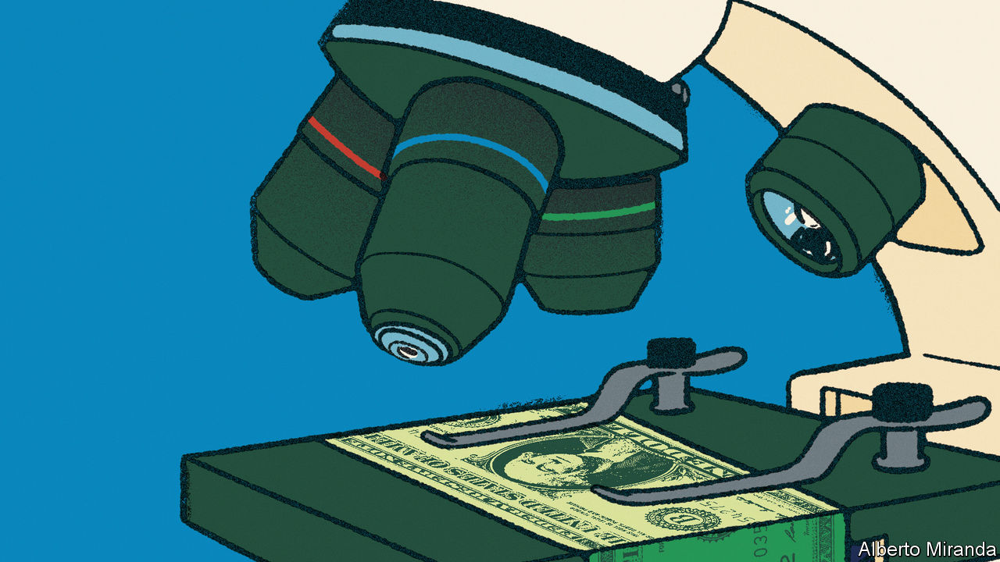
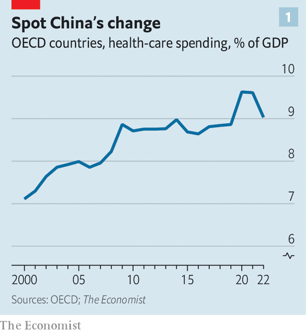

###### Under the microscope

# How health-care costs stopped rising 

##### In America and elsewhere the received wisdom has been proved wrong 

 

> Oct 26th 2023 

For a long time, health care was eating the world. From 1950 to 2009 American spending on hospitals, medics and the like rose from 5% of gdp to 17%. Between the late 1970s and the mid-2010s British public spending on health rose by 4% a year in real terms, much faster than the economy’s growth of 2% a year. From 1980 to 2010 overall French prices rose by 150%; the price of caring for a sick or old person rose by 250%. Among economists, the proposition “health care’s share of gdp rises” was almost as close to an iron law as “free trade is good” or “rent controls do not work”. 

 


The iron has now melted. Even as populations age, and as the world continues to deal with the fallout from the covid-19 pandemic, health care is no longer taking over the economy. Across the rich world health care’s share of gdp jumped in 2020 and 2021, because of a combination of pandemic-related spending and lower gdp. However, it has since fallen back to close to its level in 2008 (see chart 1). Because of this “flattening of the curve”, health spending today is somewhere in the region of $2trn below its pre-2009 trend. 

In some countries the changes are still more dramatic. The ratio of health-care spending to gdp has fallen from its pre-covid peak in Australia and Sweden. In Norway it has tumbled by a remarkable 2.5 percentage points of gdp from its level in 2016. Even in America—the land of costly health care—something has changed. A new measure published by the Bureau of Economic Analysis suggests that the share of spending going on health care has been falling since before the pandemic. A widespread slowdown has never happened before. It has not even come close to happening. 

 


Inflation in the global health-care industry, which once looked Argentine, now looks rather more normal. Consider a broad measure of American health-care prices, which includes not only things purchased directly by consumers but also those paid for on their behalf, such as by insurers. From the 1970s to the 2000s annual inflation almost always exceeded the average (see chart 2). But in around 2010 that relationship flipped—and much the same is true elsewhere. Relative to the “gdp deflator”, an economywide measure of inflation, the deflator in health and social care across the rich world has pretty much stopped rising. In the 1990s Japanese health inflation soared relative to average prices, but has fallen since 2015. In the French health-and-social-care sector, once dreadful at cost control, prices now grow in line with the economywide average.

To understand the significance of this development, consider some earlier warnings. “Put simply,” said President Barack Obama in 2009, “our health-care problem is our deficit problem.” In 2017 Britain’s fiscal watchdog cautioned that “excess cost growth” in health could add an additional 90% of gdp to Britain’s debt by the 2060s. Such statements now look a little outlandish, but few people saw this curve-flattening coming. What prompted it?

Begin with supply-side factors. Falling health-care inflation is consistent with rising health-care productivity. Economists typically think productivity gains in health care are difficult to come by because the service is labour-intensive. It is, for example, unrealistic to expect a phlebotomist to draw a blood sample 3% faster, year after year. Typically this results in “cost disease”, where spending must rise over time in order for the service merely to stand still. After all, even if phlebotomists do not get more efficient, they still expect a pay rise every now and then—without them they may be enticed to other sectors. William Baumol, who identified this phenomenon, worried about health-care spending swallowing up an ever-larger share of gdp.

At the same time, it never seemed plausible that health care was entirely immune to productivity gains. Even for an occasional patient it is blindingly obvious that health systems are ravaged by inefficiencies: paper-based forms instead of digital ones; hours spent filing insurance claims; different parts of the system not talking to one another. Meanwhile, some systems do seem to have improved. According to America’s Bureau of Labour Statistics, labour productivity in health care and social assistance fell by 13% between 1990 and 2000, but then made up all the lost ground from 2000 to 2019. In Britain, a study found that staff in the National Health Service (nhs) provided 17% more care pound for pound in 2016 than they did in 2004, compared with productivity growth of 7% in the economy as a whole. All this may have helped keep cost growth under control. 

Another supply-side factor—technological change—may also play a role. Over the long sweep of history, innovations have tended to raise health-care spending. This is in part because they often make therapies available for conditions that were previously impossible to treat. In the 1960s, for instance, the advent of dialysis machines was quite literally a life-saver for people suffering from kidney failure. And yet in the rich world the current cost of a year of dialysis for a patient is somewhere between $40,000 and $60,000, close to these countries’ per-person gdp. 

The nature of technological innovation in health care may now be changing. One possibility is that there has been a generalised slowdown in treatments that represent medical breakthroughs and are costly, such as dialysis. But this is difficult to square with a fairly healthy pipeline of drugs coming to market. Another possibility, which is perhaps more plausible, is that the type of advancements has changed, involving a shift from whizzy curative treatments to less glamorous preventive ones. There is decent evidence that the increased use of aspirin, a very low-cost preventative treatment, in the 1990s has cut American spending on the treatment of cardiovascular diseases today. 

A pill for the bill

Demand-side factors may also be keeping health-care spending in check. In America the Affordable Care Act (aca)—which was introduced in 2010, at about the time costs tailed off—tightened up the ways in which the government reimburses companies that provide treatment. The aca also made it more difficult for doctors to prescribe unnecessary treatments (seven expensive scans, perhaps, instead of one cheap one) in order to make more money. 

There are similar trends elsewhere. Following the global financial crisis of 2007-09, many cash-strapped European governments decided to reduce spending. This included limiting staff pay rises. The average basic earnings of British nurses are at least 10% lower in real terms than in 2010. Other governments have reduced spending by cutting services, sometimes to the bone. Take Greece, where the ratio of health spending to gdp is the same as it was in 2005. A paper published by the imf noted that, even before covid, the country’s health care was struggling, with “widening inequalities and large unmet needs, especially among the poor”. 

Other governments have saved money by replacing brand-name pharmaceutical offerings with generic equivalents. In the median European country for which there are data, generics take up 50% of the market by volume, up from 33% in 2010. After a patent on adalimumab, which is often known as “Humira” and is used to treat rheumatoid arthritis and other conditions, expired in 2018, the nhs saved around £150m ($200m) a year by bulk-buying non-brand versions of the drug. 

 


Another demand-side factor relates to overall economic growth. Health care is a “superior good”. When people get a dollar richer, they want more than a dollar more in health care—maybe demanding, say, mental-health care in addition to more traditional life-saving treatments. Across countries there is a strikingly strong relationship between prosperity and spending on health, even in places where the government provides the bulk of the health care (see chart 3). Americans spend so much on health because they are so much richer than almost everyone else.

These days growth in income per person across the rich world is far slower than it was before 2008. According to our estimates, this explains 40-60% of the curve flattening. This part of the story is therefore a pyrrhic victory: health spending is not growing in part because the world has stopped getting much richer. 

How long will the curve stay flat? Spending is being pulled in different directions. An ageing population will continue to push up demand. In some countries the pandemic appears to have dealt a blow to health-care productivity, which may not yet have shown up in the data. On the other hand, America’s Inflation Reduction Act allows Medicare to use its purchasing power to bludgeon pharma companies into lowering prices. And economic growth remains weak. What is clear for now, though, is that the received wisdom is wrong. Health care need not eat the world. ■


