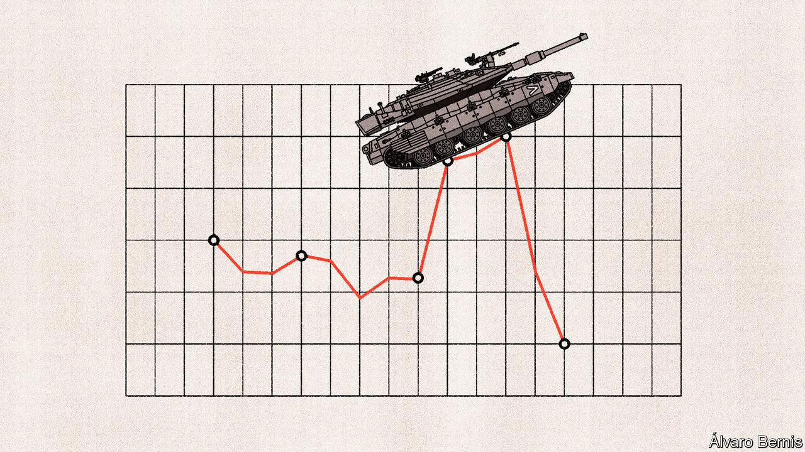

###### Free exchange

# Israel’s war economy is working—for the time being 

##### The longer the conflict lasts, the greater the pressure 

 

> Oct 26th 2023 

Less than three weeks since Hamas plunged Israel into war, conflict is taking a toll on the country’s economy. The shekel has sunk to its lowest level against the dollar in more than a decade, prompting Israel’s central bank to sell $30bn of foreign-exchange reserves to prop up the currency. The price of insuring the country’s debt against default has rocketed. Firms from builders to restaurants have shut. On October 19th the finance ministry outlined plans to ramp up defence spending and provide for those pushed out of work. Four days later the central bank cut its growth forecast for the year from 3% to 2.3%.

Since war is not just fought by military forces, but also by economic ones, an important question hovers over all this activity. Can Israel withstand the economic pain? The country’s clashes with Hamas since withdrawing from Gaza in 2005 do not provide much of a guide. In each case billions of shekels—a mere fraction of gdp—were spent on the military and repairs. The conflicts did not pose a threat to the country’s economy, which has long had one of the highest incomes per person in the Middle East. 

The scale of Hamas’s attacks on October 7th, and the likely ensuing conflict, is therefore pushing economists to the history books. In 1973 the cost of weapons and drafting 200,000 army reservists for the Yom Kippur war brought Israel to the brink of financial collapse. The country’s central bank reckons that, in 2002, a single year of intifada (Palestinian uprisings that ran intermittently from the late 1980s to the 2000s) cost 3.8% of gdp. 

To dodge disaster, Israeli officials must face up to three challenges. The first is employment. There are not enough workers to support both the economy and the war. Since October 7th the armed forces have mobilised more than 360,000 reservists, or 8% of the country’s workforce—a bigger call-up than in 1973. Most have left jobs, producing an enormous hole in the economy. Worse, the recruits are some of Israel’s most productive workers. Start-Up Nation, an Israeli charity, reckons that a tenth of tech workers have been called up. Workers in the industry are a quarter more productive than the average in the oecd club of mostly rich countries. By contrast, those in the rest of the economy are two-fifths less productive. Just a handful of reservists are from ultra-Orthodox communities in which employment is shunned.

There is another source of labour shortages. Many of Israel’s low-skilled jobs are done by Palestinians from the West Bank, some 200,000 of whom work in either Israel or its settlements. But unrest in the West Bank means that many workers are not being allowed across the border, and they may begin to strike. During part of the second Palestinian intifada, which lasted from 2000 to 2005, missing Palestinian workers were one of the biggest brakes on Israeli growth, according to the imf. 

Moreover, there are few workers with which to replace reservists and Palestinians, since Israel’s labour market is ultra-tight. According to the central bank, which has spent the past few months raising interest rates to cool the economy, unemployment is at 3.2%. Strict labour laws mean that firms can only hire temporary replacements for those on military duty—not an attractive option. Investors worry about capital flooding away from “Silicon Wadi” and back to its Californian namesake. Start-Up Nation reckons that 70% of tech firms are struggling to function. The risk is that, when the war finishes, there will be fewer jobs to which to return. 

A second challenge for policymakers is the collapse of private consumption. Amid uncertainty and fear of repeat attacks, people have changed their consumption habits by staying at home. For nearly three weeks, restaurants and shopping malls have been empty. Those with the workers to open have discovered there are few customers. Tourism, Israel’s main business aside from tech, has screeched to a halt. Entire towns along the border with Gaza and Lebanon have been cleared out, putting a stop to economic activity. In order to support firms, all but the biggest businesses that suffer because of the war will receive covid-style grants to cover fixed costs. vat payments have been deferred. Workers who used to toil in areas now deemed unsafe will get handouts.

That brings the final challenge for Israeli policymakers: managing the fiscal costs of conflict. Rescuing businesses, paying reservists and housing the population of entire villages in hotels will take its toll. An enormous increase in defence spending will be required in order to finance a ground invasion this year, and stock Israel with enough weapons to feel secure next year. 

Israel’s debt is currently at around 60% of gdp, a modest ratio for somewhere so rich. Even assuming that the war continues to the end of the year, it is forecast to rise to a mere 62%. The central bank has a healthy $170bn of foreign-exchange reserves. On top of this, America will help, assuming that President Joe Biden is able to unlock the $14bn he is asking for in military aid from Congress. Yet the longer the conflict continues, the more risks will grow. In 2024 Israel’s primary deficit is forecast to jump from 3% of gdp to 8%. The country’s economy had been on the rocks before Hamas’s attack. The government’s revenues were down by 8% in September, after a tough first eight months of the year. Now the cost of borrowing is rising and the tax base is crumbling. A longer war will mean more destruction, and reconstruction will not come cheap.

Now or never

The government will not be able to pay its way for ever, which is one reason why a chorus of local politicians insists that a ground invasion of Gaza ought to proceed straight away. Although, in the next few months, households and firms will receive generous financial support, conflict is draining labour, capital and expertise from Israel’s economy faster than it can be replaced. Other economies may have withstood far greater damage in pursuit of military victories in the past, but that will be little consolation to those forced to bear the costs in Israel this time around. ■


