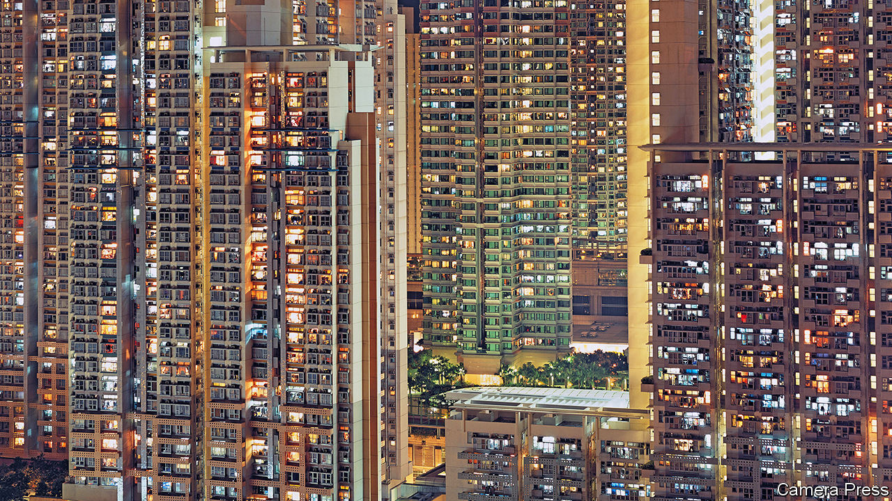

###### Consumerzzzzzzzzz

# Welcome to the age of the hermit consumer 

##### The world economy is witnessing a $600bn-a-year shift in behaviour 

 

> Oct 22nd 2023 

In some ways covid-19 was a blip. After soaring in 2020, unemployment across the rich world quickly dropped to pre-pandemic lows. Countries re-attained their pre-covid gdp in short order. And yet, more than two years after lockdowns were lifted, at least one change is enduring:  across the rich world have shifted decisively, and perhaps permanently. Welcome to the age of the hermit. 

Before covid, the share of consumer spending devoted to services was rising steadily. As societies became richer, they sought more luxury experiences, health care and financial planning. Then in 2020 , from hotel stays to hair cuts, collapsed. With people , demand for goods jumped, with a rush for computer equipment and exercise bikes. 

 


Three years on, the share of spending devoted to services remains below its pre-covid level (see chart 1). Relative to its pre-covid trend, the decline is sharper still. Rich-world consumers are spending around $600bn a year less on services than you might have expected in 2019. In particular, people are less interested in leisure activities that take place outside the home, including hospitality and recreation. , ranging from durables like chairs and fridges, to things such as clothes, food and wine. 

In countries that spent less time in lockdown, hermit habits have not become ingrained. Elsewhere, though, the behaviour looks pathological. In the Czech Republic, which was whacked by covid, the services share is three percentage points below trend. America is not far off. Japan has witnessed a 50% decline in restaurant bookings for client entertainment and other business purposes. Pity the drunken salaryman staggering round Tokyo’s pleasure districts: he is an endangered species.

At first glance, the figures are difficult to reconcile with the anecdotes. Isn’t it harder than ever to get a table at a restaurant? Yet the true source of the crowding is not sky-high demand, but constrained supply. These days fewer people want to work in hospitality—in America employment in the industry remains lower than in 2019. And pandemic disruption means many new hotels and restaurants that would have opened in 2020 and 2021 never did. The number of hotels in Britain, at around 10,000, has not grown since 2019. 

 


Firms are noticing the $600bn shift. In a recent earnings call an executive at Darden Restaurants, which runs one of America’s finest restaurant chains, Olive Garden, noted that, relative to pre-covid times, “we’re probably in that 80% range in terms of traffic”. At Home Depot, which sells tools to improve homes, revenue is up by about 15% on 2019 in real terms. Goldman Sachs, a bank, tracks the share prices of companies that benefit when people stay at home (such as e-commerce firms) and those that thrive when people are out (such as airlines). Even today, the market looks favourably upon firms that serve stay-at-homers (see chart 2).

Why has hermit behaviour endured? The first possible reason is that some tremulous folk remain afraid of infection, whether by covid or something else. In Britain, car use is in line with the pre-covid norm, whereas public-transport use is well down. People also seem less keen on up-close-and-personal services. In America spending on hairdressing and personal grooming is 20% below its pre-covid trend, while spending on cosmetics, perfumes and nail preparations is up by a quarter.

The second reason relates to . Across the rich world people now work about one day a week , according to Cevat Giray Aksoy of King’s College London and colleagues. This cuts demand for services bought at the office, including lunches, and raises demand for do-it-yourself goods. Last year Italians spent 34% more on glassware, tableware and household utensils than in 2019. 

The third relates to values. Covid may have made people genuinely more . According to official data from America, last year people slept 11 minutes more a day than in 2019. They also spent less on clubs that require membership and other social activities, and more on solitary pursuits, such as gardening and pets. Meanwhile, global online searches for “Patience”, a card game otherwise known as Solitaire, are running at about twice their pre-pandemic level. Covid’s biggest legacy, it seems, has been to pull people apart. ■


