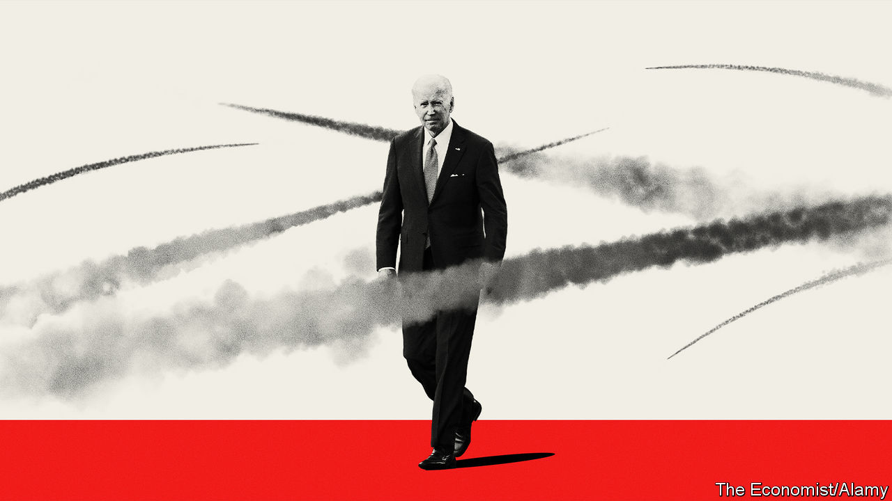

###### The stakes in Gaza

# American power: indispensable or ineffective? 

##### How Joe Biden manages the war between Israel and Hamas will define America’s global role 

 

> Oct 26th 2023 

AS MASSED ISRAELI troops await the command to invade Gaza, two hulking US Navy aircraft-carriers have been sent to support Israel. Their task is to  and its sponsor Iran from opening a second front across the Lebanese border. No other country could do this. The carriers are a 200,000-tonne declaration of American power at a time when much of the world believes that American power is in decline.

The coming months will test that view. It is hard to exaggerate the stakes. On October 20th President Joe Biden called this “an inflection point”. He warned of the need to repulse Hamas’s terror as well as Russia’s aggression against Ukraine. China’s threat to invade Taiwan lurked unspoken in the background. 

Yet things are even more dangerous than Mr Biden suggests. Abroad, America faces a complex and hostile world. For the first time since the Soviet Union stagnated in the 1970s it has a serious, organised opposition, led by China. At home, politics is plagued by dysfunction and a Republican Party that is increasingly isolationist. This moment will define not only Israel and the Middle East but America and the world. 

The foreign threat has three parts. One is the chaos spread by Iran across the Middle East and by Russia in Ukraine. Aggression and instability consume American political, financial and military resources. Conflict will spread in Europe if Russia gets its way in Ukraine. Bloodshed could radicalise people in the Middle East, turning them against their governments. Wars draw in America, which becomes an easy target for accusations of warmongering and hypocrisy. All this undermines the idea of a world order.

A second threat is complexity. A group of countries, including India and Saudi Arabia, are increasingly transactional, bent on fiercely pursuing their own interests. Unlike Iran and Russia, such countries do not want chaos, yet neither will they take orders from Washington—and why should they? For America, this makes the job of being a superpower harder. Look, for example, at Turkey’s games over Sweden’s membership of NATO, seemingly resolved this week after 17 months of tiresome wrangling. 

The third threat is the biggest. China has ambitions to create an alternative to the values enshrined in global institutions. It would reinterpret concepts like democracy, freedom and human rights to suit its own preference for development over individual freedom and national sovereignty over universal values. China, Russia and Iran are forming a loosely co-ordinated group. Iran supplies drones to Russia and oil to China. Russia and China have given Iran’s client Hamas diplomatic cover at the UN. 

These threats are magnified by politics at home in Washington. Republican politicians are reverting to the  in trade and foreign affairs that their party embraced before the second world war. This goes deeper than Donald Trump, and it raises the question of whether America can act as a superpower if one of its parties rejects the entire notion of global responsibilities. Remember that it took Pearl Harbour for America to enter the war in 1941.

To see how this can damage American interests, consider Ukraine, which MAGA Republicans want to stop supplying with weapons and money. That makes no sense, even in terms of the narrowest self-interest. The war presents America with a chance to defang Vladimir Putin and deter China from invading Taiwan without putting its own troops at risk. Deserting Ukraine, by contrast, invites a Russian attack on NATO that would cost far more American lives and treasure, and signals to friend and foe that America is no longer a dependable ally. If isolationist Republicans fail the Ukraine test, there is no knowing where America might end up, were Mr Trump to return to the White House.

These are formidable obstacles. However, America also has formidable strengths. One is its military heft. It has not only deployed those two carrier strike groups to the Middle East, but is also supplying arms, intelligence and expertise to Israel, just as it has to Ukraine. China has rapidly increased its budget for the People’s Liberation Army, but at market exchange rates America still spent as much last year on defence as the ten next countries combined, and most of them are its allies.

America’s economic heft is impressive, too. The country generates a quarter of the world’s output with a twentieth of its population, and the share is unchanged over the past four decades, despite China’s rise. This newspaper worries about the inefficiency and creeping protectionism of Mr Biden’s industrial policy, but we do not doubt America’s technological muscle and underlying dynamism—especially when set against China, where it has become increasingly clear that the goal of economic growth has been subordinated to the goal of maximising Communist Party control.

America’s other underestimated strength is its reinvigorated diplomacy. The war in Ukraine has proved the value of NATO. In Asia, America has created AUKUS and shored up its relations with a host of countries, including Japan, the Philippines and South Korea. In  this week America’s national security adviser, Jake Sullivan, spells out how countries which pursue their own interests can still be essential partners. The model is India, which is increasingly part of America’s designs for security in Asia, despite its determination to remain outside any alliance. 

Centrifugal force

Where does that leave America, as it hugs Israel close in an attempt to stop a wider war? Some will say that an ageing superpower is once again being sucked back into the Middle East, after nearly 15 years of trying to get out. However, this crisis is not as all-consuming as the wars in Afghanistan and Iraq were.

Mr Biden’s formulation is better: this is indeed an inflection point, which will test whether America can adapt to a more complex and threatening world. It still has a lot to offer, especially if it works with its allies to enhance security and keep trade open. Its values, however imperfectly they are realised, still attract people from all across the planet in a way that Chinese communism does not. If Mr Biden succeeds in managing the crisis over Gaza, that would be good for America, good for the Middle East and good for the world. ■


