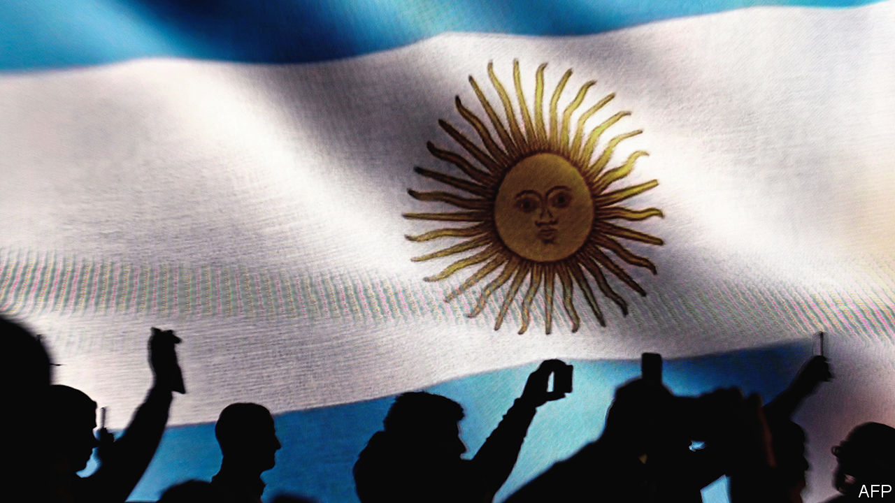

###### How to destroy an economy—and get away with it

# Argentina’s election result is the worst of all possible outcomes 

##### Sergio Massa, the economy minister, will now go head-to-head with Javier Milei 

 

> Oct 23rd 2023 

On October 22nd, two days after Argentina’s brave rugby team was thrashed in the semi-finals of the World Cup, any hope of a prudent course for the country’s politics was similarly eliminated. Sergio Massa, the economy minister, won almost 37% of votes in the first round of the presidential election, ahead of expectations. Javier Milei, a libertarian “anarcho-capitalist” who had been leading the polls, got 30%. Patricia Bullrich, the sensible centre-right option, got just 24% of votes and is now out of the race. Mr Massa and Mr Milei will head to a run-off next month. Even by the standards of Argentina’s telenovela-like politics, the next four weeks are likely to be dramatic. 

Two depressing messages come out of this race. The first is that Argentine voters have rejected a rational, centre-right platform for change. In a country where annual inflation is 138% and the local currency has lost nearly 95% of its value over the past four years, the economy is unsurprisingly voters’ main concern. And yet they plumped for Mr Massa, whose populist party, the Peronists, has been the main cause of the country’s disastrous economic performance for generations. Their second choice was Mr Milei, who promises a radical free-market package that he surely could not deliver, which includes scrapping the central bank, dollarising the economy and reducing public spending by a colossal 15% of GDP. 

The second message is that, in a country where the Peronists have been in power for 28 of the past 40 years, it is difficult for outsiders to break in. Only one non-Peronist president, Mauricio Macri, has been able to complete his term since democracy was restored in 1983. The electoral machine behind the Peronists kicked into action in August, when Mr Milei did unexpectedly well in an open primary. Mr Massa promptly  for 99% of workers and gave pensioners a tasty bonus, never mind the deficit. 

Some of Mr Milei’s economic policies are wise. But he put off a lot of voters with his divisive rhetoric. In a country where nearly two-thirds of people are Catholic, Mr Milei called the pope, also an Argentine, “a leftist son of a bitch”. He has said inflammatory things about other politicians, and appealed to the far right by appointing as his running-mate Victoria Villarruel, a lawyer who has downplayed the atrocities committed during Argentina’s military dictatorship. His erratic character and lack of experience—he joined Congress only in 2021, after a stint as a TV personality—could make him unsuitable for office.

In short, neither remaining candidate seems likely to solve Argentina’s problems. The country is on the brink of its sixth recession in a decade. It owes $43bn to the IMF, which it cannot pay back. Its central bank should be properly independent, rather than a political money-printing machine. The country needs painful structural reforms. Rather than dollarise, it should restructure its debts. That may damage its relationship with the IMF, but there is no other way out of its debt black hole.

Although he is considered a centrist by Peronist standards, Mr Massa is unlikely to be willing to implement reforms. His pre-election splurge on handouts is just another example of the spendthrift populism which his party has practised for decades. The country’s dollar bonds, which were already trading at below 30 cents to the dollar, fell further on the news of Mr Massa’s win. Another spending spree is likely ahead of the second round. 

Ms Bullrich backed the libertarian outsider on October 25th. With her support, Mr Milei may try to appeal more broadly to centre-right voters. Neither of the two contenders will have a majority in Congress. The least bad outcome to hope for is that Mr Milei moderates his wild rhetoric and tries to assemble a coalition of sensible politicians keen on reform. If so, Argentina might have a chance, however slim, to change its fortunes. If it sticks with Peronism, it will just descend further into chaos. ■

