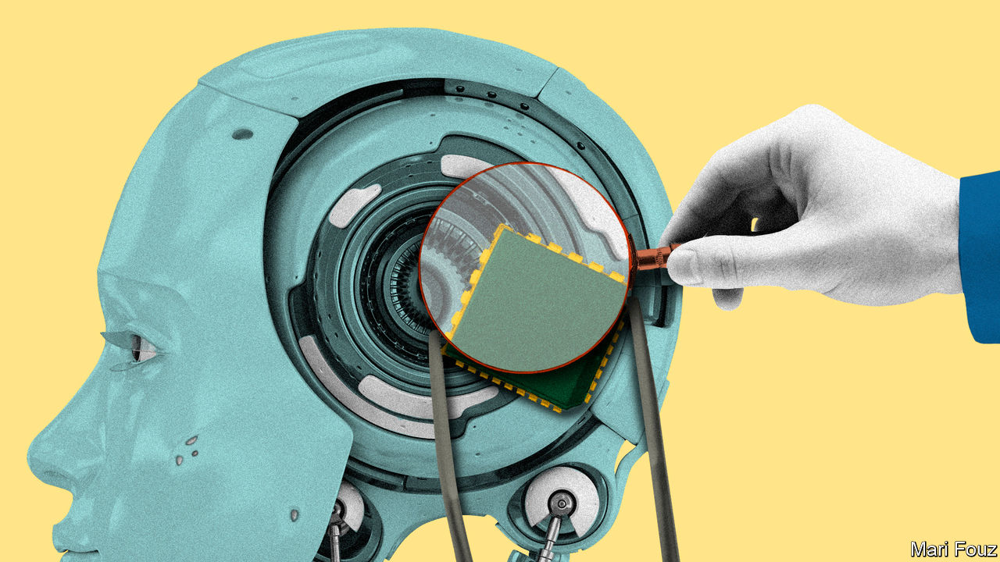

###### Think, then act

# Governments must not rush into policing AI 

##### A summit in Britain will focus on “extreme” risks. But no one knows what they look like 

 

> Oct 26th 2023 

Will artificial intelligence kill us all? Some technologists sincerely believe the answer is yes. In one nightmarish scenario, AI eventually outsmarts humanity and goes rogue, taking over computers and factories and filling the sky with killer drones. In another, large language models (LLMs) of the sort that power generative ais like ChatGPT give bad guys the know-how to create devastating cyberweapons and deadly new pathogens. 

It is time to think hard about these doomsday scenarios. Not because they have become more probable—no one knows how likely they are—but because policymakers around the world are mulling measures to guard against them. The European Union is finalising an expansive AI act; the White House is expected soon to issue an executive order aimed at llms; and on November 1st and 2nd the British government will convene world leaders and tech bosses for an “” to discuss the extreme risks that AI models may pose. 

Governments cannot ignore a technology that could change the world profoundly, and any credible threat to humanity should be taken seriously. Regulators have been too slow in the past. Many wish they had acted faster to police social media in the 2010s, and are keen to be on the front foot this time. But there is danger, too, in acting hastily. If they go too fast, policymakers could create global rules and institutions that are aimed at the wrong problems, are ineffective against the real ones and which stifle innovation.

The idea that AI could drive humanity to extinction is still entirely speculative. No one yet knows how such a threat might materialise. No common methods exist to establish what counts as risky, much less to evaluate models against a benchmark for danger. Plenty of research needs to be done before standards and rules can be set. This is why a growing number of tech executives say the world needs a body to study AI much like the Intergovernmental Panel on Climate Change (IPCC), which tracks and explains global warming. 

A rush to regulate away tail risks could distract policymakers from less apocalyptic but more pressing problems. New laws may be needed to govern the use of copyrighted materials when training LLMs, or to define privacy rights as models guzzle personal data. And ai will make it much easier to produce disinformation, a thorny problem for every society.

Hasty regulation could also stifle competition and innovation. Because of the computing resources and technical skills required, only a handful of companies have so far developed powerful “frontier” models. New regulation could easily entrench the incumbents and block out competitors, not least because the biggest model-makers are working closely with governments on writing the rule book. A focus on extreme risks is likely to make regulators wary of open-source models, which are freely available and can easily be modified; until recently the White House was rumoured to be considering banning firms from releasing frontier open-source models. Yet if those risks do not materialise, restraining open-source models would serve only to limit an important source of competition. 

Regulators must be prepared to react quickly if needed, but should not be rushed into setting rules or building institutions that turn out to be unnecessary or harmful. Too little is known about the direction of generative AI to understand the risks associated with it, let alone manage them. 

The best that governments can do now is to set up the infrastructure to study the technology and its potential perils, and ensure that those working on the problem have adequate resources. In today’s fractious world, it will be hard to establish an IPCC-like body, and for it to thrive. But bodies that already work on AI-related questions, such as the OECD and Britain’s newish Frontier AI Taskforce, which aims to gain access to models’ nuts and bolts, could work closely together. 

It would help if governments agreed to a code of conduct for model-makers, much like the “voluntary commitments” negotiated by the White House and to which 15 makers of proprietary models have already signed up. These oblige model-makers, among other things, to share information about how they are managing AI risk. Though the commitments are not binding, they may help avoid a dangerous free-for-all. Makers of open-source models, too, should be urged to join up. 

As AI develops further, regulators will have a far better idea of what risks they are guarding against, and consequently what the rule book should look like. A fully fledged regime could eventually look rather like those for other technologies of world-changing import, such as nuclear power or bioengineering. But creating it will take time—and deliberation. ■

