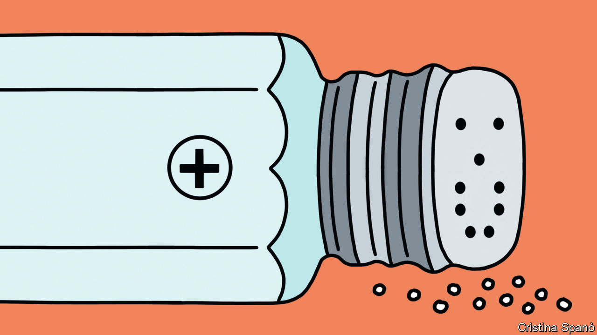

###### The green transition

# Sodium batteries offer an alternative to tricky lithium 

##### Lithium is relatively scarce and mostly refined in China. Sodium is neither 

 

> Oct 26th 2023 

In the early 20th century Britain’s Royal Navy converted its ships to run on oil instead of coal. But whereas coal could be produced at home, oil had to be imported. That caused jitters: what if those imports were one day cut off? Winston Churchill, who was in charge of the navy at the time, argued that the best defence was a diversity of supply. As he told a fretful Parliament: “Safety and certainty in oil lie in variety and variety alone.”

These days, politicians in rich countries find themselves in an even tighter bind. They need to switch not just their navies, but their entire economies from fossil fuels to low-carbon electricity to avert the worst consequences of climate change. But they worry that doing so will leave them geopolitically exposed.

They fret in particular about batteries. The green transition will require huge numbers of them: for cars, lorries and homes, and to help balance national power grids as they come to rely on intermittent electricity from the sun and the wind. Although lots of different types of battery exist, the dominant technology is the lithium-ion battery, which offers a useful mix of low maintenance requirements and high energy density. But lithium, an essential component, is hard to come by, and the refining of it mostly takes place in China.

Western countries, particularly those in Europe that have spent the past two years trying to wean themselves off Russian natural gas, are wary of leaving their future energy security similarly compromised. Such fears are not merely theoretical. On October 20th China announced national-security restrictions on the export of graphite, another important component of lithium batteries. It was the latest salvo in a trade-and-technology war that began when America  to China.

Fortunately, lithium is not the only game in town. As we report this week, a clutch of firms are , lithium’s elemental cousin. Since sodium’s chemical properties are very similar to those of lithium, it too makes for good batteries. And sodium, which is found in the salt in seawater, is thousands of times more abundant on Earth than lithium and cheaper to get at. Most of the companies using sodium to make batteries today are also Chinese. But pursuing the technology in the West might be a surer route to energy security than relying heavily on lithium. 

Besides its abundance, sodium has other advantages. The best lithium batteries use cobalt and nickel in their electrodes. Nickel, like lithium, is in . Mining it on land is . Proposals to grab it from the seabed instead have caused rows. A good deal of the world’s cobalt, meanwhile, is extracted from  in the Democratic Republic of Congo, where child labour is common and working conditions are dire. Sodium batteries, by contrast, can use electrodes built from iron and manganese, which are plentiful and uncontroversial. Since the chemical components are cheap, a scaled-up industry should be able to produce batteries that cost less than their lithium counterparts.

Sodium is not a perfect replacement for lithium. It is heavier, meaning sodium batteries will weigh more than lithium ones of an equivalent capacity. That is likely to rule them out in some cases where . But for other applications, such as grid storage or home batteries, weight is irrelevant. Several Chinese carmakers are even beginning to put sodium batteries in electric vehicles.

Perhaps the biggest disadvantage of sodium batteries is their late start. Lithium-ion batteries were first commercialised in the 1990s and have benefited from decades of investment. But the rest of the world is behind China on both fronts anyway. America and the European Union have announced enormous programmes of green industrial subsidies. If they are determined to bankroll batteries, some of the pot should go to sodium. ■


