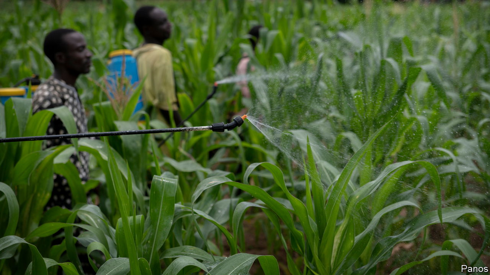

###### Pesticidal farmers

# Nigeria is awash with dangerous pesticides 

##### Many are banned elsewhere for causing cancer or harming the environment 

 

> Oct 26th 2023 

For quite a while, Nigeria has been talking up its desire to end its reliance on oil money and earn more from other sources, especially farming. Its population of around 213m, the biggest in Africa, has some 37m hectares of fertile land. But it grows too little on it. 

Worse, some of its produce isn’t healthy. Food exported to Europe and America has been rejected because of its excessive residue of pesticide. To feed Nigeria’s own people, let alone markets abroad, farmers will have to cut back on their use of some chemicals. 

That will not be easy, since Nigeria is one of the continent’s leaders at splurging on pesticides, importing some $384m-worth in 2018 alone to kill bugs and weeds. Yet 58% of the pesticides registered for use in Nigeria are banned in Europe because of their toxicity. 

Sometimes the chemicals are so strong that they don’t only wipe out pests and other crop-predators; they can kill people. In 2020 some 270 people in a village in Benue state died after fishermen using chemicals to catch fish had dumped some of them into the community’s main water source. Scientists at several Nigerian universities argue that dangerous pesticides and other agrochemicals are contributing to rising rates of cancer, which kills as many as 79,000 Nigerians a year. A recent study found that roughly 80% of the pesticides most commonly used by small-scale farmers are highly hazardous.

“Farmers use what’s available and recommended to them,” taking advice from marketers and traders, says Jochen Luckscheiter of the Heinrich Böll Foundation, an NGO tied to Germany’s Green party. “If you want to stop them, you have to stop the supply—and make alternative products available.”

In August environmental activists and politicians gathered in Abuja, Nigeria’s capital, to review the current laws on importing and using pesticides—and discovered that hardly any exist. Instead, they lamented that two bills going through parliament will make it easier for foreign firms to sell dangerous wares. 

Boosting Nigeria’s farm output is no simple task. Farmers need seeds that produce higher yields, affordable fertiliser and better access to markets. They also need security. Thousands have fled their homes and fields because of jihadists in the north and to escape fighting over land between herders and farmers. By contrast with these challenges, it ought to be easy to regulate pesticides so they do not poison people. ■

