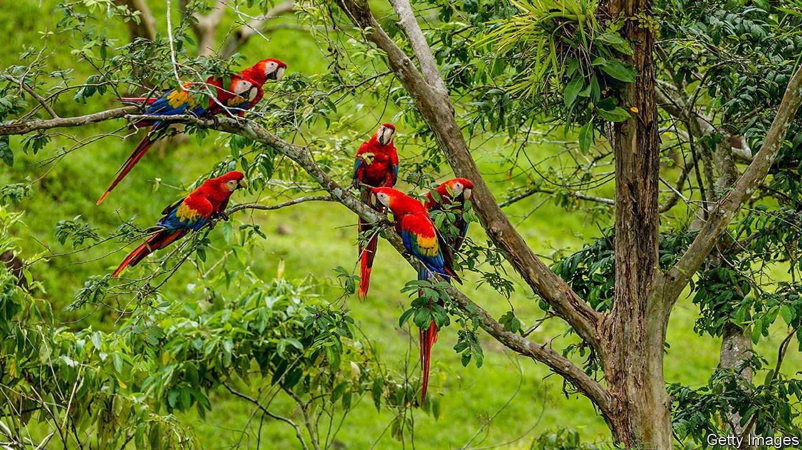

###### Listening to the jungle

# AI can catalogue a forest’s inhabitants simply by listening 

##### That could help check whether reforestation projects work as advertised 

 

> Oct 25th 2023 

The rainforests are alive with the sound of animals. Besides the pleasure of the din, it is also useful to ecologists. If you want to measure the biodiversity of a piece of land, listening out for animal calls is mucher than grubbing about in the undergrowth looking for tracks or spoor. But such “bioacoustic analysis” is still time-consuming, and it requires an expert pair of ears.

In a paper published on October 17th in , a group of researchers led by Jörg Müller, an ecologist at the University of Würzburg, describe a better way: have a computer do the job. Smartphone apps already exist that will identify birds, bats or mammals simply by listening to the sounds they make. Their idea was to apply the principle to conservation work. 

The researchers took recordings from across 43 sites in the Ecuadorean rainforest. Some sites were relatively pristine, old-growth forest. Others were areas that had recently been cleared for pasture or cacao planting. And some had been cleared but then abandoned, allowing the forest to regrow. 

Sound recordings were taken four times every hour, over two weeks. The various calls were identified manually by an expert, and then used to construct a list of the species present. As expected, the longer the land had been free from agricultural activity, the greater the biodiversity it hosted. 

Then it was the computer’s turn. The researchers fed their recordings to artificial-intelligence models that had been trained, using sound samples from elsewhere in Ecuador, to identify 75 bird species from their calls. “We found that the AI tools could identify the sounds as well as the experts,” says Dr Müller. 

Of course, not everything in a rainforest makes a noise. Dr Müller and his colleagues used light-traps to capture night-flying insects, and DNA analysis to identify them. Reassuringly, they found that the diversity of noisy animals was a reliable proxy for the diversity of the quieter ones, too. 

The results may have relevance outside ecology departments, too. Under pressure from their customers, firms such as L’Oreal, a make-up company, and Shell, an oil firm, have been spending money on forest restoration projects around the world. Dr Müller hopes that an automated approach to checking on the results could help monitor such efforts, and give a standardised way to measure whether they are working as well as their sponsors say.■


