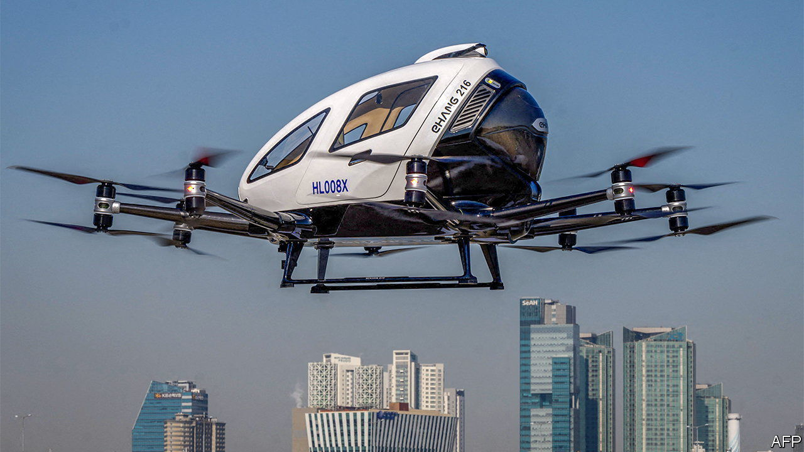

###### Two seats, no pilot

# China approves the world’s first flying taxi 

##### EHang could soon take passengers on pilotless joyrides over Guangzhou 

 

> Oct 25th 2023 

Anyone keen to view from on high the sprawling cityscapes of Guangdong, a bustling province in southern China, may soon be able to do so from the cabin of a flying taxi. On October 13th the Civil Aviation Administration of China (CAAC) awarded a “type certificate”, a crucial piece of aviation paperwork, to the world’s first electric vertical take-off and landing (eVTOL) taxi. And in case that does not sound futuristic enough, the small two-seater, called the EH216-S, was also cleared to fly without a pilot on board.

The EH216-S is made by EHang, a company based in Guangdong. It resembles a scaled-up consumer drone with a passenger bubble mounted on top. Propulsion is provided by 16 small rotors, mounted on the tips of eight arms that fold away when the vehicle is not in use, allowing it to park in small spaces.

EHang has already set up a factory to produce the aircraft at scale. The firm hopes sightseeing flights in Guangdong could begin before the end of the year. There is interest from elsewhere, too. On October 18th the city government of Hefei, in Anhui province, announced a $100m deal with EHang to provide tourist flights and other services such as deliveries and emergency response, using 100 of the machines. The company believes its eVTOLs will one day be able to offer taxi rides at a similar price to terrestrial cabs.

Scores of eVTOLs are being developed around the world. These have already attracted more than $30bn in orders, says Robin Riedel, co-lead of the Centre for Future Mobility, a part of McKinsey. Being the first to certify one could allow China, which is keen to promote the industry, to gain valuable operating experience. 

The CAAC gave its approval after EHang had conducted more than 40,000 test flights, including with volunteer passengers in 18 cities across China. It also subjected the EH216-S to structural analysis and crash tests, and checked its ability to keep flying if one of its rotors fails. Regulators also inspected the wireless network which EHang uses to link its flying taxis to a control centre on the ground. That allows backup pilots to land an aircraft by remote control if there is a problem. 

EHang says its pilotless eVTOLs will be quieter than helicopters, their closest cousins, and much cheaper to operate, thanks in part to the ability to swap out an expensive pilot for a second paying passenger. Performance, though, will be limited, at least at first. The EH216-S has a range of about 30km, and a speed of up to 130kph. EHang is developing a second version, the VT30, with 300km of range—though it will require separate certification.

The firm thinks that doing away with pilots will make things safer too, in the same way that enthusiasts argue that self-driving cars, if they are ever widely deployed, could prove safer than human-driven ones. A computer’s attention never wavers, and its reflexes operate at the speed of silicon. And flying is, in many ways, much easier to automate than driving, for there are fewer obstacles and unexpected situations to navigate. 

EHang has ambitions beyond China, too. It has carried out demonstration flights in America and Europe with the aim of obtaining type certificates in both markets. The company says it hopes its Chinese approval will shorten that process. But American and European aviation regulators are likely to take a more cautious approach than their Chinese counterparts. Both have signalled that they will approve only piloted air taxis at first, and allow autonomous flights only after the vehicles have proved themselves safe in human hands. Given that most piloted eVTOLs under development are designed with automation in mind, having to build piloted versions increases costs. It might, though, encourage more people to use them.

The firm’s closest rivals are Volocopter, a German company, and a pair of Californian firms, Joby Aviation and Archer Aviation. All three are conducting test flights of piloted eVTOLs of various designs. Volocopter’s vehicle, for example, looks more like an ordinary helicopter, with a passenger pod slung below a circular frame supporting 18 small propellers. It hopes to start carrying passengers in its two-seater version (with one seat used by a pilot) at the Paris Olympics, which open in July 2024. 

And EHang is not alone in taking the autonomous route first. Wisk Aero, another Californian firm, has begun testing a pilotless eVTOL as part of America’s certification programme. The firm, which is a subsidiary of Boeing, one of the world’s biggest aircraft-makers, will also use a ground-based control centre to monitor flights. As Wisk expects to obtain certification only sometime “within this decade”, EHang might find it has to hover hopefully for a long while before it can do the same.■


