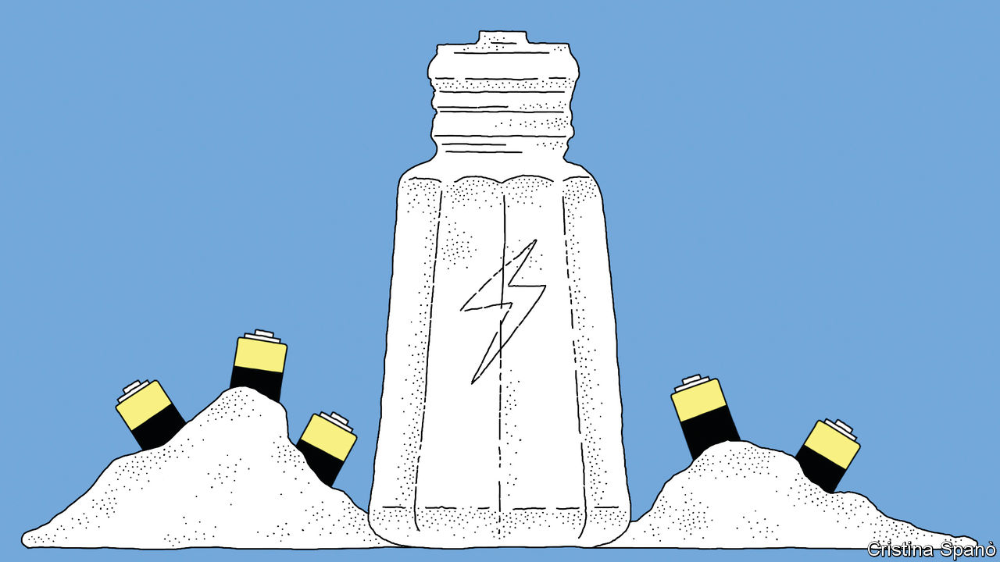
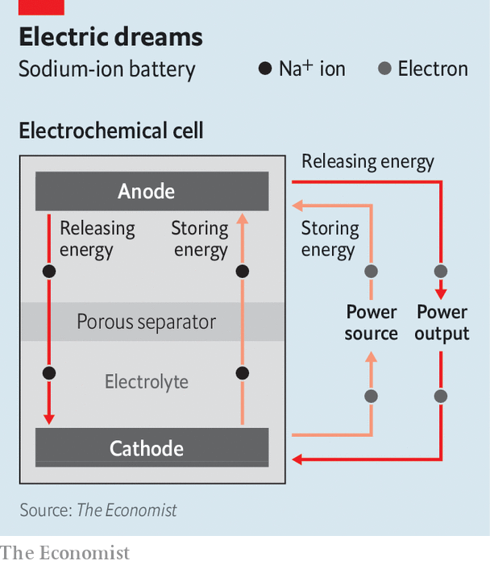

###### A battery ReNaissance

# Firms are exploring sodium batteries as an alternative to lithium 

##### Unlike lithium, sodium is cheap and abundant 

 

> Oct 25th 2023 

They power tiny phones and two-tonne electric cars. They form the guts of a growing number of grid-storage systems that smooth the flow of electricity from wind and solar power stations. Without them, the electrification needed to avoid the worst effects of global warming would be unimaginable. And in 2019 they earned three of their pioneers a Nobel prize.

But lithium-ion (Li-ion) batteries have downsides. Lithium is scarce, for one. And the best Li-ion batteries, those with layered-oxide cathodes, also require cobalt and nickel. These metals are scarce, too—and cobalt is also problematic because a lot of it is mined in the Democratic Republic of Congo, where working conditions leave much to be desired. A second sort of Li-ion battery, a so-called polyanionic design that uses lithium iron phosphate (LFP), does not need nickel or cobalt. But such batteries cannot store as much energy per kilogram as layered-oxide ones.

A clutch of companies, though, think they have an alternative: making batteries with sodium instead. Unlike lithium, sodium is abundant: it makes up most of the salt in the oceans. And chemists have found that layered-oxide cathodes which use sodium rather than lithium can get by without cobalt or nickel to jazz them up. The idea of making sodium-ion (or Na-ion) batteries at scale is therefore gaining traction. Engineers are tweaking designs. Factories, particularly in China, are springing up. For the first time since the Li-ion revolution began, lithium’s place on the electrochemical pedestal is being challenged. 

Salts of the Earth

Lithium and sodium, members of a group called the alkali metals, sit just below hydrogen in the first column of the Periodic Table. Alkali metals are famously reactive. (Dropping some in water will give you a lot of fizzing. Others will produce explosions.) This is because the outermost shell of electrons surrounding the nucleus of an alkali-metal atom has but a single occupant. These “valence” electrons are easily shed, creating positive ions (cations) that can link up with negative counterparts (anions), such as hydroxyl ions derived from water. The results are compounds like lithium hydroxide and sodium chloride, better known as table salt.

 


If, however, the lost electrons are routed to their destinations via a wire, rather than hopping directly to a neighbouring atom or group of atoms, while the cations make the journey separately, through a medium called an electrolyte, the result is an electrochemical cell. Energy can be drawn from this as the electrons journey through the wire (see diagram). Conversely, if the whole process is put into reverse by applying a current, the cell can be recharged. 

All this applies as much to sodium as to lithium. Given sodium’s cost advantages, non-chemists may wonder why it was not preferred to lithium in the first place. The answer is that sodium atoms, which have 11 protons, 12 neutrons and an extra electron shell, are bigger and heavier than lithium ones (three protons and three neutrons). A sodium battery will be bigger and heavier than a lithium one of the same capacity. 

Small size and a low weight are crucial for phones, and at least desirable in cars. But they do not matter everywhere. Sodium batteries could work for grid-scale storage, home storage and heavy forms of transport, such as lorries and ships.

China’s interest stems partly from the government’s current five-year economic plan, which began in 2021, and which aims, among other things, to explore a variety of battery chemistries. Benchmark Mineral Intelligence, a firm in London, lists 36 Chinese companies that are either making or investigating sodium batteries. These firms mostly play their cards close to their chests—in four cases Benchmark’s researchers cannot even determine exactly which battery chemistry is involved. The leader of the pack is, nevertheless, generally agreed to be CATL, based in Fujian.

 


CATL is already the world’s largest maker of Li-ion vehicle batteries. In 2021 it announced the world’s first sodium battery for electric vehicles. Chery, a Chinese carmaker, will use catl’s sodium batteries, alongside some lithium ones, in its iCAR brand, to be launched shortly.

BYD, CATL’s chief rival and a carmaker in its own right, is similarly active. Its Seagull hatchback, which was unveiled at the Shanghai Auto Show in April, will also soon sport Na-ion batteries. Farasis Energy, another established battery-maker, has teamed up with Jiangling Motors; HiNa Battery Technology, a firm created specifically to develop Na-ion batteries, is collaborating with JAC group, yet another carmaker; and Svolt, a subsidiary of Great Wall Motor, has a ready-made automotive partner in its parent company. 

According to Benchmark, these five firms, together with 22 of the others, are using layered-oxide cathodes (besides the four unknowns, the remainder are working either on polyanionic designs or a third approach involving an iron-containing substance called Prussian blue). And this is where the cobalt and nickel come in. Experience has shown that oxide layers involving cobalt and nickel ions (together with those of manganese, which is cheap and uncontroversial to mine) result in the best lithium battery cathodes. 

Cobalt and nickel (and also manganese and iron) are so-called transition metals, with more than one valence electron. Whereas lithium and sodium ions always have a single positive charge, cobalt, for example, can form ions with charges of +2 or +3. When an electron arrives at a layered-oxide battery’s cathode, it reacts with a transition-metal ion, reducing its positive charge by one and creating a net negative charge. An alkali-metal ion (which is positively charged) moves into the crystal structure to balance out the charges.

In sodium batteries, layered-oxide cathodes can be made with just manganese and iron (though they may be spiced with metals such as copper and titanium to improve performance). Why is not entirely clear. Dominic Bresser of the Karlsruhe Institute of Technology, in Germany, reckons it is because sodium atoms’ larger sizes and somewhat different electronic properties allow them to fit into a wider range of crystals. Whatever the answer, the practical upshot is a big reduction in cost of materials. This flexibility also allows the engineering into Na-ion batteries of properties, such as higher power output, that are harder to achieve with Li-ions.

Starting grid

Between them, according to Rory McNulty, a research analyst at Benchmark, Chinese firms have 34 Na-ion-battery factories built, being built or announced inside the country, and one planned in Malaysia. Established battery-makers in other places, by contrast, are not yet showing much interest. Even without a five-year plan to guide them, though, some non-Chinese startups are seeking to steal a march by developing alternatives to layered oxides, in the hope of improving the technology, reducing its cost, or both.

One of the most intriguing of these neophytes is Natron Energy, of Santa Clara, California. It is taking the Prussian blue approach. Prussian blue, which is a common dyestuff, is cheap. But Natron hopes it can prolong a battery’s service life. At least at the moment, Na-ion layered-oxide cathodes are less durable than their Li-ion counterparts. Natron claims that its cells can endure 50,000 cycles of charging and discharging—between ten and 100 times more than commercial Li-ion batteries can manage. The firm has built a factory in Michigan, which it says will begin production later this year. 

Other non-Chinese firms are less far advanced, but full of hope. Altris, in Sweden, which is also building a factory, employs a material called Prussian white that substitutes some of the iron in Prussian blue with sodium. Tiamat, in France, uses a polyanionic design involving vanadium. And Faradion, in Britain (now owned by Reliance, an Indian firm), intends to stick with a layered-metal-oxide system.

How things will all play out remains to be seen. Dr McNulty urges caution, at least in the short term. Battery technologies take time to mature (the first research into lithium batteries dates back to the 1960s). Benchmark predicts that sodium battery manufacturing capacity in 2030 will be about 140 gigawatt-hours of storage a year. However, the firm thinks that only just over half of this capacity will actually be churning out cells. This amounts to 2% of its projection for lithium-cell production in that year.

Sodium batteries do, nevertheless, look attractive. For grid storage, they seem like serious competitors with LFPs—though they will also have to compete with other novel approaches, such as vanadium flow-batteries. Their chief rivals in the lorry and shipping markets are probably hydrogen fuel cells, but these are an untested technology that rely on an as-yet-unbuilt infrastructure to supply the hydrogen.

For weight-sensitive, high-value applications such as electric cars or even , their future is less certain. The crucial factor will be materials prices. If prospecting for lithium, cobalt and nickel creates enough new mines to keep these down, the incentive to pay scientists and engineers to drive up the amount of energy per kilogram which sodium batteries can store may evaporate. But if the costs of those metals remain high, then for sodium the sunny uplands could beckon. ■


