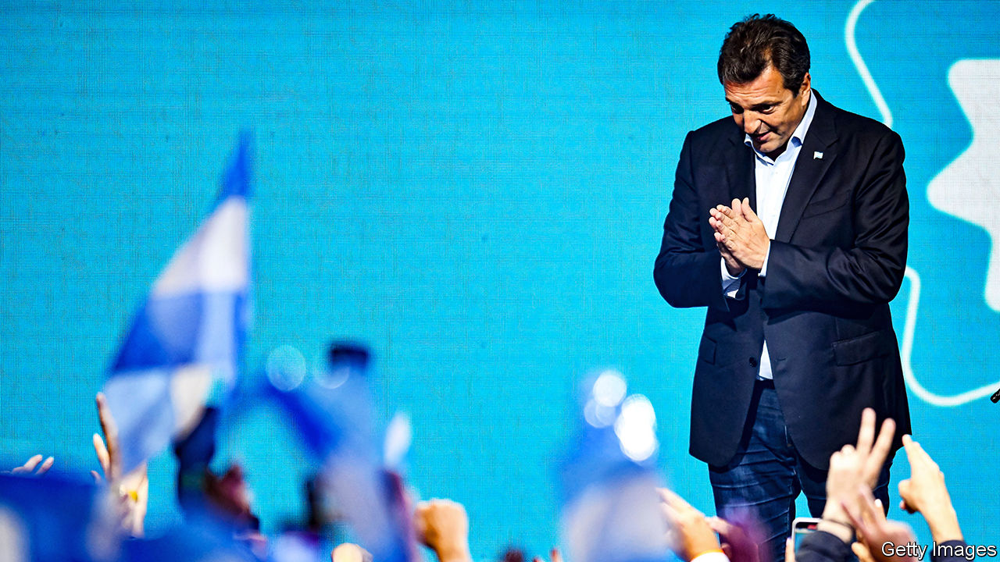
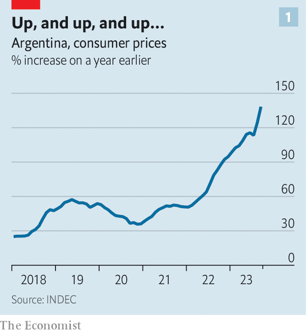
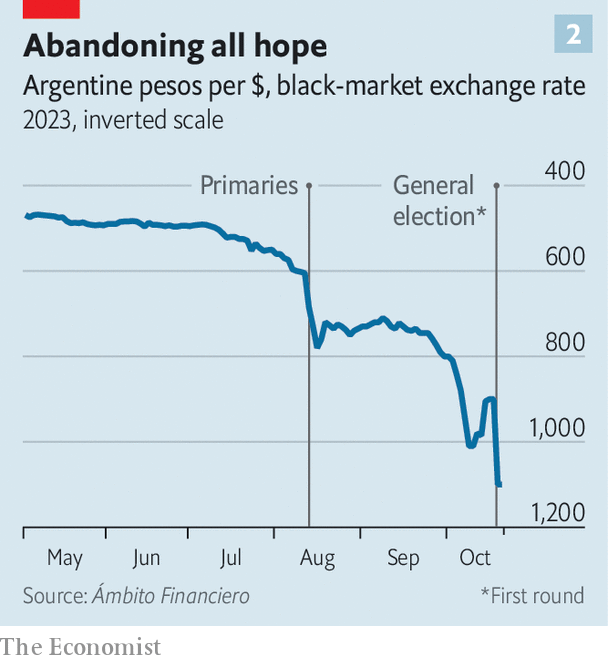

###### The enduring power of Peronism

# Argentina’s presidential election delivers a surprise result 

##### The Peronists knock Javier Milei, an erratic libertarian, into second place. Now for the run-off 

 

> Oct 23rd 2023 

There are two certainties in Argentine politics. One is that polls cannot be trusted. The other is that predictions of the demise of Peronism, the populist movement that has dominated politics in the country for seven decades, always prove premature. In the first round of Argentina’s presidential election on October 22nd, both truths were borne out.

Most polls had put , a libertarian outsider, as the front-runner. Yet Mr Milei received 30% of votes. By contrast Sergio Massa (pictured), the Peronist candidate who is Argentina’s economy minister, won almost . The two candidates will now compete in a run-off on November 19th. Patricia Bullrich of Together for Change, a centre-right coalition, got 24% of votes and is out of the race. Half of the seats in the national Congress, and a third in the Senate, were also up for grabs. 

 


Mr Massa’s turnaround is astounding. Since he took up his current job in August last year, annual inflation in Argentina has increased from 79% to 138% (see chart 1). The price of one black-market American dollar—the currency Argentines prefer to save in—has increased from around 300 pesos to around 1,000. Multiple exchange rates have been invented, adding distortions to the country’s already labyrinthine economic rules. Most voters say inflation is their top concern.

It may seem baffling that the steward of Argentina’s deteriorating economy has a good chance of becoming the next president. Considered a centrist Peronist, Mr Massa portrayed himself as someone who could unite the whole country. He has good relations with the IMF and has supported export-oriented sectors, such as mining, through special exchange rates and by investing in infrastructure for oil and gas firms. Yet this can go only so far in explaining the surprising result. Mr Massa also owes his victory to the mobilising power of the movement behind him.

After Mr Milei came first in a  in August, Peronist leaders activated the vast apparatus they control throughout the country. Mr Milei rose to fame by railing against politicians as a “caste” that steals from hard-working Argentines. Many voters, whose living standards have sunk under both Peronist and centre-right governments, flocked to him. To win them back, the government opened the taps. In the weeks running up to the election Mr Massa handed out a bonus for pensioners in pesos worth $100 (at the official exchange rate), and eliminated income tax for 99% of all workers. Such measures are estimated to have cost the equivalent of around 1% of GDP. 


The effort to win back disillusioned voters was concentrated in the often miserable suburbs of Buenos Aires province, where more than a third of Argentines live. Days before the election, lorries owned by a poor municipality called Lomas de Zamora were found to be delivering refrigerators, housing materials and mattresses to voters. One person later thanked the Peronist president of the local legislature for a new stove. In September a , or ward boss, was caught in another district using 48 debit cards to withdraw cash that belonged to employees of the local legislator. Police suspect the money was intended to buy votes.

Fear-mongering also played a role, thinks María Eugenia Duffard, a journalist in Buenos Aires. The government built a narrative about “all the things that could be lost” if a free-market candidate like Ms Bullrich—or, worse, a libertarian like Mr Milei—came to power. Two days before the election, bus and railway stations put up signs showing customers how much their ticket prices would increase if subsidies, which cost the government around 2% of GDP per year, were removed. One message on a card reader at a train station said that prices would remain at 56 pesos ($0.16 cents) under Mr Massa, but would rise to 1,100 pesos under Mr Milei or Ms Bullrich.

Deus ex machina

Some apparent tactics were cruder. On election day no posters were visible for Mr Milei or Ms Bullrich in the poor district of José C. Paz, in Buenos Aires province, which has long been governed by Peronists. One local claimed that people who campaigned for Mr Milei or Ms Bullrich had received threats from thugs. Another said he had been told his garage would be shut if he did not vote the right way, though he declined to say who had pressured him and for whom he was told to vote.  has obtained a text message in which one  claims his bosses hired 7,000 taxis to get voters to polling stations. Such tactics seem to have increased turnout. Between the primaries and the first round Mr Massa received 4.5m extra votes. Mr Milei only got around 500,000 more.

 


Yet Mr Milei’s loss cannot solely be explained by Mr Massa’s gains. Mr Milei’s bizarre, often aggressive, language and his radical proposals put many voters off. In a majority-Catholic country he has called the pope, who is Argentine, a “leftist son of a bitch”, among other slurs. On election day his mentor suggested suspending diplomatic relations with the Vatican. Although over a third of employees in the country work for the public sector, Mr Milei has described the state as a “criminal organisation” and compared it to a paedophile in a kindergarten. He wants to slash public spending by 15% of GDP (from around 40% today), scrap most taxes and .

He has also proposed loosening gun-ownership laws, banning abortions and establishing a legal market for human organs. Lilia Lemoine, an influencer who manages Mr Milei’s image, and who was elected to Congress, recently said she would like to propose a bill that would allow men to refuse paternity of their children. She argued that many women often use tricks to trap men in relationships, such as pretending to take the morning-after pill. Meanwhile Mr Milei has not denied rumours of going to his four genetically identical dogs for political advice.

On the day of the election Eduardo Bolsonaro, the son of Brazil’s former populist right-wing president, Jair Bolsonaro, was in Buenos Aires to support Mr Milei. The association with kooky ideas and right-wing demagogues turned many moderates off. “He’s very aggressive, and that scares me a bit,” says Augusto, a 36-year-old.

Even if Mr Milei were to win, he would struggle to govern. Over the past year all the candidates he backed have failed in their electoral bids to become governors of Argentina’s 23 provinces. On election night his coalition, Liberty Advances, made significant gains, but will still hold only 38 of the lower house’s 257 seats. In the Senate, they will have eight of 72 seats.

But Mr Massa’s victory in the run-off is not assured. Ms Bullrich refused to congratulate him, since he is “part of the worst government in Argentina’s history”. On October 25th both she and Mauricio Macri, a former centre-right president, vowed to work with Mr Milei. The fact that candidates who propose free-market ideas secured more than half of all votes suggests that Peronism may have to reinvent itself soon—or face its long-heralded demise. ■


