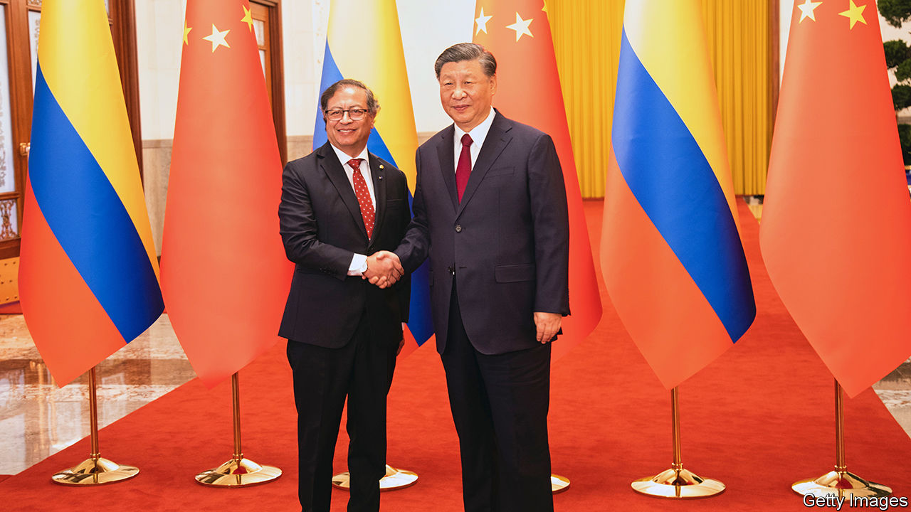

###### How to lose friends and irritate people

# Gustavo Petro, Colombia’s left-wing president, is floundering 

##### Just a year into his term, he is deeply unpopular 

 

> Oct 26th 2023 

Gustavo Petro is often late. Colombia’s first avowedly left-wing president was famously delayed in voting for himself in last year’s presidential election (he left his ID at home). On October 24th he continued that tradition by landing in China eight months after declaring an impending trip. Mr Petro was expected to sign up for the Belt and Road Initiative (BRI), Beijing’s tarnished infrastructure splurge. Yet he managed to arrive the week after the end of the BRI summit, and left with a dozen deals and several “working groups” to improve commerce between the two countries, instead. One year into his term Mr Petro is struggling, and not just against the clock.

Mr Petro is deeply unpopular. His approval rating has crashed from close to 60% in August 2022 to half that in October this year. This is not uncommon for Colombian presidents, who tend to poll below 50% for most of their terms. “The thing to notice is how rapid and sharp the fall was,” says Andrés Mejía Vergnaud, a political consultant. 

The president got off to a good start, forming a moderate coalition government filled with seasoned ministers. They sailed through a tax reform in record time. They negotiated with ranchers to redistribute land to the rural poor and created a peace plan to end the internal conflict which has racked the country for decades. Allies, though wary of his more radical bills, agreed to back more moderate versions. 

But that was not enough for Mr Petro. In April, when centrist ministers opposed a health-care reform, which would have handed control of health-care funding from private providers to the state, he dissolved the coalition and fired a third of his cabinet. He then turned dogmatic and packed the new cabinet with left-wingers. He has tried to rule by emergency decree, but the constitutional court can reverse his acts. As a result the government’s legislative agenda is moribund. A dozen ambitious reforms are stuck in Congress, infuriating Mr Petro. He has taken to organising mass rallies where he denounces what he calls the “soft coup” against him. 

Few are buying it, particularly after a series of scandals. It began in May when Mr Petro’s chief of staff, Laura Sarabia, accused her children’s nanny of stealing money, forced her to take a polygraph test and had her phone illegally wiretapped by Colombia’s intelligence agency. That was a bad look for a government elected to help the poor. Ms Sarabia blamed another ally of Mr Petro, Armando Benedetti, who was then the ambassador to Venezuela, for having leaked the story. Although Ms Sarabia denied any impropriety, both she and Mr Benedetti were forced to resign. Mr Benedetti then claimed he had incriminating evidence about the funding for Mr Petro’s presidential campaign. Mr Petro denies all the allegations.

Then Nicolás Petro, the president’s son and a regional deputy, was arrested on charges of taking drug money in exchange for political favours. Mr Petro junior admitted to soliciting bribes for his father’s presidential campaign, but said his father had not known and that he had kept the money. Mr Petro denied all involvement. The cases are still running.

Mr Petro’s desultory approach to foreign policy is not helping matters. Take China. The country could expand Colombia’s ports, construct highways through the interior and provide investment for renewable energies. Instead, before meeting Xi Jinping, China’s leader, Mr Petro indicated that his priority was to talk about the metro in Bogotá, the capital, which is being built by a Chinese consortium and which he has strong views about. That seems small-bore. Indeed Chinese diplomats recommended that the president should not bring it up. “There’s basically no public policy on China,” says Parsifal D’Sola of the Andrés Bello Foundation, a research group. 

Earlier this month Mr Petro shattered Colombia’s policy on Israel-Palestine, too. After Israel retaliated against Hamas by bombing Gaza, the president let loose on social media. He accused Israel’s government of “Nazism” and compared the Palestinian territory to Auschwitz. When Israel retaliated by freezing exports of weapons and air-defence systems to Colombia, Mr Petro threatened to cut off diplomatic relations. Under pressure from American officials he met the Israeli and Palestinian ambassadors on October 19th. Hours later he tweeted that Colombia would open an embassy in the West Bank. 

On October 29th the president’s allies are likely to face a thrashing in local elections. His party’s candidates are predicted to lose the big cities, including Bogotá. This will be a humiliation for Mr Petro, who served as the capital’s mayor from 2012 to 2015. Some fear that a landslide defeat would cause the president to lash out. The government is already delaying funds to certain cities, revoking licences for their projects and meddling in any way it can. “If he were willing to compromise and moderate, a number of political forces would be willing to co-operate with him,” says Mr Mejía. That seems unlikely. ■

