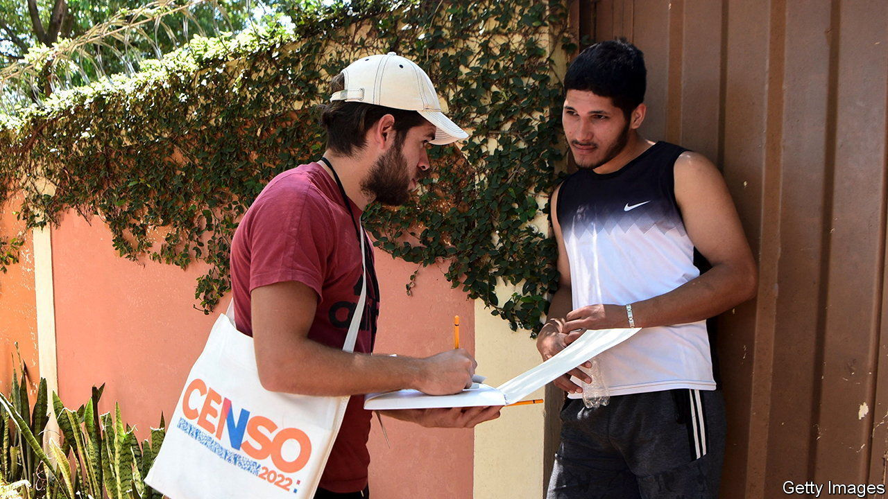

###### Paraguay’s population puzzle

# Over a million Paraguayans disappear in the latest census 

##### The country’s population is a fifth smaller than thought. Why? 

 

> Oct 26th 2023 

Last November Paraguay’s first census in a decade got off to a rocky start. A fifth of those recruited to conduct the household survey in Asunción and Central, the capital and its sprawling suburban hinterland, did not show up. Those that did sometimes found their tidy neighbourhood maps bore little relation to the brick bungalows and plywood shacks jumbled before them. Social media filled with complaints from those waiting in vain for a knock at the door.

And when Paraguay’s National Statistical Institute (INE) released preliminary data on August 31st, they pointed to a surprising conclusion. Unusually for a fast-growing, emerging economy, the population appeared to have drastically shrunk. The last census, in 2012, found that Paraguayans numbered nearly 6.5m. Official projections held that the population would grow to almost 7.5m by now. Instead, the new survey points to a figure of barely 6.1m. Many reacted with derision. “We will basically have to plan for a new Paraguay,” a nonplussed Carlos Valdovinos, the economy minister, told reporters. Even the director of the INE, Iván Ojeda, admitted to having initial doubts about the results.

But the mystery can be explained, says Norma Medina, an INE official. Nearly half a million of her compatriots have migrated since the turn of the millennium, including many young women taking up jobs as nurses and nannies in Spain and Argentina. Whereas Paraguayan families once reliably produced 3.5 children on average, that figure has fallen sharply over the past 20 years, to 2.3. Life expectancy has risen, but the pandemic kept it in the low 70s.

More to the point, the 2012 census was botched. The then president had just been impeached. Those in charge of the survey were replaced. Contractors went on strike over late pay. In the end, they reached barely three-quarters of the population. “They did what they could with what they had,” concedes Ms Medina. Officials had to fall back on the 2002 census, which recorded a population of 5.2m, both to hazard a guess at the 2012 population and project its growth. Yet birth rates fell and migration had picked up sharply in the early 2000s, so this extrapolation diverged further from reality each year.

The new census is much more reliable, thinks Verónica Serafini at CADEP, a think-tank. In the weeks after the launch of the census last year, INE’s workers chased up remote farmsteads and indigenous villages. A subsequent survey suggests they reached a respectable 93.7% of households in total. The lower population figure tallies with data on births and deaths compiled by hospitals, as well as student registers. 

Civil servants have long reported the countryside to be emptier than their clipboards suggest. The data also suggest that Paraguay’s demographic dividend is winding up sooner than thought, says Ms Serafini. More formal jobs and bigger tax receipts will be needed to support an ageing population, she warns.

Paraguay’s new conservative president, Santiago Peña, believes his nation’s best days are before it. A former finance minister, he won an election in April promising to create 500,000 jobs, double the country’s GDP and keep taxes low. “The world will bear witness to the revival of a giant,” he proclaimed at his inauguration in August. Mr Peña has said that Paraguay’s underdevelopment is mostly due to a devastating war 150 years ago (rather than the policies of his party, the Colorados, which has ruled almost without pause since 1947). Luckily for the president, the revised population data may cause Paraguay’s GDP per person to jump somewhat. But unfortunately for ordinary folk, Paraguayans are unlikely to wake up next year with an extra $1,000 in their pockets. ■

