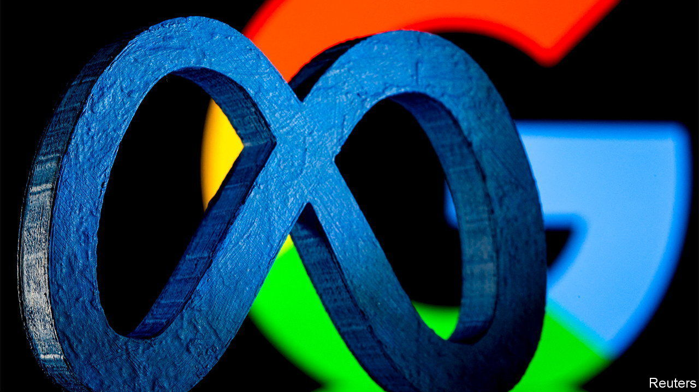
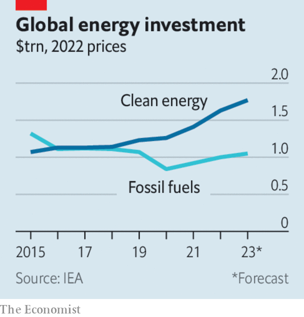

###### The world this week

# Business 

#####  

 

> Oct 26th 2023 

 reported record quarterly revenue of $34.1bn, of which sales from advertising made up 98.5%. Net profit rose by 164%, to $11.6bn. Mark Zuckerberg noted the savings made from his “year of efficiency”, and said that artificial intelligence was improving the business. The good results were tempered by news that dozens of American states are suing Meta, alleging that its apps, such as Facebook, are deliberately designed to be addictive to children. 

On a cloud

Surging revenue from cloud computing contributed to a 27% jump in  quarterly net profit, year on year. Satya Nadella, the CEO, said the company was reaping the gains from using AI models developed by OpenAI for its platforms.  cloud division, by contrast, underperformed in the quarter. However, overall revenue and profit at Google’s parent company came in above forecasts, driven by digital-ad sales. 

  in which Microsoft has a 49% stake, could be valued at as much as $86bn after a possible sale of shares, according to reports. That would make the developer of ChatGPT one of the most valuable privately held firms in the world, behind the likes of SpaceX and ByteDance. 

The Chinese authorities have reportedly launched an investigation into the tax affairs and land use of , which assembles the iPhone in China. Foxconn is a Taiwanese company. Its founder, Terry Gou, stepped down from the board in September to run as an independent candidate in Taiwan’s presidential election. 

 CSI 300 stockmarket index fell to its lowest level since 2019, taking its losses for the year to 10%. Investors are rattled by financial problems in the property industry. Country Garden, China’s biggest developer, has defaulted on a dollar bond for the first time. 

, which supplies equipment to semiconductor manufacturers, made its stockmarket debut on the Tokyo exchange. Its share price jumped by 28%, valuing the company at ¥542bn ($3.6bn) and making it the biggest IPO in Japan for five years. 

 undertook its biggest ever acquisition when it announced that it is buying , an oil and gas company that has its headquarters in New York, for $53bn. The deal, hot on the heels of ExxonMobil’s $59.5bn offer for Pioneer, gives Chevron access to the booming oilfields in Guyana’s offshore waters. Both takeovers signal a bet that demand for fossil fuels will be buoyant for some time. 

 


The International Energy Agency thinks differently in its latest report, forecasting that global demand forwill peak in 2030, though demand for oil and gas will then remain flat until 2050, while it falls sharply for coal. The IEA thinks that 50% of new car registrations in America by 2030 will be for electric vehicles. It also forecasts a big uptake of heat pumps in the European Union and of solar power in China.

The  kept interest rates on hold for the first time since it started its round of tightening monetary policy in July 2022, leaving the deposit rate at 4%. But with inflation in the euro area still far above the ECB’s target, interest rates are not expected to come down any time soon.

Meanwhile,  central bank lifted its main rate to 35%, the fifth increase since June, in a bid to quell resurgent inflation.

grew by 4.9% in the third quarter at an annualised rate, the fastest pace in two years, and underlining the strength of the economy despite the Federal Reserve’s long campaign of interest-rate increases. 

 reached a tentative agreement with the United Auto Workers that would end the union’s strike at the carmaker. The company has offered a 25% pay increase over a four-year contract, with 11% in the first year. “We told Ford to pony up,” said the union’s president, Shawn Fain. 

The strike is costing  $200m a week in operating profit. Still, the carmaker reported solid quarterly net income of $3.1bn. It also rejigged its sales targets for electric vehicles, abandoning a target of selling 400,000 next year. In another setback, California suspended permits for self-driving cars operated by Cruise, GM’s autonomous-vehicle division, deeming them to be unsafe. 

 disclosed that it is being investigated by the Department of Justice on several fronts, including whether it has exaggerated the range of its electric cars and “certain matters associated with personal benefits”. Tesla has been subpoenaed by the department to provide it with documents. 

Pick is picked

 named Ted Pick as its new chief executive. He is replacing James Gorman, who will have held the job for 14 years. Mr Pick currently heads the investment-banking side of the business. 

Britain’s financial regulators confirmed that  will no longer be capped. The cap was introduced in 2014, limiting bonuses to twice the size of a banker’s basic salary. The regulators believe that removing the cap will give firms more flexibility in pay during bad times. 

 quarterly net profit leapt by 20%, year on year, making it the latest big bank to benefit from charging its borrowers higher interest on their debts.  profit was up by 36%. The Italian lender said it would set aside €1.1bn ($1.2bn) as “non- distributable reserves”, which allows it to avoid paying the government’s windfall tax on bank profits. 

