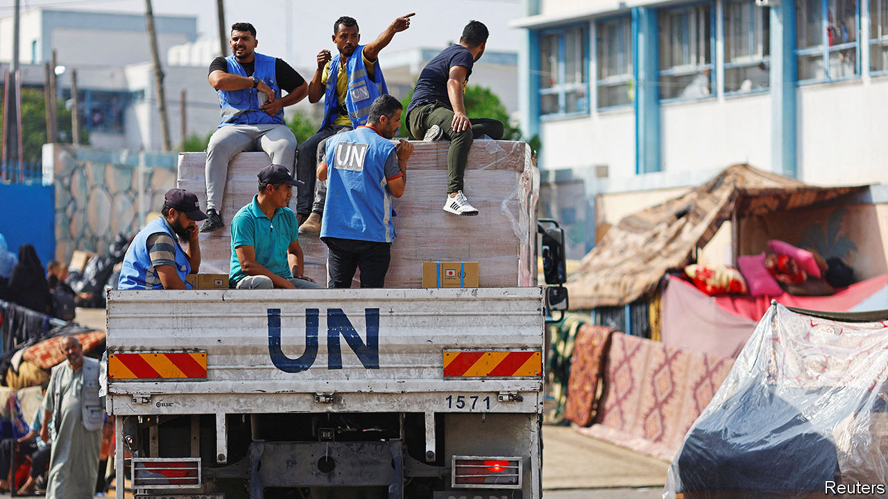
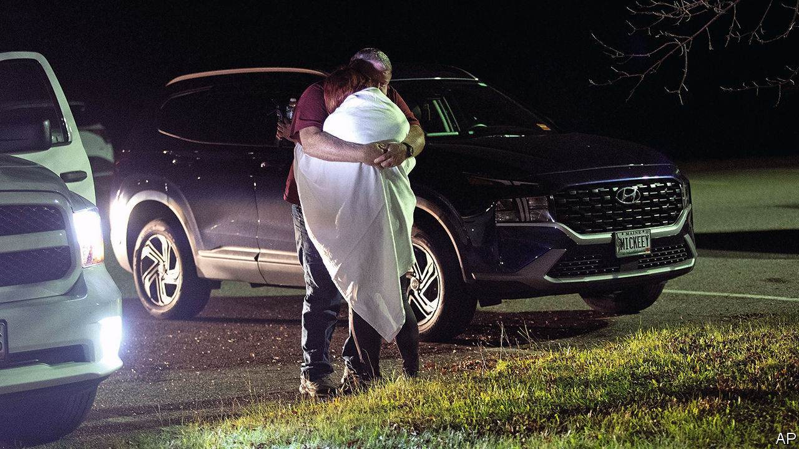

###### The world this week

# Politics 

#####  

 

> Oct 26th 2023 

 continued to pound Hamas’s infrastructure in , knocking out command centres, weapon stockpiles and tunnels. The army said it carried out an operation inside northern Gaza to prepare for a ground invasion. Some humanitarian aid was being let in. As the death toll grew among Palestinians, the UN said a third of Gaza’s hospitals were shut. Clashes between Palestinians and Israeli settlers and troops intensified in the , where Israel detained scores of Hamas men. 

Israel said that Hamas is holding 220 . Some of the captives are dual-nationals and foreign citizens. Hamas released four women, two of whom were American. Meanwhile, Israel decided to release raw footage of the  on October 7th to counter claims that the atrocity has been exaggerated. A government spokesman said such claims are “a Holocaust denial-like phenomenon unfolding in real time.”

More  rained down on Israel, with one reaching Eilat on the Red Sea. Missiles fired from Yemen were intercepted by an American warship and rockets were also launched from Syria. America is boosting its troops and weaponry in the region amid fears that Iran’s proxies, Hamas, Hizbullah and Islamic Jihad, may escalate the conflict. 

After travelling to China and North Korea,  foreign minister, Sergei Lavrov, visited , where he held talks with the country’s president, Ebrahim Raisi. Russia said the meeting was held in a “traditionally trusting atmosphere”.

Volodymyr Zelensky claimed that the Russian fleet “is no longer capable of operating in the western part of the Black Sea and is gradually retreating from Crimea” because of Ukrainian attacks on Russian ships.  president provided no evidence for the claim. Meanwhile, Russia intensified its offensive in Avdiivka, in east Ukraine. 

The leader of  Socialists and acting prime minister, Pedro Sánchez, struck a deal with the hard-left Sumar alliance that could see him form a new government, more than three months after a general election in which his party came second. Talks are continuing with other potential coalition partners, notably Catalan and Basque nationalists. 

Better late than never

 president, Recep Tayyip Erdogan, at last signed a bill approving  bid to join  and sent it to parliament for ratification. Once Turkey’s legislature passes the bill Hungary will be the only NATO country yet to approve Sweden’s application. NATO’s secretary-general, Jens Stoltenberg, hopes all this can be done in time for a big meeting in late November. Separately, Mr Erdogan described Hamas as a “liberation group”. 

The right-wing Swiss People’s Party (SVP) came first in  parliamentary election, taking 28% of the vote and 62 seats in the 200-member lower house. The SVP’s main campaign theme was restricting immigration. On the left the social democrats held their ground, but the greens’ share of the vote fell and they lost several seats. The parliament will elect a new government on December 13th, though its composition is not expected to change much. 

Olaf Scholz, the  chancellor, stepped up his rhetoric on restricting “irregular” immigration, saying that “too many people are coming” to Germany and “we have to deport people more often and faster.” Speaking after returning from a trip to Israel, Mr Scholz was responding to a question about Arab groups in Germany. 

In  the leader of the opposition Labour Party, Sir Keir Starmer, said his party was “redrawing the political map”, after inflicting two heavy defeats on the Conservatives at  in what had hitherto been safe Tory seats. In both constituencies the swing from Conservative to Labour was more than 20%. 

Djibouti, Somalia and Eritrea rejected a demand by landlocked  for direct access to their ports. Abiy Ahmed, Ethiopia’s prime minister, claimed the Red Sea is his country’s “natural boundary” and if it is not given a harbour “we will fight”.

America formally declared that a coup took place in  in August, a determination that requires it to cut aid. The declaration follows attempts by America to negotiate a restoration of civilian rule.

 struck Mexico’s Pacific coast, making landfall near Acapulco. Otis intensified to a category five hurricane, the strongest level of storm, when it hit. 

Sergio Massa,  economy minister, took the most votes in the first round of a presidential election, with 37%. Javier Milei, a libertarian outsider who had been considered the front-runner, managed only 30%. Both will now head to a run-off in November. Patricia Bullrich, the third candidate, who has now been knocked out, has said she will support Mr Milei.

 sacked its defence minister, , who has not been seen in public since August. No reason was given, but there has been speculation that he is under investigation for corruption. Several other Chinese officials have been removed in recent months, including Qin Gang, who lost his job as foreign minister in July.

The president of the , Ferdinand Marcos junior, held an emergency meeting with his defence staff after Chinese coastguard ships collided with Filipino vessels near the disputed Second Thomas shoal in the South China Sea. The Philippines said the collision was intentional. China blamed the Filipinos for “trespassing”. America accused China of continued “harassment”. 

America, Japan and South Korea held their first trilateral  for fighter jets. The drill, which also involved a B52 bomber, took place south of the Korean peninsula. North Korean state media said the allies were trying to provoke a nuclear confrontation. 

 Supreme Court ruled that people can officially change their gender without undergoing sterilisation. Japan is one of 18 countries, most of which are in Europe, that does not recognise gender changes without surgery. The court’s decision means the government must consider changing the law to allow people to change their gender in official documents. 

 


A gunman opened fire at a bowling alley and a restaurant in Lewiston, . Early reports suggested he killed at least 16 people, which would make it America’s worst mass shooting this year. 

America’s House of Representatives at last settled on a new . Mike Johnson, an ally of Donald Trump in his efforts to overturn the result of the election in 2020, got the job after Republicans rejected three other candidates. 

America’s Customs and Border Protection agency recorded 2.5m  apprehensions and expulsions on the border with Mexico during the 12 months ending September 30th, the most since records began in 1960. 

Delusions of grandeur

 compared the prosecutions he is facing to the persecution of Nelson Mandela. Mr Trump also said he is “willing to go to jail”, a promise that may be tested after the courts finish trying him on 91 criminal charges. 

