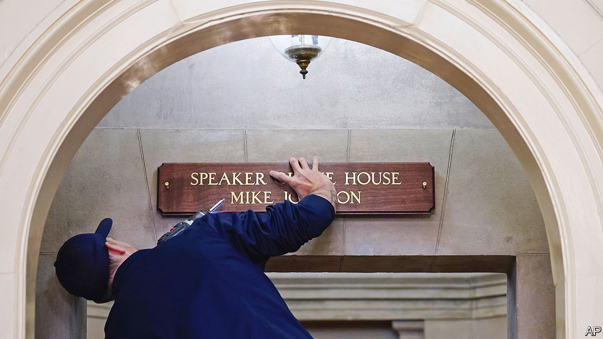

###### Speak now

# America’s House of Representatives finally has a speaker 

##### What might Mike Johnson make of the worst job in Washington? 

 

> Oct 26th 2023 

As America’s House of Representatives began its fourth week without a speaker, it seemed like  would ever get Republicans to unite behind a new leader. But it turns out something could bring the fractious party together: sheer exhaustion, mixed with the possibility of having to govern with Democrats.

On October 25th Republicans unanimously voted for Mike Johnson, a 51-year-old congressman from Louisiana, to lead the lower chamber. Three  nominees had dropped out after failing to get the support needed for the job. Mr Johnson, a lawyer and self-described “full-spectrum conservative”, has quietly risen through the ranks on Capitol Hill since arriving in 2017. He held relatively low-key positions in Republican leadership and for two years led the Republican Study Committee, an ideological caucus that counts a large majority of House Republicans as members. Yet Mr Johnson has never even served as a committee chairman.

Democrats who worked with hard-right Republicans to  of Kevin McCarthy may have hoped for a more moderate replacement. They are likely to be disappointed with the outcome. Mr Johnson’s congressional website describes him as “a leading defender of the right to life, religious liberty, free speech, the Second Amendment and free-market principles”, and the father of four stands out as a social conservative even within the Republican Party. Compared with Jim Jordan, a mentor whose own speakership bid failed, Mr Johnson has had a little more success sponsoring bills that actually became law. 

Perhaps most troubling, Mr Johnson has indulged some of his party’s worst impulses in recent years. He voted against certifying the 2020 election results and lobbied House Republicans to support a long-shot lawsuit to invalidate electoral-college votes in several states won by Joe Biden. Will Mr Johnson behave responsibly now that he is in a real position of power—especially as he has to negotiate with Democrats, given Republicans’ slim nine-seat majority in the House?

After the painful process of finding a leader, Republicans will be eager to avoid such an embarrassing spectacle again. And, lacking Mr McCarthy’s baggage, the new speaker could have some space to compromise. For now, at least, he is operating with some sense of urgency.

“We’re going to dispense with all the usual ceremonies and celebrations that traditionally follow a new speakership, because we have no time,” Mr Johnson said minutes after getting promoted. “You’re going to see an aggressive schedule in the days and weeks ahead. You’re going to see Congress working as hard as it’s ever worked.” He added with a smile, “I want to thank you for being patient with us.”

The House immediately moved to pass a resolution condemning Hamas: its first vote will also be the easiest. The first real challenge will be finding a way to fund the government. On September 30th the House passed a bill to temporarily fund it at current levels. This averted a shutdown—but only until November 17th. Mr Johnson voted against the so-called continuing resolution last month, though he showed more pragmatism earlier in the year when he supported a bill that raised the debt ceiling.

In a letter to colleagues on October 23rd Mr Johnson the candidate laid out an ambitious plan to pass a series of spending bills instead of one large long-term funding package. But intraparty fighting has made it hard to agree within the House, let alone negotiate with the rest of the government. “They actually have to pass something and work with the Senate and work with the president,” says Philip Wallach, an expert on Congress at the American Enterprise Institute. “He finds himself in the worst sort of predicament from day one.”

Mr Johnson acknowledged that the House may need to pass another stopgap bill to fund the government into next year, hoping to “ensure the Senate cannot jam the House with a Christmas omnibus”. (Such a bill would package several measures into one big piece of legislation.) That does not mean a government shutdown is entirely out of the question. Even if Republicans finally agree on legislation, Democrats could find it unacceptable and bet that Republicans would receive more blame for a government closure.

The other urgent matter is the national-security funding request made by Mr Biden on October 20th. The spending package would allocate $61.4bn to fund Ukraine’s defence; $14.3bn for Israel; $13.6bn for America’s immigration crisis; $9.15bn in humanitarian aid for Gaza; and an additional $2bn in foreign support for the defence budgets of countries in Asia. The proposal should easily pass the Senate, which plans to hold hearings on the legislation on October 31st. Yet House Republicans have grown much more sceptical about assisting Ukraine.

The new speaker had yet to reveal his strategy on the national-security request by the time this article was published, but he did call the aid package a “top priority”—a welcome about-turn for Mr Johnson, who has routinely voted against aid for Ukraine. “We have to ensure that Vladimir Putin is not successful,” he told reporters. One possibility will be dividing each of the requests into separate bills and allowing separate votes. But he will have to move cautiously on this given the Republican Party’s 

One member of Congress can still call for a vote to oust Mr Johnson, and it would take only a handful of Republicans working with every Democrat to remove him from the speakership. House Republicans certainly want to avoid the chaos and drama of another speakership fight. But if recent weeks have shown anything, it is that their capacity for political self-harm remains unmatched.■


