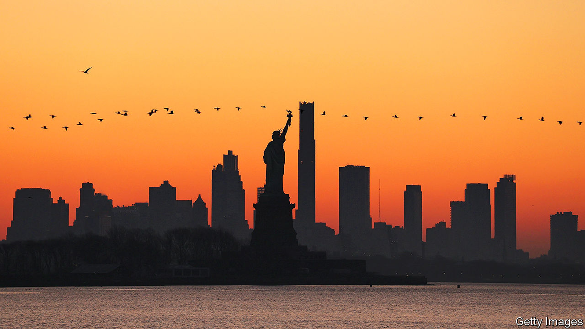

###### Birds of New York

# How to make NYC work better for its winged inhabitants 

##### Some small changes to building design can result in many fewer dead migrating birds 

 

> Oct 26th 2023 

EARLY-RISING NEW YORKERS may spot an unusual patrol group in Manhattan this autumn. They sport sensible shoes, latex gloves and an armful of brown paper bags. As in spring, they comb the streets for migrating birds that have struck windows. They are Project Safe Flight volunteers, out to save the injured and count the dead.

It is a tough gig. Fruzsina Agocs saw her first yellow-billed cuckoo, a shy species that is hard to spot, dead on the pavement. “That was not the way I wanted to see it,” she says. But she is cautiously optimistic that she will have fewer such encounters in the future. In the past couple of years New York has moved to the forefront of a push to make cities more welcoming to their avian neighbours.

New York—like Philadelphia, Baltimore and Washington—sits underneath the “Atlantic Flyway”, an ancient migration route travelled by millions of birds, from teeny warblers to long-legged shorebirds, every spring and autumn. Up to a quarter of a million of them die colliding with windows in New York every year, according to New York City Audubon, the bird charity that organises Project Flight Safe. Birds confuse reflections of sky or vegetation for the real thing and fly straight for them.

In 2021, however, new legislation came into force in New York requiring all new buildings and renovations to be made bird-friendly. Specifically, they must use glass that birds recognise as surfaces, which is usually achieved by incorporating tiny dots. It is the most stringent such legislation in America, spurred by the compelling case of the Jacob K. Javits Convention Centre in west Manhattan. It used to be a top bird-killer, but after swapping its panes for bird-friendly glass in 2013 strikes dropped by 90%. The centre has now fully embraced bird life. Its green roof is home to a breeding herring gull colony, and as of October 18th, 62 different species have been spotted there—most recently tree-climbing brown creepers and colourful northern parulas.

Other places are now following New York’s lead. Maryland’s version of the law went into effect this month, and Washington, DC’s will begin next year. And while the law does not apply to New York’s 1m existing buildings, some are taking voluntary steps. This month the Circa building by Central Park, another infamous bird-killer, covered its courtyard windows with translucent UV dot stickers that are more visible to birds than humans, hoping to shed its bad reputation.

At night artificial light draws birds into the city, where they are more likely to crash; some studies suggest it disorients them because it interferes with their ability to navigate using the Earth’s magnetic field. Last year the city passed a law that requires all city-owned and managed buildings to switch their lights off at night during migration. An expanded bill, which would extend the requirement to privately owned commercial buildings all year, is in committee in the council. Though exemptions would be allowed for icons such as the Empire State and the Chrysler Building, the change would still transform the world’s most famous skyline.

Jessica Wilson of NYC Audubon says that would be a good thing for birds, energy consumption and people. New York is on track to become the most bird-friendly big city in America. If the bill passes, “it would be a model for the entire country”. ■


