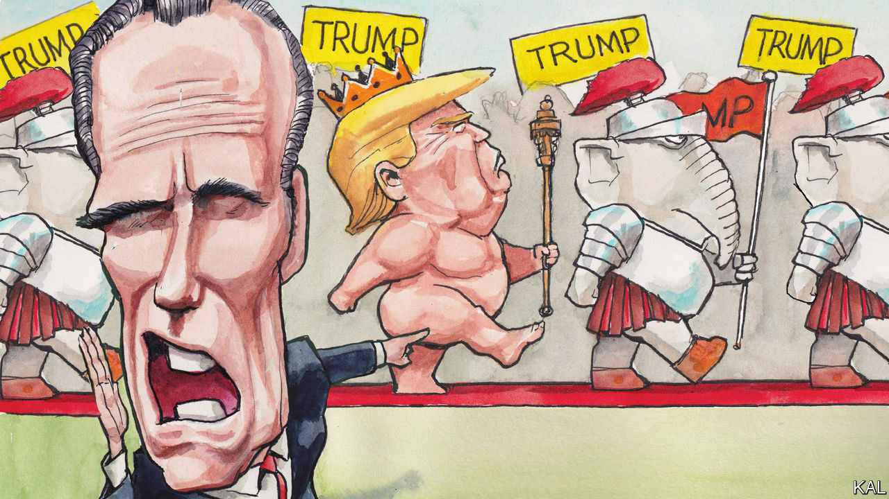

###### Lexington

# Mitt Romney is the fixed point revealing the Republicans’ slide 

##### A new biography shows how far that slide has gone 

 

> Oct 26th 2023 

So a politician in the evening of his career, with a vast family, a rich spiritual life and great wealth to fall back upon, summoned the nerve to declare what his peers muttered privately: that a man who was obviously unfit to be president was, in fact, unfit to be president. Does the courage of Mitt Romney in standing up to Donald Trump really say something wonderful about Mr Romney, or just something dismal about American democracy?

The grim answer is that it does say something good about Mr Romney precisely because it illuminates how debased the leadership of the Republican Party has become. Only against the shadow of dire compromise and cowardice could Mr Romney’s sense and decency gleam so brightly. 

Not that American politics looked so great even before Mr Trump ran for president in 2016. As McKay Coppins writes in a new biography, “Romney: A Reckoning,” Mr Romney made compromises of his own to run for office, including to become the Republican nominee for president in 2012. He was also subject to the kind of hysterical demonisation that has long been standard partisan practice: Joe Biden, then the vice-president, warned a mostly black crowd in 2012 that Mr Romney and his banker allies wanted to “put ya’ll back in chains”. Maybe politicians of both parties cried wolf for so long that they—and thus voters—failed to recognise him when he appeared at the door. 

In 2012 Mr Romney welcomed Mr Trump’s endorsement. Yet back then Mr Romney, like many who knew Mr Trump, considered him outrageous but harmless and therefore charming. “This guy is not fake—he says 100% of what he thinks,” Mr Coppins quotes Mr Romney writing in his journal. “Got to love him. Makes me laugh and makes me feel good, both.” The feeling curdled as Mr Trump emerged as a viable candidate in 2015. The Republicans’ swing in four years to Mr Trump from Mr Romney seems neck-snapping even now; it was a kind of penance in reverse, a brawling, bankrupting bender in a strip club after a quiet morning in the pews. Mr Romney was offended by Mr Trump’s policies, but he was more alarmed by his character, seeing him, in Mr Coppins’s words, as “a profoundly depraved and broken person”. 

Mr Romney considered getting into the race himself, then tried to engineer an anti-Trump unity ticket. In February 2016 he gave a speech calling Mr Trump “a phoney, a fraud” who was playing Americans “for suckers”. When Chris Christie, the former governor of New Jersey, dropped out and endorsed Mr Trump, Mr Romney harangued Mr Christie to withdraw the endorsement, saying it “severely diminishes you morally”. 

In 2017 Mr Romney, in his management consultant’s style, kept a list on his iPad of the pros and cons of possibly running for the Senate from Utah. At the top, he quoted W.B. Yeats: “The best lack all conviction, while the worst/Are full of passionate intensity.” Those lines, he felt, captured “the new GOP”. Once he ran and won, Mr Romney was astonished by what he learned about Republican senators: “Almost without exception they shared my view of the president,” he tells Mr Coppins. Once, after Mr Trump addressed the senators and then left the room, “the Republican caucus burst into laughter”. His colleagues would tell Mr Romney they wished they had secure enough constituencies back home to be able to speak up as he did. The majority leader, Mitch McConnell, referred to Mr Trump as “an idiot” and told Mr Romney he was lucky because “you can say the things that we all think”. Mr Romney developed a stock response: “There are worse things than losing an election. Take it from somebody who knows.”

The book’s emotional high point is its account of the agonised process by which Mr Romney decided to vote to convict Mr Trump after his first impeachment, for abuse of power in conditioning aid to Ukraine on its announcing an investigation of Mr Biden. Mr Romney’s journal reveals his contempt for Republican legislators’ indifference to their constitutional duty—even Mr McConnell suggests he thinks Mr Trump is guilty—and his growing isolation as they lobby and even attack him. “Sad to see what happens to people when they want to win at any cost,” Mr Romney writes. 

In the second impeachment trial, after the attack of January 6th, Republicans added a chilling new rationale for not voting to convict: too many Trump supporters had guns. Mr Romney was sympathetic to this fear, since by then he was paying $5,000 a day for security to protect his own family.

The real Romney

Mr Romney not only handed over his journals, texts and emails to Mr Coppins but also sat for more than 45 interviews over more than two years. Although the leftish press has celebrated Mr Romney’s catty put-downs of fellow Republicans, the book’s more satisfying revelations, of which there are many, form a portrait of Mr Romney as an introspective, vulnerable, even self-lacerating person, ambitious for himself but also to do the right thing. 

Mr Coppins frames his biography around Mr Romney’s own compromises, regarding them as moral lapses and asking if they empowered Mr Trump (that’s the “reckoning”). This seems unfair to Mr Romney and, for students of politics, a bit of a dead end. After all, in politics, compromise—even of principles—can be a good thing. To witness the chaos created by its absence one need look no further than the House Republican caucus. The trick is to know when to compromise and how far to go. Mr Romney, who at 76 has decided not to run again for his seat, seems to have got far more such calls right than wrong. 

The first line of his obituary—an obsession for Mr Romney—seems less likely to record that he lost a presidential election than that he was the first senator to vote to convict a president of his own party. Whether history will ultimately judge that to have been the act of a hero or a turncoat, of course, is something American politics has yet to determine. ■


